# Neural Network From Scratch: From One Neuron to a Tiny MLP in NumPy

*Start with one neuron, expand it into Dense layers, then train a small network on a curved spiral dataset*

## Brief Intro

A neural network is a model that learns from examples. Instead of writing every rule by hand, we give it data, compare its prediction with the correct answer, and let it adjust its internal numbers until the predictions improve.

The idea is loosely inspired by biological neurons: many small units receive signals, combine them, and pass a result forward. In machine learning, those signals are numbers, and the things being adjusted are weights and biases.

This post builds that idea from the smallest useful piece: one neuron. Once that one piece is clear, every later section only answers one question: how do we make the same idea handle more inputs, more samples, harder shapes, and actual learning?

Companion notebook: [`src/0.neural_net/0. neural_network_from_scratch.ipynb`](../../src/0.neural_net/0.%20neural_network_from_scratch.ipynb). The notebook uses pure NumPy, no PyTorch, no autograd.

---

## One Neuron

The smallest neural network unit receives inputs, multiplies them by weights, adds a bias, and produces one output. This is the smallest place where the main ingredients appear: input, weight, bias, prediction, and loss.

With one input, the neuron is just a line:

```text
output = weight * input + bias
```

```python
x = 3
w = 0.8
b = 2

output = w * x + b
print(output)  # 4.4
```

- **Input**: the value the model receives.
- **Weight**: controls how strongly the input affects the output.
- **Bias**: shifts the output up or down.
- **Output**: the prediction from this tiny model.

The weight changes the slope of the line. A larger positive weight makes the output climb faster as the input grows. A negative weight flips the slope downward. The bias shifts the whole line up or down without changing the slope.

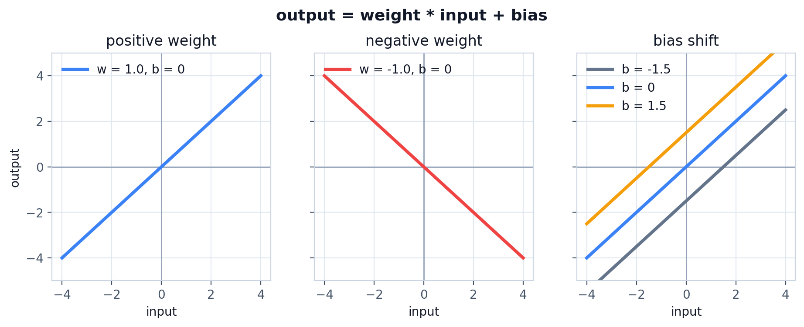
A weight changes the slope of the line; a bias shifts the line without changing its slope.

With more than one input feature, one neuron still produces one output. In vector form, the neuron takes a dot product between the input vector and the weight vector, then adds one bias:

```text
output = dot(inputs, weights) + bias
```

Expanded, that same dot product is just a weighted sum:

```text
output = sum(inputs * weights) + bias
```

```python
inputs = [1, 2, 3]
weights = [0.2, 0.8, -0.5]
bias = 2

output = (
    inputs[0] * weights[0]
    + inputs[1] * weights[1]
    + inputs[2] * weights[2]
    + bias
)

print(output)  # 2.3
```


Shape view for this one-neuron case:

```text
inputs   [D]
weights  [D]
output   scalar
```

Drawn as a small computation graph:
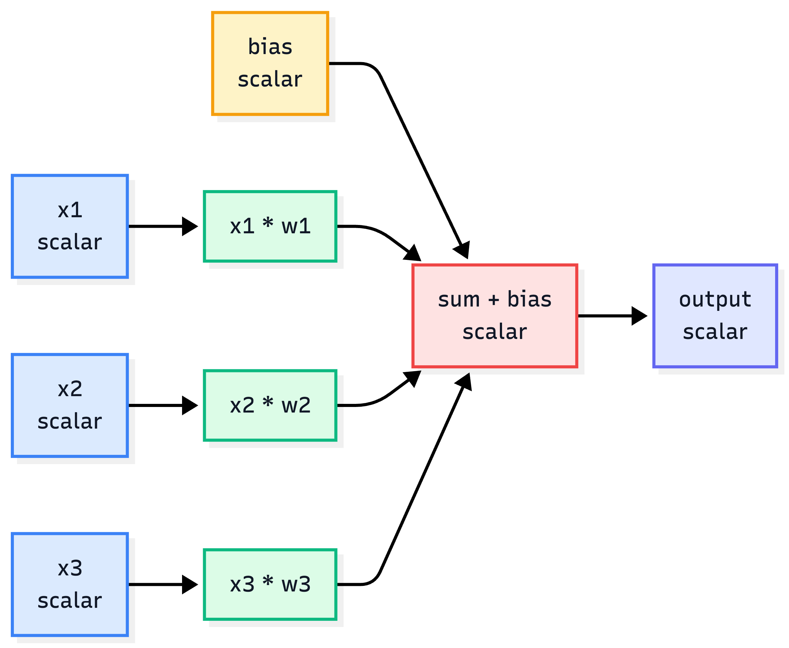
Each input is first scaled by its own weight. The neuron then adds those scaled values plus one bias to produce one output.

The model is useful only if we can say how wrong it was. For a simple regression target, squared error is enough:

```python
target = 3.0
loss = (output - target) ** 2

print(loss)  # 0.49
```

### *Bonus: Why squared error?*

The raw error can be positive or negative:

```text
error = output - target
```

If `output = 2.3` and `target = 3.0`, the error is `-0.7`. If `output = 3.7`, the error is `0.7`. Both predictions are equally wrong, but the signs are different. Squaring removes the sign:

```text
(-0.7) ** 2 = 0.49
( 0.7) ** 2 = 0.49
```

Why not use absolute error?

```text
loss = abs(output - target)
```

Absolute error also removes the sign, but it has a sharp corner at `0`, so the derivative is not defined exactly at the target. Away from `0`, its gradient is always either `-1` or `1`.

That means the gradient push has the same strength whether the model is very far from the target or already very close. Squared error changes that:

```text
loss = error ** 2
dLoss/dError = 2 * error
```

When the error is large, the gradient is large. When the error gets small, the gradient also gets small. This gives training a natural braking effect near the target.

Why not use a fourth power?

```text
loss = error ** 4
dLoss/dError = 4 * error ** 3
```

Now the loss becomes too sensitive. A small error like `0.5` gives a tiny gradient, while a large error like `10` gives a gradient of `4000`. Squared error is a useful middle ground for this first regression example: it removes the sign, gives smooth gradients, and makes larger mistakes matter more without being as extreme as higher powers.

For classification, we will switch to cross-entropy later. Squared error is only here because it is the simplest loss for understanding one numeric prediction.

The output is the prediction. The loss is the penalty. Training is the process of changing the weights and bias so the loss gets smaller.

The important distinction is that inputs come from data, while weights and biases belong to the model. During training, the input values stay fixed for a given sample; the model changes its weights and biases to make better outputs.

This hand-written neuron is useful because every number is visible. It is also obviously not how we want to write a real model, so the next step is to replace the repeated arithmetic with array operations.

---

## Arrays, Matrices, and Tensors

The previous neuron had three inputs and three weights. A real model may have millions, so the first upgrade is not conceptual; it is notation. The same weighted sum can be written as a dot product between an input vector and a weight vector.

```python
inputs = np.array([1, 2, 3])
weights = np.array([0.2, 0.8, -0.5])
bias = 2

output = inputs @ weights + bias
```

Shape view:

```text
inputs   [D]
weights  [D]
output   scalar
```

The dot product does exactly what the hand-written neuron did:

```text
inputs @ weights
= inputs[0] * weights[0]
  + inputs[1] * weights[1]
  + inputs[2] * weights[2]
```

To produce multiple outputs, put many weight vectors side by side in a matrix:

```text
x    [D]
W    [D, H]
b    [H]
out  [H] = x @ W + b
```

To process many samples at once, stack the samples into a batch:

```text
X    [B, D]    # B samples, D features per sample
W    [D, H]    # D input features, H output features
b    [1, H]    # broadcast across the batch
out  [B, H] = X @ W + b
```

This is the shape convention used through the rest of the post:

```text
Rows are samples.
Columns are features.
```

Matrix multiplication has one rule that matters here: the inner dimensions must match.

```text
X @ W
[B, D] @ [D, H] -> [B, H]
```

The `D` dimensions disappear into dot products. The remaining dimensions become the output shape: one row per sample, one column per output feature.

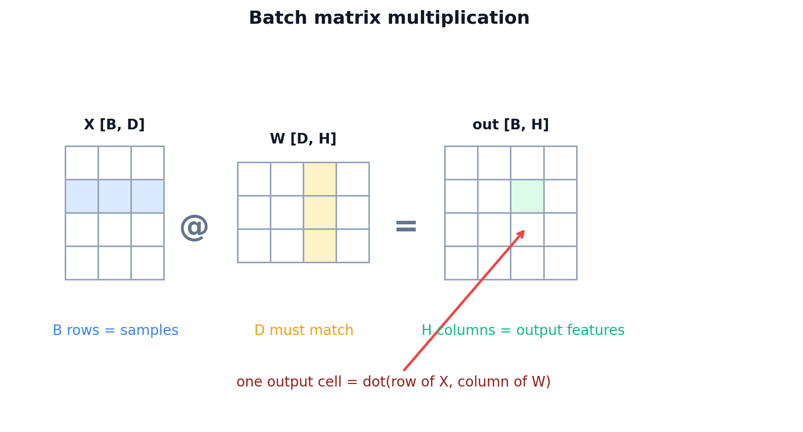

In deep learning code, "tensor" usually means a multidimensional array. A vector is a 1D tensor, a matrix is a 2D tensor, and a batch of images might be a 4D tensor like `[B, H, W, C]`. Arrays also need to be rectangular along each dimension: every row in a matrix must have the same number of columns, otherwise it is just a ragged Python list and not a useful numeric array.

Once the shapes are written this way, the next abstraction is almost forced: package `X @ W + b` into a reusable layer.

---

## Dense Layer

A Dense layer is the array version of many neurons sitting side by side. Every neuron receives the same input vector, but each neuron owns a different weight column and a different bias. The layer wraps `X @ W + b`, takes a batch of vectors, and projects each vector into a new feature space.

For the first pass, ignore gradients and look only at the forward computation.

```python
class Dense:
    def __init__(self, n_in, n_out, rng, init="xavier"):
        if init == "he":
            scale = np.sqrt(2.0 / n_in)
        elif init == "xavier":
            scale = np.sqrt(1.0 / n_in)
        else:
            raise ValueError(f"unknown init: {init}")

        self.W = rng.normal(0.0, scale, size=(n_in, n_out))
        self.b = np.zeros((1, n_out))

    def forward(self, x, training=True):
        return x @ self.W + self.b
```

For `B = 32`, `D = 2`, `H = 64`:

```text
x      [32, 2]
W      [2, 64]
b      [1, 64]
out    [32, 64]
```


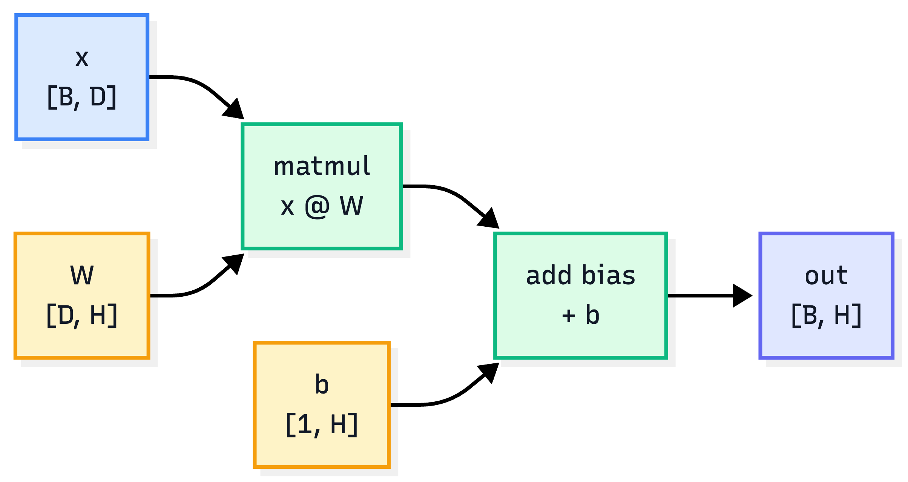
Caption: a Dense layer is just matrix multiplication plus a bias broadcast across the batch.

- **`n_in`** is the number of input features.
- **`n_out`** is the number of output features.
- **`W`** stores one column per output feature.
- **`b`** is broadcast across all rows in the batch.

The weight matrix shape is chosen so the forward pass does not need a transpose:

```text
X [B, D] @ W [D, H] -> out [B, H]
```

Some tutorials store weights as `[H, D]` and call `X @ W.T`. Both layouts represent the same math. This post stores weights as `[D, H]` because the forward pass reads directly as `X @ W + b`.

Weights start as small random numbers so neurons do not all behave identically. Biases usually start at zero because the weights already break symmetry; the bias can learn its offset later.

One Dense layer is already enough to build a linear classifier. Using the `Sequential` wrapper we define later, a `[B, 2]` input can map to 3 class scores:

```python
linear_model = Sequential([
    Dense(2, 3, np.random.default_rng(100), init="xavier"),
])
```

```text
X       [B, 2]
W       [2, 3]
b       [1, 3]
logits  [B, 3] = X @ W + b
```

The three output numbers are called **logits**. They are raw class scores, not probabilities. The predicted class is the index of the largest logit:

```python
preds = logits.argmax(axis=1)
```

That gives us the simplest classifier worth testing. Before adding hidden layers, we should see exactly where this linear model breaks.

---

## The First Target: Spiral Data

The Dense layer can produce class scores, but a toy classifier is only interesting if the data exposes its limits. Linear data can be fit by a straight line or a few straight decision regions. Spiral data is still easy to draw, but not easy for straight lines. Each sample is a 2D point, and the label is one of three spiral arms.

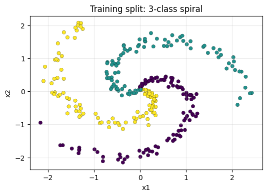

```python
def make_spiral(samples_per_class=120, n_classes=3, noise=0.20, seed=42):
    rng = np.random.default_rng(seed)
    X = np.zeros((samples_per_class * n_classes, 2), dtype=np.float64)
    y = np.zeros(samples_per_class * n_classes, dtype=np.int64)

    for class_id in range(n_classes):
        ix = slice(class_id * samples_per_class, (class_id + 1) * samples_per_class)
        r = np.linspace(0.0, 1.0, samples_per_class)
        t = np.linspace(class_id * 4.0, (class_id + 1) * 4.0, samples_per_class)
        t = t + rng.normal(0.0, noise, samples_per_class)
        X[ix] = np.c_[r * np.sin(t), r * np.cos(t)]
        y[ix] = class_id

    return X, y
```

The shapes are small:

```text
X       [360, 2]    # 360 points, each point has x1 and x2
y       [360]       # integer labels: 0, 1, 2
logits  [360, 3]    # one score per class
```

Read the plot literally: each dot is one training example, and the color is the label. The word "spiral" only describes the shape of the toy dataset. We use it because a straight line cannot separate the classes, but the data is still small enough to debug.

Each sample has two features:

```text
sample = [x1, x2]
target = class_id
```

The colors in the plot are only for us. The model does not see red, green, or blue. It only sees two coordinates and a target label like `0`, `1`, or `2`.

The one-layer linear model exposes the first failure mode:

```text
Linear model:
X [B, 2] -> Dense(2, 3) -> logits [B, 3]
```

With the notebook seed, the linear baseline reaches `48.6%` validation accuracy (`54.5%` train accuracy). It learns three broad regions split by straight lines, but the spiral needs a boundary that bends.

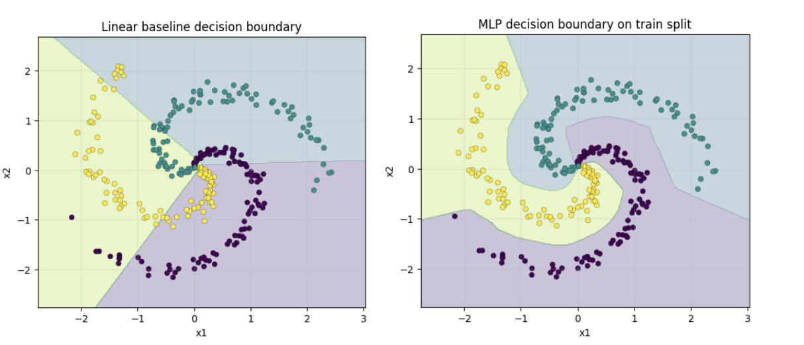

The important point: the linear baseline does not fail because the optimizer is bad. It fails because one Dense layer can only draw linear boundaries. A hidden layer gives the model more room, but only if we add something that prevents stacked Dense layers from collapsing back into one linear map.

---

## ReLU: Why Dense Layers Need an Activation

The spiral failure suggests adding a hidden layer. But adding another Dense layer by itself does not solve the problem, because two linear transformations in a row still collapse into one linear transformation.

```text
y = (X @ W1 + b1) @ W2 + b2
  = X @ (W1 @ W2) + (b1 @ W2 + b2)
  = X @ W' + b'
```

Without a nonlinearity, stacking Dense layers only creates a bigger linear model. ReLU breaks that collapse with one small function:

```python
class ReLU:
    def forward(self, x, training=True):
        self.mask = x > 0
        return np.maximum(0.0, x)

    def backward(self, dout):
        return dout * self.mask

    def parameters(self):
        return []
```

```text
ReLU(x) = max(0, x)
```

- **Forward**: positive values pass through, negative values become `0`.
- **Backward**: gradients pass only through positions that were positive during the forward pass.
- **Effect**: many ReLU units split the input space into small linear regions that can bend around the spiral.

The step function is the simplest "fire or do not fire" activation, but it throws away too much information: every positive input becomes the same `1`, and every negative input becomes the same `0`. ReLU keeps the useful part of that idea without collapsing all positive values together.

```text
step(-0.1) = 0      step(100.0) = 1
ReLU(-0.1) = 0      ReLU(100.0) = 100.0
```

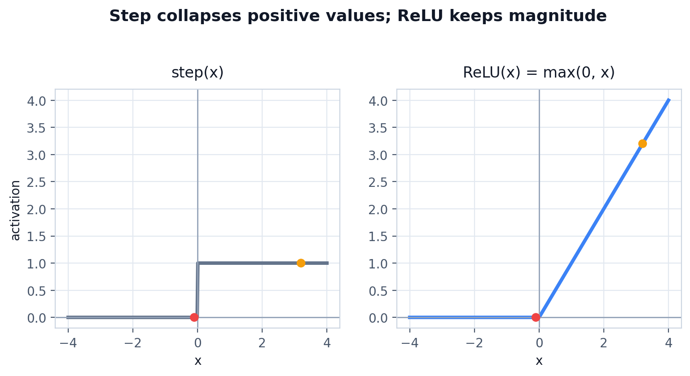
Step only says active or inactive. ReLU keeps the positive magnitude, which gives later layers more useful signal.

That difference matters for learning. A ReLU neuron has an activation region: inputs on one side of its threshold are silent, and inputs on the other side pass through with their size preserved. Many such regions can approximate a curved boundary with piecewise-linear segments.

Our main MLP only adds one hidden Dense layer and one ReLU:

```python
model = Sequential([
    Dense(2, 64, np.random.default_rng(101), init="he"),
    ReLU(),
    Dense(64, 3, np.random.default_rng(102), init="xavier"),
])
```

```text
X          [B, 2]
Dense1     [B, 64]
ReLU       [B, 64]
Dense2     [B, 3]
logits     [B, 3]
```

The first Dense layer creates 64 hidden features. ReLU gates those features. The second Dense layer mixes the gated features into 3 class scores.

ReLU gives the model the shape it was missing. The next problem is different: the model now returns three raw scores per point, so we need a clean way to read those scores as class predictions and training loss.

---

## Softmax: From Logits to Class Probabilities

The ReLU MLP ends with logits: raw class scores. For prediction, we only need the largest logit:

```python
def accuracy(model, X, y):
    logits = model.forward(X, training=False)
    preds = logits.argmax(axis=1)
    return (preds == y).mean()
```

Softmax is useful when we want class probabilities and a classification loss. It does two things:
1. Exponentiate logits so every value becomes positive.
2. Normalize each row so the values sum to 1.

```python
shifted = logits - logits.max(axis=1, keepdims=True)
exp_scores = np.exp(shifted)
probs = exp_scores / exp_scores.sum(axis=1, keepdims=True)
```

```text
logits  [B, C]
probs   [B, C]
y       [B]
```

Each row of `probs` sums to `1`. The largest probability points to the predicted class, but the probabilities also tell us how confident the model was.

```text
logits row:  [4.8, 1.2, 2.4]
softmax row: [0.90, 0.02, 0.08]
prediction:  class 0
```

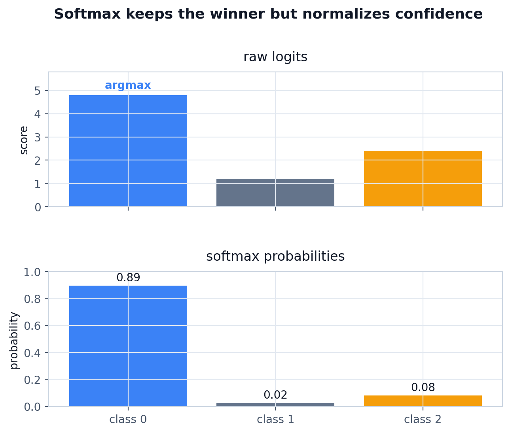
Softmax keeps the winning class the same, but converts raw scores into probabilities.

The exponential is monotonic: a larger logit still becomes a larger exponentiated value. That means softmax does not change which class wins; it changes raw scores into comparable confidence values.

Cross-entropy penalizes the model when the correct class gets low probability:

```python
correct_probs = probs[np.arange(len(y)), y]
loss = -np.log(correct_probs + 1e-12).mean()
```

For sparse labels, `y` contains class indices:

```text
probs:
  sample 0 -> [0.70, 0.10, 0.20]
  sample 1 -> [0.10, 0.50, 0.40]
  sample 2 -> [0.02, 0.90, 0.08]

y = [0, 1, 1]

correct_probs = [0.70, 0.50, 0.90]
losses = -log(correct_probs)
```

Cross-entropy only needs the probability assigned to the correct class. If the correct class gets probability near `1`, the loss is near `0`. If it gets probability near `0`, the loss becomes very large.

The subtraction in stable softmax is a numerical trick:

```text
softmax([1000, 1001, 1002])
== softmax([-2, -1, 0])
```

Softmax contains `exp`, so large logits can overflow. Subtracting the per-sample max keeps the numbers safe without changing the probabilities.

In the loss, we also clip or add a tiny epsilon around probabilities before `log`. The reason is practical: `-log(0)` is infinite, and one infinite value can ruin the whole training step.

Now we have a scalar loss. The loss tells us how wrong the model is; backpropagation tells us how each weight should move to reduce it.

---

## Backpropagation

The forward pass produced logits, and cross-entropy turned those logits into one loss number. Training needs the reverse path: how did each parameter affect that loss? A gradient is that sensitivity: if this weight moves a little, how does the loss move?

Start with a one-variable function:

```text
y = f(x)
```

The derivative tells us the slope at a point. For a line, the slope is constant. For a curve, the slope depends on where we measure it. In training, the "curve" is the loss as a function of every weight and bias in the model.

Neural networks have many parameters, so we need **partial derivatives**:

```text
dLoss/dW1    how much W1 affected the loss
dLoss/db1    how much b1 affected the loss
dLoss/dX     how much the layer input affected the loss
```

Backpropagation is chain rule bookkeeping. The model is a chain of functions:

```text
X -> Dense1 -> ReLU -> Dense2 -> SoftmaxCrossEntropy -> loss
```

```mermaid
graph LR
    X["X<br/>[B, 2]"] --> D1["Dense1<br/>[B, 64]"]
    D1 --> R["ReLU<br/>[B, 64]"]
    R --> D2["Dense2<br/>logits [B, 3]"]
    D2 --> L["SoftmaxCrossEntropy<br/>loss scalar"]
    L -. "dlogits [B, 3]" .-> D2B["Dense2.backward"]
    D2B -. "dhidden [B, 64]" .-> RB["ReLU.backward"]
    RB -. "dhidden [B, 64]" .-> D1B["Dense1.backward"]

    style X fill:#DBEAFE,stroke:#3B82F6,color:#111827
    style D1 fill:#DCFCE7,stroke:#10B981,color:#111827
    style R fill:#DCFCE7,stroke:#10B981,color:#111827
    style D2 fill:#DCFCE7,stroke:#10B981,color:#111827
    style L fill:#FEE2E2,stroke:#EF4444,color:#111827
    style D2B fill:#FEF3C7,stroke:#F59E0B,color:#111827
    style RB fill:#FEF3C7,stroke:#F59E0B,color:#111827
    style D1B fill:#FEF3C7,stroke:#F59E0B,color:#111827
```

Caption: forward values move left to right. Gradients start at the loss and move backward through the same layers in reverse order.

The gradient starts at the loss and moves backward through that chain. Each layer receives an incoming gradient, multiplies it by its local derivative, stores gradients for its own parameters, then returns the gradient for the previous layer.

That gives each layer two concrete jobs:

```text
1. Compute gradients for its own parameters.
2. Return the gradient for the layer before it.
```

In code, trainable arrays are easier to manage if each one stores both its value and gradient:

```python
class Parameter:
    """Trainable array plus its gradient."""

    def __init__(self, value):
        self.value = np.asarray(value, dtype=np.float64)
        self.grad = np.zeros_like(self.value)

    def zero_grad(self):
        self.grad.fill(0.0)
```

Now the Dense layer can cache its input during the forward pass and reuse it during the backward pass:

```python
class Dense:
    def __init__(self, n_in, n_out, rng, init="he"):
        if init == "he":
            scale = np.sqrt(2.0 / n_in)
        elif init == "xavier":
            scale = np.sqrt(1.0 / n_in)
        else:
            raise ValueError(f"unknown init: {init}")

        self.W = Parameter(rng.normal(0.0, scale, size=(n_in, n_out)))
        self.b = Parameter(np.zeros((1, n_out)))

    def forward(self, x, training=True):
        self.x = x
        return x @ self.W.value + self.b.value

    def backward(self, dout):
        self.W.grad[...] = self.x.T @ dout
        self.b.grad[...] = dout.sum(axis=0, keepdims=True)
        return dout @ self.W.value.T

    def parameters(self):
        return [self.W, self.b]
```

Shape view:

```text
Forward:
  x      [B, D]
  W      [D, H]
  b      [1, H]
  out    [B, H]

Backward:
  dout   [B, H]
  dW     [D, H] = x.T @ dout
  db     [1, H] = sum(dout over batch)
  dx     [B, D] = dout @ W.T
```

- **`dout`** is the gradient arriving from the next layer.
- **`W.grad`** has the same shape as `W.value`, because the optimizer updates every weight.
- **`b.grad`** sums over the batch because the same bias is broadcast to every sample.
- **`dx`** is not a parameter update. It is the gradient passed to the previous layer.

Why is `dW = x.T @ dout`? Each weight connects one input feature to one output neuron. For a batch, the gradient for that weight accumulates the product of:

```text
input feature value * incoming gradient for that neuron
```

Writing all those products at once gives:

```text
x.T    [D, B]
dout   [B, H]
dW     [D, H]
```

Why is `db = sum(dout)`? The same bias is added to every sample in the batch, so its total effect is the sum of all incoming gradients for that output neuron.

Why is `dx = dout @ W.T`? The previous layer needs to know how the current layer's output depends on its input. The weights tell us how strongly each input feature contributed to each output feature, so the gradient flows back through `W.T`.

For softmax plus cross-entropy, the gradient has a compact form:

```python
class SoftmaxCrossEntropy:
    def forward(self, logits, y):
        shifted = logits - logits.max(axis=1, keepdims=True)
        exp_scores = np.exp(shifted)
        self.probs = exp_scores / exp_scores.sum(axis=1, keepdims=True)
        self.y = y

        correct_probs = self.probs[np.arange(len(y)), y]
        return -np.log(correct_probs + 1e-12).mean()

    def backward(self):
        grad = self.probs.copy()
        grad[np.arange(len(self.y)), self.y] -= 1.0
        grad /= len(self.y)
        return grad
```

For one sample whose correct class is `2`:

```text
probs before: [0.70, 0.20, 0.10]
one_hot(y):   [0.00, 0.00, 1.00]
gradient:     [0.70, 0.20, -0.90]
```

Positive gradients on the wrong classes push those logits down. The negative gradient on the correct class pushes that logit up.

That compact gradient is the reason many implementations combine Softmax and Cross-Entropy into one class for backward. Calculating the Softmax Jacobian separately is possible, but the combined derivative simplifies to:

```text
dlogits = (probs - one_hot(y)) / batch_size
```

At this point each layer knows how to run forward and backward. The next piece is only plumbing: connect the layers so the whole model behaves like one object.

---

## Sequential: A Tiny Framework

The Dense and ReLU layers now share the same pattern: run forward, keep the state needed for backward, then send gradients back. The loss function will stay outside the model, and `Sequential` will connect the model layers into one object.

```python
class Sequential:
    def __init__(self, layers):
        self.layers = layers

    def forward(self, x, training=True):
        for layer in self.layers:
            x = layer.forward(x, training=training)
        return x

    def backward(self, grad):
        for layer in reversed(self.layers):
            grad = layer.backward(grad)
        return grad

    def parameters(self):
        params = []
        for layer in self.layers:
            params.extend(layer.parameters())
        return params

    def zero_grad(self):
        for param in self.parameters():
            param.zero_grad()
```

Forward goes left to right:

```text
X -> Dense1 -> ReLU -> Dense2 -> logits -> loss
```

Backward goes right to left:

```text
dlogits -> Dense2.backward -> ReLU.backward -> Dense1.backward
```

Layers with parameters expose `Parameter` objects to the optimizer. Layers without parameters, like ReLU, only pass gradients along.

After `backward`, every trainable parameter has a gradient. Those gradients still do nothing until an optimizer uses them to change the parameter values.

---

## Optimizer: SGD

Backpropagation computes gradients; SGD uses them. It does not need to know which layer a parameter came from. It only sees each `Parameter` and moves its `value` in the opposite direction of `grad`.

```python
class SGD:
    def __init__(self, lr=0.75):
        self.lr = lr

    def step(self, params):
        for param in params:
            param.value -= self.lr * param.grad
```

The word "descent" means we move downhill on the loss curve. If the gradient points in the direction where loss increases fastest, `-gradient` points toward lower loss.

Before gradients, one naive idea is random search: try random weights, keep them if loss improves, and repeat. That can work on tiny examples, but it scales terribly because a real network has thousands or millions of parameters. Gradients give direction instead of blind guessing.

The learning rate controls how large each update step is:

| `lr` | Typical behavior |
|---:|---|
| Too small | Loss decreases very slowly |
| About right | Loss decreases smoothly, accuracy rises |
| Too large | Loss jumps around or becomes `nan` |

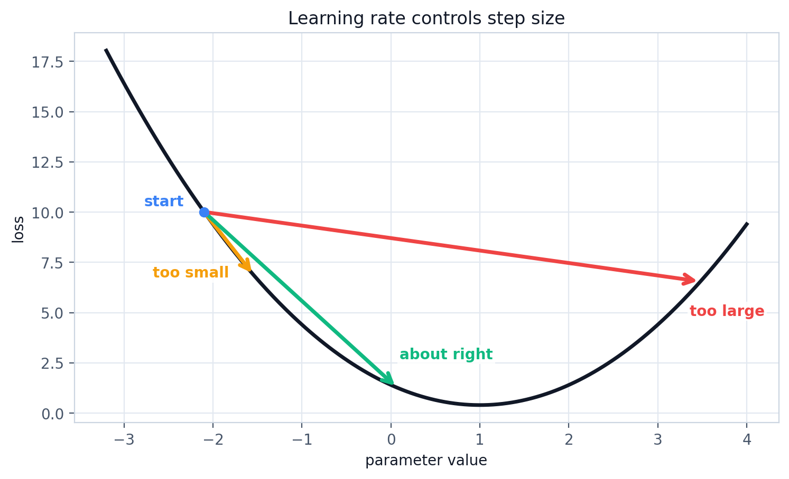
The gradient gives the downhill direction. The learning rate decides how far to step in that direction.

SGD optimizes loss, not accuracy directly. Accuracy can sometimes stay flat while loss improves because the model is becoming more confident on already-correct samples, or less wrong on hard samples, before enough predictions flip to change accuracy.

In the notebook, `lr = 0.75` works well for the small MLP on the spiral dataset with He initialization. If you change hidden size, noise, normalization, or batch size, the best learning rate can change too.

We now have every moving part: model, loss, gradients, and optimizer. The full training loop is just those parts in the right order.

---

## Training the MLP

All previous sections were pieces of this loop. Now they run together: forward pass, loss, backward pass, parameter update, then repeat.

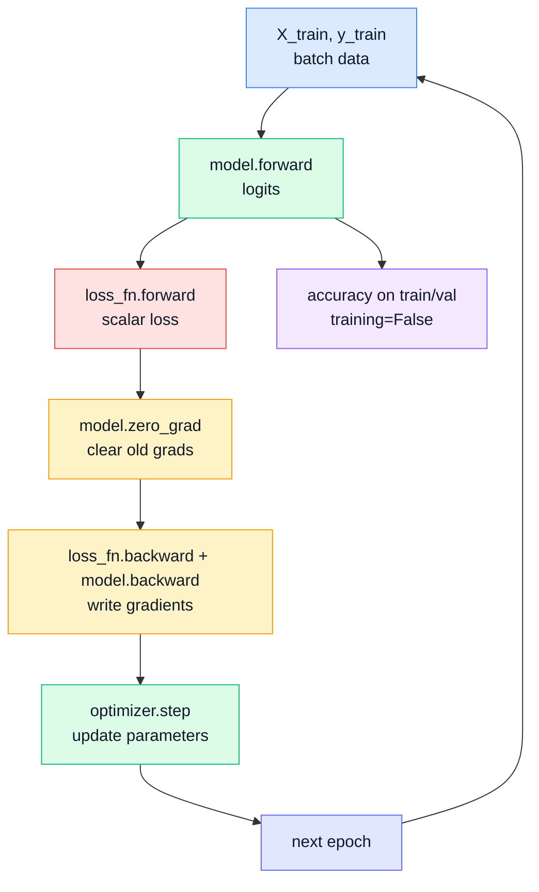

Caption: the training loop repeats the same sequence: predict, measure loss, clear gradients, backpropagate, update parameters, and evaluate without training-only behavior.

```python
loss_fn = SoftmaxCrossEntropy()
optimizer = SGD(lr=0.75)

for epoch in range(2001):
    logits = model.forward(X_train, training=True)
    loss = loss_fn.forward(logits, y_train)

    model.zero_grad()
    model.backward(loss_fn.backward())
    optimizer.step(model.parameters())

    if epoch % 100 == 0:
        train_acc = accuracy(model, X_train, y_train)
        val_acc = accuracy(model, X_val, y_val)
        print(epoch, loss, train_acc, val_acc)
```

One concrete pass:

```text
1. model.forward
   X_train [288, 2] -> logits [288, 3]

2. loss_fn.forward
   logits [288, 3] + y_train [288] -> scalar loss

3. loss_fn.backward
   scalar loss -> dlogits [288, 3]

4. model.zero_grad
   clear old gradients before writing new ones

5. model.backward
   dlogits -> dW2, db2, dW1, db1

6. optimizer.step
   W1, b1, W2, b2 move a little bit
```

One full pass over the training data is called an epoch. This notebook uses the whole training set in each update, which keeps the code simple. In larger training runs, the same logic usually runs on mini-batches:

```text
full-batch:  one update uses all training samples
mini-batch:  one update uses a smaller slice, like 32 or 128 samples
```

Mini-batches are faster on hardware and usually produce updates that generalize better than fitting one sample at a time.

After a few hundred epochs, loss drops clearly. With the notebook seed, the final MLP reaches `98.6%` validation accuracy and `99.7%` train accuracy. The number is not the main lesson; the decision boundary is.

The linear model creates hard straight boundaries. The MLP creates a piecewise-linear boundary with enough small pieces to wrap around the spiral. The network does not hard-code a curved formula; it learns to stitch many local linear maps together.

That result is good, but it is still only meaningful if the model works beyond the exact points it trained on.

---

## Validation Data and Test Data

The training loop can make training loss go down even when the model is memorizing. Low training loss does not guarantee the model learned the real pattern. That is why we split the data.

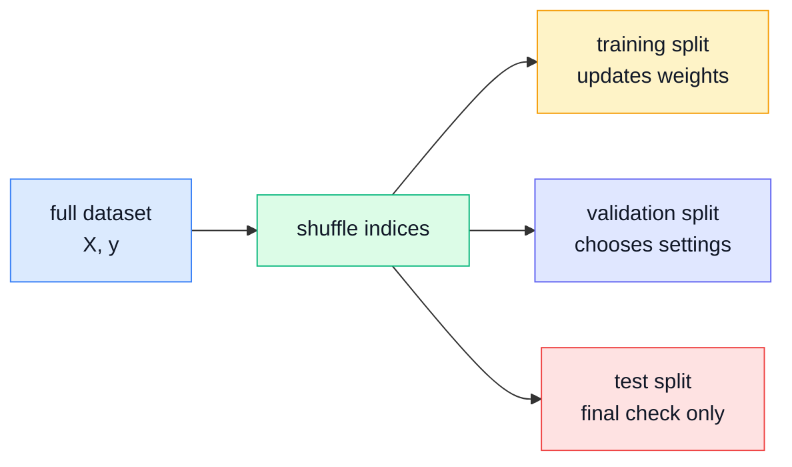

Caption: training data changes the parameters, validation data guides development choices, and test data should stay untouched until the end.

```python
def train_val_split(X, y, val_ratio=0.20, seed=7):
    rng = np.random.default_rng(seed)
    idx = rng.permutation(len(X))
    split = int((1.0 - val_ratio) * len(X))
    train_idx, val_idx = idx[:split], idx[split:]
    return X[train_idx], y[train_idx], X[val_idx], y[val_idx]
```

```text
Training data    used to update weights
Validation data  used to check choices during development
Test data        used once at the end
```

For this small post, the notebook uses a train/validation split. In a larger project, keep a separate test set untouched until the final evaluation.

The reason for the split is not ceremony. A large enough network can memorize the exact training points. On the training scatter plot, that can look impressive. On new points from the same distribution, the decision boundary may fail because it learned the accidents of the training sample rather than the rule behind the data.

Overfitting looks like this:

```text
train loss keeps going down
train accuracy keeps going up
validation accuracy stops improving or drops
```

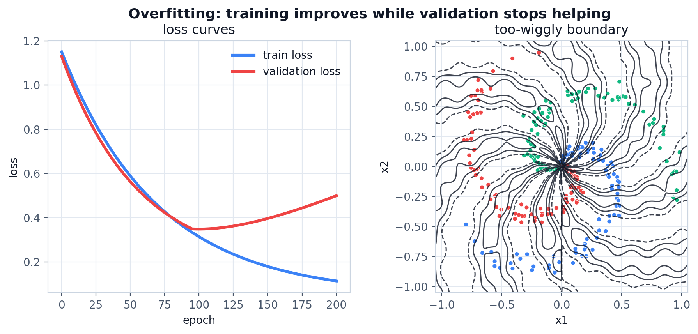
Overfitting often looks good on training data while validation performance stops improving.

When splitting data, avoid leakage. For ordinary shuffled tabular data, random splitting may be fine. For time-series data, random splitting can be misleading because neighboring timestamps can be almost identical. In that case, hold out whole time blocks so validation really means "future or unseen conditions."

The model is not done when it fits the training data. It is done when it also works on data it did not train on.

When validation performance starts to lag behind training performance, the next question is how to reduce memorization without removing the model's ability to learn.

---

## Generalization: L1, L2, and Dropout

Validation data tells us when the model is overfitting. Regularization is one way to respond: it adds pressure against memorization while keeping the same forward/backward/optimizer structure.

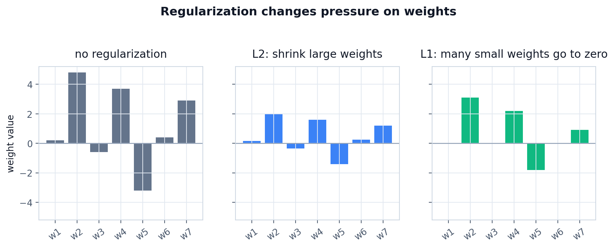
Regularization changes the pressure on weights, not the basic training loop.

L2 regularization penalizes large weights. It adds a second term to the loss:

```python
data_loss = loss_fn.forward(logits, y_train)
l2_loss = lambda_l2 * np.sum(W * W)
loss = data_loss + l2_loss
```

The square matters. A weight of `10` gets penalized much more than a weight of `1`, so L2 discourages the model from leaning too hard on a few large parameters.

The backward contribution is simple:

```text
dW += 2 * lambda_l2 * W
```

L1 regularization penalizes absolute weight size:

```python
data_loss = loss_fn.forward(logits, y_train)
l1_loss = lambda_l1 * np.sum(np.abs(W))
loss = data_loss + l1_loss
```

L1 pushes small weights toward exactly zero more aggressively than L2. That can make the model sparse, but it is less common to use L1 alone for basic neural networks.

The backward contribution is based on the sign of the weight:

```text
dW += lambda_l1 * sign(W)
```

Dropout attacks memorization differently. It randomly zeroes part of an activation during training so the model cannot depend too heavily on a few hidden units:

```python
class Dropout:
    def __init__(self, p=0.1, rng=None):
        if not 0.0 <= p < 1.0:
            raise ValueError("p must be in [0, 1).")
        self.p = p
        self.rng = rng or np.random.default_rng()

    def forward(self, x, training=True):
        if not training or self.p == 0:
            self.mask = np.ones_like(x)
            return x

        keep_prob = 1.0 - self.p
        self.mask = (self.rng.random(x.shape) < keep_prob) / keep_prob
        return x * self.mask

    def backward(self, dout):
        return dout * self.mask

    def parameters(self):
        return []
```

The division by `keep_prob` is inverted dropout. If we keep only `90%` of activations, the kept activations are scaled up by `1 / 0.9` so the expected activation size stays roughly the same. That lets evaluation skip dropout entirely.

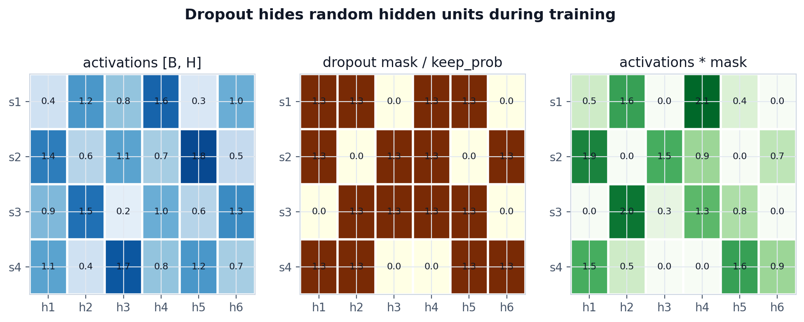
Dropout randomly hides some hidden activations during training, so the model cannot rely on the same units every time.

The important gotcha: dropout is on during training and off during evaluation. If you forget `training=False` during evaluation, accuracy becomes noisy because every evaluation uses a different mask.

By now the model has enough moving parts that most bugs are no longer syntax bugs. They are shape, order, or training-mode bugs.

---

## Common Bugs

- Forgetting to divide the gradient by batch size in `SoftmaxCrossEntropy.backward`.
- Writing `dW = dout @ x.T` instead of `dW = x.T @ dout`.
- Summing softmax over the wrong axis. For class probabilities, each sample row should sum to `1`.
- Broadcasting bias correctly in forward but forgetting `keepdims=True` for `db`.
- Returning `dout @ W` instead of `dout @ W.T` from `Dense.backward`.
- Calling `optimizer.step()` before the full backward pass.
- Using dropout during evaluation because `training=False` was missing.
- Computing softmax before argmax for accuracy. It is not wrong, but it is unnecessary.

Most of these mistakes come from losing track of the same three things: shapes, gradient flow, and whether the model is training or evaluating.

---

## Key Takeaway

The full model looks larger than the first neuron, but it is built from the same idea repeated carefully. At the basic level, a neural network is not a black box. In this post, the whole model is a few NumPy matrices, a ReLU mask, a stable softmax, and an SGD loop.

```text
Neural network =
  linear projections
  + nonlinear activations
  + a loss function
  + backpropagation
  + an optimizer
```

Frameworks like PyTorch automate backward passes and parameter management, but the learning logic is still this loop: predict, measure the error, send the error backward, and update the parameters.

## References

- CS231n, [Neural Network Case Study](https://cs231n.github.io/neural-networks-case-study/) - spiral dataset and a 2-layer neural network, excellent for a first lesson.
- Harrison Kinsley and Daniel Kukiela, [Neural Networks from Scratch in Python](Neural%20Networks%20from%20Scratch%20in%20Python.pdf) - the local PDF used for the neuron, Dense layer, activation, loss, optimizer, backpropagation, and regularization explanations.
- NumPy Tutorials, [Deep learning on MNIST](https://numpy.org/numpy-tutorials/tutorial-deep-learning-on-mnist/) - an MLP-from-scratch example on MNIST.
- Karpathy, [micrograd](https://github.com/karpathy/micrograd) - a tiny scalar autograd engine, good for a longer session on computational graphs.
