# Attention Variants: From Self-Attention to GQA, MLA, SWA, and Beyond

*Building every major attention mechanism from scratch in PyTorch*

## Introduction

Scaled dot-product attention — `softmax(Q @ K.T / sqrt(d_k)) @ V` — shipped in 2017 and every LLM since runs on variants of it. The equation stayed the same; the bottlenecks changed. KV cache explodes with long contexts, quadratic cost kills throughput, training becomes unstable at 8B+ scale.

Six efficiency variants solve these bottlenecks: **GQA**, **MLA**, **SWA**, **NSA**, **Gated Attention**, and **Hybrid Attention**. Each modifies the four foundation mechanisms — Self-Attention, MHA, Causal, and Cross-Attention — covered in the [previous post](https://david-hoangt.github.io/posts/2026-03-30-self-attn/).

Same running example throughout: *"The CEO announced record earnings on Friday"* — 7 tokens, `d_model = 64`.

---

## Quick Recap: The Four Foundations

Full deep-dive with implementations in the [previous post](https://david-hoangt.github.io/posts/2026-03-30-self-attn/). Here's what you need to follow the variants:

- **Self-Attention** — `softmax(Q @ K.T / sqrt(d_k)) @ V`. Project each token into Q, K, V, compute pairwise relevance, weighted sum of values. `O(n^2 * d)` cost.
- **Multi-Head Attention (MHA)** — `Concat(head_1, ..., head_h) @ W_O`. Run **h** parallel heads in `d_k = d_model / h` subspaces. Same compute, richer representations.
- **Causal Self-Attention** — add `-inf` to future positions before softmax → lower-triangular matrix. Enables autoregressive generation. The causal constraint makes KV caching safe: past keys/values never change, so cache them to avoid recomputation.
- **Cross-Attention** — Q from one sequence, K/V from another → rectangular `n x m` matrix. Standard for multimodal; replaced by concatenation in text-only LLMs.

Every variant below modifies one of these four to solve a specific bottleneck: KV cache memory, sequence length scaling, training stability, or compute allocation.

---

## Grouped-Query Attention (GQA)

MHA stores separate K and V tensors for every head. The KV cache scales as `2 * n_layers * n_heads * T * d_k` — for LLaMA 3 8B (32 layers, 32 heads, d_k=128) that's ~4 GB at 8K tokens and **~67 GB at 128K** in float16 (GB = 10⁹ bytes throughout this post). Serving a single user burns an entire GPU's memory on cached keys and values. Can we share some of the K/V work across heads without collapsing to a single pattern?

Ainslie et al. at Google Research answered this in *"GQA: Training Generalized Multi-Query Transformer Models from Multi-Head Checkpoints"* ([EMNLP 2023](https://arxiv.org/abs/2305.13245)). The idea: group query heads into clusters that share a single K/V head. Instead of `n_heads` independent K/V projections, use `n_kv_heads` — cutting cache by a factor of `n_heads / n_kv_heads`.

```
GQA: n_kv_heads < n_heads, each KV head shared by (n_heads / n_kv_heads) query heads
```

## The Sharing Mechanism

MHA stores 4 separate K/V heads for our 4-head example — but "CEO" and "announced" don't need 4 independent key representations to be found. What if heads share K/V projections?

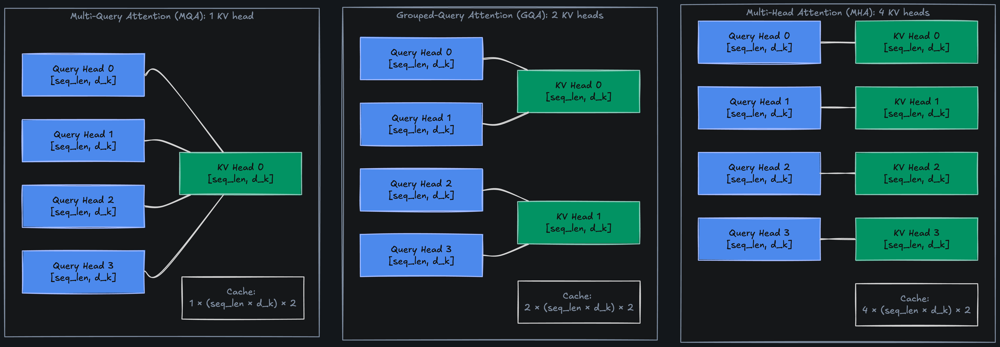

- **4 query heads, 2 KV heads** — each KV head serves a group of 2 query heads
- **KV cache cut in half**: only 2 K/V pairs cached instead of 4
- **Each query head keeps its own W_Q** — diversity preserved where it matters

With `d_model = 64`, `n_heads = 4`, `d_k = 16`, GQA with `n_kv_heads = 2` groups heads into pairs:

```
Query heads:  [Q_0, Q_1, Q_2, Q_3]    — 4 independent query projections
KV heads:     [KV_0,      KV_1     ]    — 2 shared KV projections
Mapping:       Q_0, Q_1 -> KV_0         — heads 0,1 share K_0, V_0
               Q_2, Q_3 -> KV_1         — heads 2,3 share K_1, V_1
```

- **group_size** = `n_heads / n_kv_heads` = 4 / 2 = 2 query heads per KV head
- **KV cache reduction** = 2x (only 2 KV heads cached instead of 4)
- **Query diversity preserved** — each query head still has its own W_Q projection

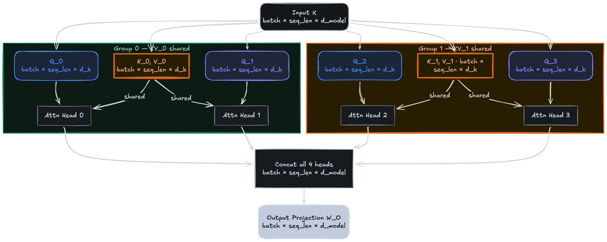

## The Spectrum: MHA → GQA → MQA

GQA is a continuum between MHA and Multi-Query Attention (MQA):

- **MHA** — `n_kv_heads = n_heads`. Every head has its own K/V. Maximum quality, maximum cache
- **GQA** — `1 < n_kv_heads < n_heads`. Groups share K/V. Tunable quality/cache trade-off
- **MQA** — `n_kv_heads = 1`. All heads share one K/V pair. Minimum cache, some quality loss

```
                MHA (n_kv=32)          GQA (n_kv=8)          MQA (n_kv=1)
KV cache:       32 * T * d_k * 2      8 * T * d_k * 2       1 * T * d_k * 2
LLaMA 3 8B:     ~67 GB @ 128k         ~17 GB @ 128k         ~2 GB @ 128k
Quality:        Baseline               ~Baseline              Slight degradation
```

The original paper evaluated this at T5 XXL scale — GQA-8 closed nearly all the quality gap vs. MHA (47.1 vs. 47.2 ROUGE-1 on CNN/DailyMail, 81.6 vs. 81.9 TriviaQA F1) while running ~5x faster (0.28s vs. 1.51s per sample). MQA was marginally faster (0.24s) but showed noticeable quality degradation (46.6 ROUGE-1) that GQA avoids.

## Implementation Detail: expand vs. repeat_interleave

The key implementation choice: how to broadcast `n_kv_heads` K/V tensors to `n_heads` query heads. Two approaches yield identical results:

```
# Option 1: expand (no memory copy, just a view)
K = K_kv[:, :, None, :, :].expand(-1, -1, group_size, -1, -1).reshape(B, n_heads, T, d_k)

# Option 2: repeat_interleave (explicit copy)
K = K_kv.repeat_interleave(group_size, dim=1)    # [batch, n_heads, seq_len, d_k]
```

- `expand` creates a view with no memory copy — more efficient during training
- `repeat_interleave` copies the data — simpler to reason about, same result

## Gotchas and Trade-offs

- **n_heads must be divisible by n_kv_heads** — otherwise grouping is uneven
- **Quality is surprisingly robust**: GQA-8 (LLaMA 3's config) matches MHA on most benchmarks while cutting KV cache 4x
- **Doesn't reduce compute** — same number of attention operations; only memory for cached K/V shrinks
- **Uptraining from MHA to GQA**: mean-pool K/V weights within each group, fine-tune for 5% of pre-training steps (Ainslie et al., 2023)

## Example Architectures

- **LLaMA 3 8B** — 32 query heads, 8 KV heads (group_size = 4)
- **Mistral 7B** — 32 query heads, 8 KV heads
- **Gemma 2** — 16 query heads, 8 KV heads (group_size = 2)

## Implementation from Scratch

```python
class GroupedQueryAttention(nn.Module):
    def __init__(self, d_model: int, n_heads: int, n_kv_heads: int):
        super().__init__()
        self.n_heads = n_heads
        self.n_kv_heads = n_kv_heads
        self.d_k = d_model // n_heads
        self.group_size = n_heads // n_kv_heads
        self.W_q = nn.Linear(d_model, n_heads * self.d_k, bias=False)
        self.W_k = nn.Linear(d_model, n_kv_heads * self.d_k, bias=False)
        self.W_v = nn.Linear(d_model, n_kv_heads * self.d_k, bias=False)
        self.W_o = nn.Linear(n_heads * self.d_k, d_model, bias=False)

    def forward(self, x: torch.Tensor, mask=None):
        B, T, _ = x.shape
        Q = self.W_q(x).view(B, T, self.n_heads, self.d_k).transpose(1, 2)       # (B, n_heads, T, d_k)
        K = self.W_k(x).view(B, T, self.n_kv_heads, self.d_k).transpose(1, 2)    # (B, n_kv_heads, T, d_k)
        V = self.W_v(x).view(B, T, self.n_kv_heads, self.d_k).transpose(1, 2)
        K = K.repeat_interleave(self.group_size, dim=1)  # (B, n_heads, T, d_k)
        V = V.repeat_interleave(self.group_size, dim=1)
        scores = torch.matmul(Q, K.transpose(-2, -1)) / math.sqrt(self.d_k)
        if mask is not None:
            scores = scores.masked_fill(mask, float("-inf"))
        weights = F.softmax(scores, dim=-1)               # (B, n_heads, T, T)
        context = torch.matmul(weights, V)                 # (B, n_heads, T, d_k)
        context = context.transpose(1, 2).contiguous().view(B, T, -1)
        return self.W_o(context), weights
```

Run the full implementation with shape checks and KV cache comparison in the [attention variants notebook](https://github.com/david-hoangt/llm_from_scratch/blob/main/attention/4.%20attention_variants.ipynb).

## Key Takeaways

GQA shares K/V heads across groups of query heads — cutting KV cache by `n_heads / n_kv_heads` with minimal quality loss. The standard choice for modern open-weight LLMs.

DeepSeek looked at this and asked a different question: why cache full-dimensional vectors at all?

---

## Multi-Head Latent Attention (MLA)

GQA reduces KV cache by sharing heads. DeepSeek took a different approach entirely in *"DeepSeek-V2"* ([May 2024](https://arxiv.org/abs/2405.04434)): compress K and V into a low-rank latent *before* caching, then decompress during attention. Instead of caching `n_kv_heads` full-dimensional vectors, cache one small latent per position — achieving a **93.3% KV cache reduction** compared to their prior DeepSeek 67B model, with no quality loss.

```
c = X @ W_down                     # compress: [batch, seq_len, d_latent]
K = c @ W_up_K                     # decompress for K: [batch, seq_len, n_heads * d_k]
V = c @ W_up_V                     # decompress for V: [batch, seq_len, n_heads * d_v]
```

- **W_down** `[d_model, d_latent]` — Down-projection into latent bottleneck
- **d_latent** `<< d_model` — The compression dimension (e.g., 512 vs 4096)
- **W_up_K, W_up_V** `[d_latent, n_heads * d_k]` — Up-project back to full K/V
- **Cache** stores only `c` at `[batch, seq_len, d_latent]` — not the full K and V

In our running example, each of the 7 tokens has a 64-dim embedding. With `d_latent = 16`:

- **W_down** compresses each token from 64 → 16 dimensions — "announced" becomes a 16-dim latent capturing its key/value essence
- **W_up_K / W_up_V** decompress back to 64 dims when attention is computed
- **Cache**: 7 latent vectors (7 × 16 = 112 elements) instead of full K + V (7 × 64 × 2 = 896) — **8x reduction**

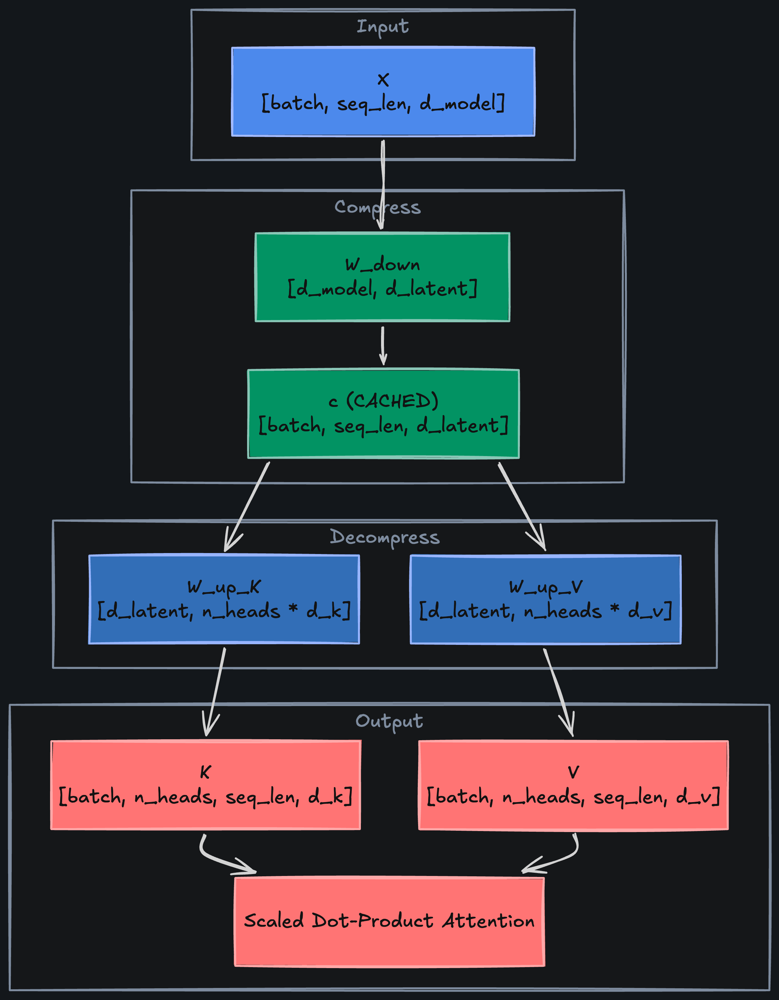

## Cache Comparison

How much does this actually save? Compare the three approaches for a 32-layer model with `d_model = 4096`, `d_k = 128`, `T = 128k` in float16:

```
MHA (32 heads):     2 * 32 * 32 * 128k * 128 * 2 bytes  = ~67 GB
GQA (8 KV heads):   2 * 32 *  8 * 128k * 128 * 2 bytes  = ~17 GB
MLA (d_latent=512):  1 * 32 *  1 * 128k * 512 * 2 bytes  = ~4 GB
```

- **MLA caches one vector per position per layer** — no per-head duplication
- **Compression ratio** = `d_model / d_latent`. With `d_latent = 512` and `d_model = 4096`: 8x compression
- **Concrete per-token cache**: ~1.15 kB (MLA) vs. ~81.92 kB (MHA) — roughly 70x smaller, as reported in the DeepSeek-V2 paper for their 236B MoE model (21B active params, 128K context)
- **Trade-off**: the up-projection adds FLOPs during attention, but memory is the bottleneck at inference

## The Absorption Trick

DeepSeek V2/V3 absorb `W_up_K` into the query projection to avoid materializing K entirely during inference. The math:

```
score = Q @ K.T = (X_q @ W_Q) @ (c @ W_up_K).T
      = X_q @ W_Q @ W_up_K.T @ c.T
      = X_q @ W_absorbed @ c.T
```

- **W_absorbed** = `W_Q @ W_up_K.T` — precomputed once
- **At inference**: compute `Q_absorbed = X_q @ W_absorbed`, then dot with cached `c` directly
- Eliminates the K up-projection entirely during generation

Note: absorption only works for the non-RoPE portion of the key. The positional part (`qk_rope_head_dim = 64`) bypasses the latent and carries RoPE separately — absorbing through RoPE would break its relative-position property.

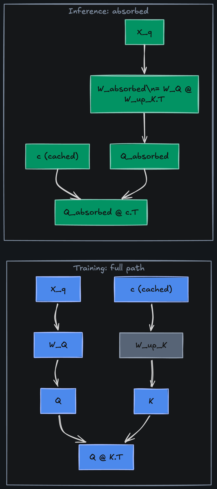

## Gotchas and Trade-offs

- **Latent dimension is a hyperparameter** — too small and you lose quality, too large and you lose the cache benefit
- **RoPE compatibility**: positional encodings can't go through the bottleneck — RoPE's relative-position property would break the absorption trick. DeepSeek splits each key into a non-positional part (`qk_nope_head_dim = 128`, from the latent) and a small positional part (`qk_rope_head_dim = 64`) that carries RoPE separately
- **Extra compute at training time** from the up/down projections — but inference memory is the bottleneck MLA targets
- **Not yet widely adopted** outside DeepSeek — GQA remains the default elsewhere

## Example Architectures

- **DeepSeek V2** — introduced MLA with `kv_lora_rank = 512` for a 236B MoE model
- **DeepSeek V3** — refined MLA with decoupled RoPE, `kv_lora_rank = 512`

## Implementation from Scratch

```python
class MultiHeadLatentAttention(nn.Module):
    def __init__(self, d_model: int, n_heads: int, d_latent: int):
        super().__init__()
        self.n_heads = n_heads
        self.d_k = d_model // n_heads
        self.W_q = nn.Linear(d_model, n_heads * self.d_k, bias=False)
        self.W_down = nn.Linear(d_model, d_latent, bias=False)       # compress
        self.W_up_k = nn.Linear(d_latent, n_heads * self.d_k, bias=False)  # decompress K
        self.W_up_v = nn.Linear(d_latent, n_heads * self.d_k, bias=False)  # decompress V
        self.W_o = nn.Linear(n_heads * self.d_k, d_model, bias=False)

    def forward(self, x: torch.Tensor, mask=None):
        """Training path — explicit up-projection for K and V.
        At inference, absorb W_up_K into W_Q (see Absorption Trick above)
        to skip the K up-projection entirely."""
        B, T, _ = x.shape
        Q = self.W_q(x).view(B, T, self.n_heads, self.d_k).transpose(1, 2)  # (B, n_heads, T, d_k)
        c = self.W_down(x)          # (B, T, d_latent) — THIS gets cached
        K = self.W_up_k(c).view(B, T, self.n_heads, self.d_k).transpose(1, 2)
        V = self.W_up_v(c).view(B, T, self.n_heads, self.d_k).transpose(1, 2)
        scores = torch.matmul(Q, K.transpose(-2, -1)) / math.sqrt(self.d_k)
        if mask is not None:
            scores = scores.masked_fill(mask, float("-inf"))
        weights = F.softmax(scores, dim=-1)
        context = torch.matmul(weights, V)
        context = context.transpose(1, 2).contiguous().view(B, T, -1)
        return self.W_o(context), weights
```

Run the full implementation with cache comparison in the [attention variants notebook](https://github.com/david-hoangt/llm_from_scratch/blob/main/attention/4.%20attention_variants.ipynb).

## Key Takeaways

MLA compresses K/V into a low-rank latent before caching — one small vector per position instead of per-head K and V tensors. Dramatically smaller KV cache at the cost of extra projection compute.

GQA and MLA both shrink what gets cached. Neither touches how many tokens get attended to — and at 128K tokens, most of that long-range attention is noise. Empirically, local context dominates in the majority of layers.

---

## Sliding Window Attention (SWA)

In a 128k-token document, does token 100,000 really need to attend to token 5? For most layers, local context dominates. The Longformer (Beltagy et al., [2020](https://arxiv.org/abs/2004.05150)) first proved this for encoders, combining sliding windows with task-specific global tokens to set SOTA on WikiHop and TriviaQA. Three years later, Mistral 7B (Jiang et al., [Oct 2023](https://arxiv.org/abs/2310.06825)) brought the idea to decoder-only LLMs — and **outperformed LLaMA 2 13B across all benchmarks with 46% fewer parameters**. SWA replaces the full `n x n` attention matrix with a band of width `w`.

```
SWA: token i attends only to tokens max(0, i - w + 1) ... i
```

- **w** — window size (e.g., 4096)
- **Attention matrix** — band-diagonal instead of full lower-triangle
- **Complexity** — `O(n * w)` instead of `O(n^2)` — linear in sequence length when `w` is fixed

With `w = 3` on our 7-token sentence, "Friday" (position 6) attends to ["earnings", "on", "Friday"] — positions 4, 5, 6. It cannot see "The" or "CEO" directly. But stack two SWA layers and "Friday" reaches "CEO" transitively: layer 1 lets "record" (position 3) see "CEO" (position 1), and layer 2 lets "Friday" attend to "record"'s updated representation.

![SWA drops long-range attention (red) — 'Friday' sees only ['earnings', 'on', 'Friday'], not 'The' or 'CEO'.](asset/swa.png)

## How Information Propagates

A single SWA layer has receptive field `w`. But stack `L` layers and the effective receptive field grows to `L * w`. With `w = 4096` and `L = 32`: effective range of 131,072 tokens — information hops across layers.

```
Layer 1:  token i sees [i-w+1, ..., i]
Layer 2:  token i sees [i-2w+1, ..., i]  (via layer 1's outputs)
Layer L:  token i sees [i-Lw+1, ..., i]  (transitively)
```

This is the key insight: SWA doesn't limit the model to local context — it limits *per-layer* attention while allowing multi-hop propagation across layers.

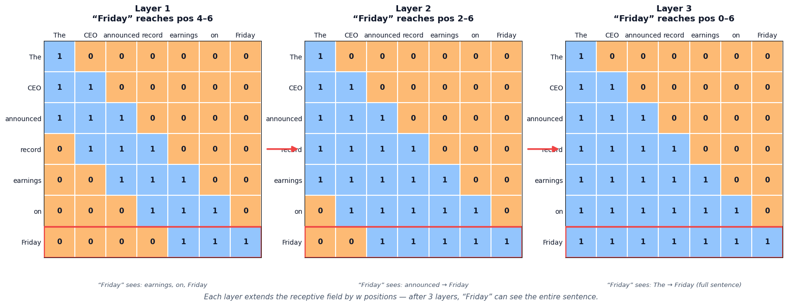

## The Hybrid Pattern: SWA + Global Layers

Pure SWA works for most layers, but some positions genuinely need global context. One solution: interleave SWA layers with occasional full-attention layers.

```
Gemma 2 pattern:
Layers 0-3:   SWA (w=4096)
Layer 4:       Full causal attention
Layers 5-8:   SWA (w=4096)
Layer 9:       Full causal attention
...
```

- **SWA layers** — fast, local context, `O(n * w)` per layer
- **Global layers** — full `O(n^2)` attention, but only every k-th layer
- **Overall cost** — much less than all-global, much more expressive than all-SWA

Mistral 7B uses pure SWA on all layers with `w = 4096` and a rolling buffer KV cache (`position mod w`), relying on multi-hop propagation for long-range context. This gives **8x cache reduction** for 32K sequences and **2x speed** on 16K sequences via modified FlashAttention. Gemma 2 takes the hybrid approach above, alternating SWA and global layers.

```
Mistral 7B vs. LLaMA 2:
MMLU:       60.1%  vs  44.4% (7B) / 55.6% (13B)
HumanEval:  30.5%  vs  11.6% (7B) / 18.9% (13B)
GSM8K:      52.2%  vs  16.0% (7B) / 34.3% (13B)
```

## Gotchas and Trade-offs

- **Window size is a hyperparameter** — too small and multi-hop propagation can't bridge distant dependencies; too large and you lose the efficiency benefit
- **KV cache is bounded**: only `w` past entries per layer, not the full sequence — enables infinite-length generation with fixed memory
- **Not compatible with standard Flash Attention** without modification — requires block-sparse or custom kernels
- **Attention sink still matters**: the first token often falls outside the window for later positions, so some implementations pin it (SWA + sink token)

## Example Architectures

- **Mistral 7B** — pure SWA with `w = 4096`, rolling buffer cache, all layers windowed
- **Gemma 2** — alternating SWA and global attention layers
- **Qwen 2.5** — SWA in selected layers

## Implementation from Scratch

```python
class SlidingWindowAttention(nn.Module):
    def __init__(self, d_model: int, n_heads: int, window_size: int):
        super().__init__()
        self.n_heads = n_heads
        self.d_k = d_model // n_heads
        self.window_size = window_size
        self.W_q = nn.Linear(d_model, n_heads * self.d_k, bias=False)
        self.W_k = nn.Linear(d_model, n_heads * self.d_k, bias=False)
        self.W_v = nn.Linear(d_model, n_heads * self.d_k, bias=False)
        self.W_o = nn.Linear(n_heads * self.d_k, d_model, bias=False)

    def forward(self, x: torch.Tensor):
        B, T, _ = x.shape
        Q = self.W_q(x).view(B, T, self.n_heads, self.d_k).transpose(1, 2)
        K = self.W_k(x).view(B, T, self.n_heads, self.d_k).transpose(1, 2)
        V = self.W_v(x).view(B, T, self.n_heads, self.d_k).transpose(1, 2)
        scores = torch.matmul(Q, K.transpose(-2, -1)) / math.sqrt(self.d_k)
        # Causal + window mask: block future AND positions beyond w
        causal = torch.triu(torch.ones(T, T, dtype=torch.bool), diagonal=1)
        window = torch.tril(torch.ones(T, T, dtype=torch.bool), diagonal=-(self.window_size))
        scores = scores.masked_fill(causal | window, float("-inf"))
        weights = F.softmax(scores, dim=-1)               # (B, n_heads, T, T)
        context = torch.matmul(weights, V)
        context = context.transpose(1, 2).contiguous().view(B, T, -1)
        return self.W_o(context), weights
```

Run the full implementation with mask visualization in the [attention variants notebook](https://github.com/david-hoangt/llm_from_scratch/blob/main/attention/4.%20attention_variants.ipynb).

## Key Takeaways

SWA replaces the full `n x n` attention matrix with a band of width `w` — `O(n * w)` per layer, linear when `w` is fixed. Information propagates globally through layer stacking. Bounded KV cache enables fixed-memory generation.

The window is the same for every token, every layer, every input. "Friday" at position 100,000 gets the same 4,096-token neighborhood whether it needs to reference "announced" 50K tokens back or not. A fixed window can't distinguish "this token needs long-range context" from "this token is fine with local."

---

## Native Sparse Attention (NSA)

SWA uses a fixed window — every token gets the same local context regardless of content. But "Friday" at position 100,000 might need to reference "announced" 50k tokens back, while most tokens only need their neighbors. DeepSeek's Native Sparse Attention (Yuan, Gao, Dai et al., [Feb 2025](https://arxiv.org/abs/2502.11089)) lets the model *learn* which tokens to attend to — sparse attention trained natively **matches or exceeds full dense attention** while delivering 6-11x speedups.

```
NSA: three parallel attention paths combined
  1. Compressed global — coarse summary of all tokens via block-mean pooling
  2. Selected sparse — top-k most relevant tokens per query, chosen by a lightweight scorer
  3. Sliding window — local context, same as SWA
```

## The Three Paths

Instead of one attention matrix, NSA runs three parallel attention paths and combines their outputs with a learned gate:

```
output = g_cmp * Attn_compressed + g_sel * Attn_selected + g_swa * Attn_sliding
```

- **Compressed global** — pool every `b` tokens into one summary vector, attend to the `T/b` summaries. Cost: `O(n * n/b)`. Captures document-level context cheaply
- **Selected sparse** — a lightweight "scorer" head picks the top-k most relevant blocks per query, then run full attention only on those blocks. Cost: `O(n * k)`. Captures precise long-range dependencies
- **Sliding window** — standard SWA with window `w`. Cost: `O(n * w)`. Captures local syntax and semantics

Picture our 7-token sentence repeated to fill a 4096-token document. When "announced" at position 3000 computes attention:

- **Compressed path** — gives a coarse overview of the entire document
- **Selected path** — scores blocks, finds the block containing "CEO" is highly relevant, pulls it in for full attention
- **Sliding window** — handles local syntax around "announced record earnings"

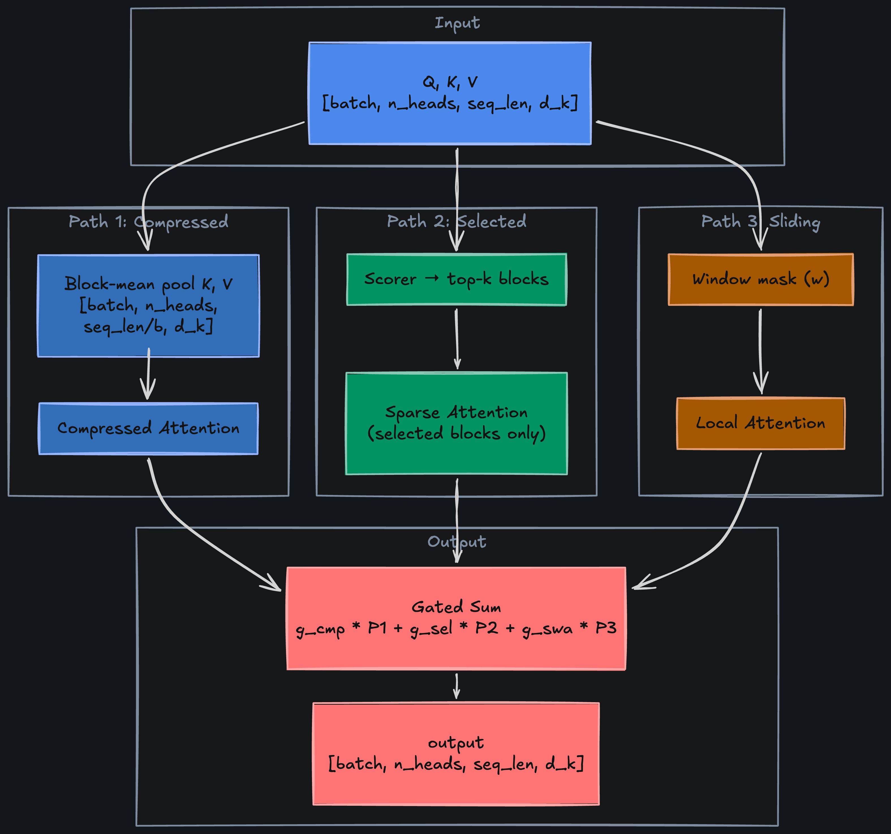

## The Scorer Mechanism

The selected-sparse path is the most novel piece. How does it pick which tokens to attend to without computing full attention (which is what we're trying to avoid)?

```
Block the sequence into chunks of size b
Score each block: score_j = mean(Q_i @ K_block_j.T)    # cheap dot product with block mean
Select top-k blocks by score
Run full attention only on the selected k * b tokens
```

- **Block scoring** — average the keys within each block, dot with the query. Cost: `O(n * n/b)`, same as compressed path
- **Selection** — `topk(scores, k)` per query position
- **Fine-grained attention** — full dot-product on only the `k * b` selected tokens per query

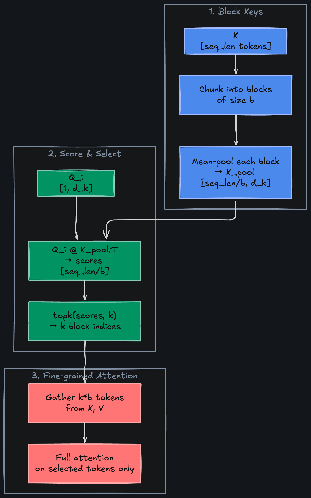

The paper's specific hyperparameters: compression block `l = 32` (stride 16), selection block `l' = 64`, top 16 selected blocks, sliding window `w = 512`. At 64k context, this delivers **9x forward / 11.6x decoding speedup** while slightly *improving* quality over full attention (0.456 vs. 0.443 general benchmarks avg, +0.032 on LongBench, +0.054 on AIME 2024 reasoning).

## Gotchas and Trade-offs

- **Block size `b` and top-k are hyperparameters** — `l' = 64`, `k = 16` in the original paper
- **Scorer must run causally** — can only score blocks that are in the past
- **Hardware-aware**: NSA's block structure maps well to GPU block-sparse kernels, unlike arbitrary sparse patterns
- **Training-time overhead**: three parallel paths + gating is more complex than standard attention; inference is where the wins show up
- **Total cost**: `O(n * (n/b + k*b + w))` — subquadratic but not as simple as pure SWA

## Example Architectures

- **DeepSeek NSA paper** — demonstrated on a 27B MoE model (3B active, GQA), trained on 270B tokens

## Implementation from Scratch

```python
class NativeSparseAttention(nn.Module):
    def __init__(self, d_model: int, n_heads: int, block_size: int = 8,
                 top_k: int = 2, window_size: int = 16):
        super().__init__()
        self.n_heads = n_heads
        self.d_k = d_model // n_heads
        self.block_size = block_size
        self.top_k = top_k
        self.window_size = window_size
        self.W_q = nn.Linear(d_model, n_heads * self.d_k, bias=False)
        self.W_k = nn.Linear(d_model, n_heads * self.d_k, bias=False)
        self.W_v = nn.Linear(d_model, n_heads * self.d_k, bias=False)
        self.W_o = nn.Linear(n_heads * self.d_k, d_model, bias=False)
        self.gate = nn.Linear(d_model, n_heads * 3, bias=False)

    def _compressed_attention(self, Q, K, V):
        B, H, T, D = K.shape
        b = self.block_size
        pad = (b - T % b) % b
        if pad > 0:
            K, V = F.pad(K, (0,0,0,pad)), F.pad(V, (0,0,0,pad))
        n_blocks = K.shape[2] // b
        K_pool = K.view(B, H, n_blocks, b, D).mean(3)      # (B, H, n_blocks, d_k)
        V_pool = V.view(B, H, n_blocks, b, D).mean(3)
        scores = torch.matmul(Q, K_pool.transpose(-2, -1)) / math.sqrt(D)
        return torch.matmul(F.softmax(scores, dim=-1), V_pool)  # (B, H, T, d_k)

    def _selected_attention(self, Q, K, V):
        B, H, T, D = K.shape
        b = self.block_size
        pad = (b - T % b) % b
        if pad > 0:
            K, V = F.pad(K, (0,0,0,pad)), F.pad(V, (0,0,0,pad))
        n_blocks = K.shape[2] // b
        K_pool = K.view(B, H, n_blocks, b, D).mean(3)
        block_scores = torch.matmul(Q, K_pool.transpose(-2, -1))  # (B, H, T, n_blocks)
        k = min(self.top_k, n_blocks)
        _, top_idx = block_scores.topk(k, dim=-1)                 # (B, H, T, k)
        # Expand block indices to token indices
        tok_idx = (top_idx.unsqueeze(-1) * b + torch.arange(b, device=K.device))
        tok_idx = tok_idx.view(B, H, T, k * b).clamp(max=K.shape[2] - 1)
        # Gather selected K/V and attend
        tok_exp = tok_idx.unsqueeze(-1).expand(-1, -1, -1, -1, D)
        K_exp = K.unsqueeze(2).expand(-1, -1, T, -1, -1)
        V_exp = V.unsqueeze(2).expand(-1, -1, T, -1, -1)
        K_sel = torch.gather(K_exp, 3, tok_exp)                   # (B, H, T, k*b, d_k)
        V_sel = torch.gather(V_exp, 3, tok_exp)
        scores = torch.matmul(Q.unsqueeze(3), K_sel.transpose(-2,-1)).squeeze(3) / math.sqrt(D)
        return torch.matmul(F.softmax(scores, dim=-1).unsqueeze(3), V_sel).squeeze(3)

    def _sliding_attention(self, Q, K, V):
        T = Q.shape[2]
        scores = torch.matmul(Q, K.transpose(-2, -1)) / math.sqrt(self.d_k)
        causal = torch.triu(torch.ones(T, T, dtype=torch.bool, device=Q.device), diagonal=1)
        window = torch.tril(torch.ones(T, T, dtype=torch.bool, device=Q.device),
                            diagonal=-(self.window_size))
        scores = scores.masked_fill(causal | window, float("-inf"))
        return torch.matmul(F.softmax(scores, dim=-1), V)

    def forward(self, x: torch.Tensor):
        B, T, _ = x.shape
        Q = self.W_q(x).view(B, T, self.n_heads, self.d_k).transpose(1, 2)
        K = self.W_k(x).view(B, T, self.n_heads, self.d_k).transpose(1, 2)
        V = self.W_v(x).view(B, T, self.n_heads, self.d_k).transpose(1, 2)
        a_cmp = self._compressed_attention(Q, K, V)   # (B, H, T, d_k)
        a_sel = self._selected_attention(Q, K, V)
        a_swa = self._sliding_attention(Q, K, V)
        g = self.gate(x).view(B, T, self.n_heads, 3).permute(0,2,1,3)  # (B, H, T, 3)
        g = torch.sigmoid(g)
        context = g[...,0:1]*a_cmp + g[...,1:2]*a_sel + g[...,2:3]*a_swa
        context = context.transpose(1, 2).contiguous().view(B, T, -1)
        return self.W_o(context), g
```

The full implementation with all three path methods and gate analysis is in the [attention variants notebook](https://github.com/david-hoangt/llm_from_scratch/blob/main/attention/4.%20attention_variants.ipynb).

## Key Takeaways

NSA combines coarse global context, precise sparse selection, and local windowed attention — three complementary views gated per-head. Subquadratic and content-aware, unlike fixed-pattern SWA.

GQA, MLA, SWA, NSA — four different answers to "which tokens should attend to which, and at what memory cost." But there's a dimension none of them address: even after computing the perfect attention weights, every position's output hits the residual stream at full strength. "The" at layer 20 rarely carries new information. Why update it as aggressively as "announced"?

---

## Gated Attention

Standard attention adds every head's output to the residual stream with equal weight. But "The" at position 0 rarely carries new information after the first few layers — why update its representation at full strength? A learned gate suppresses uninformative outputs per-position.

```
GatedAttn(X) = sigmoid(X @ W_g) * Attention(Q, K, V)
```

- **W_g** `[d_model, d_model]` — Learned gating projection
- **sigmoid(X @ W_g)** `[batch, seq_len, d_model]` — Per-position, per-dimension gate in [0, 1]
- **Element-wise multiply** — scales each dimension of the attention output before the residual connection

In our running example, after a few layers "The" and "on" are well-established function words — their gate values drop to ~0.2. Content-rich positions like "announced" and "earnings" pass through at ~0.8. The model decides per-position, per-dimension which updates matter.

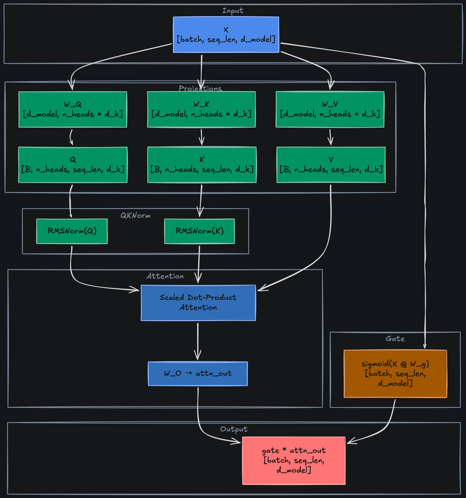

## QK-Norm: Stabilizing the Scores

Gated attention often pairs with QK-Norm — first proposed by Henry et al. (*"Query-Key Normalization for Transformers"*, [EMNLP Findings 2020](https://arxiv.org/abs/2010.04245)) and proven essential at scale by Dehghani et al. (*"Scaling Vision Transformers to 22B Parameters"*, [ICML 2023](https://arxiv.org/abs/2302.05442)). At 8B+ scale, attention logits exceed 50,000 in magnitude — near-one-hot weights that kill gradients. QK-Norm via LayerNorm enabled **stable training across three orders of magnitude of learning rate variation**.

Apply RMSNorm to Q and K before the dot product:

```
Q_norm = RMSNorm(Q)    K_norm = RMSNorm(K)
scores = Q_norm @ K_norm.T / sqrt(d_k)
```

- **Cost**: two norm operations per attention computation — negligible
- **Effect**: eliminates attention logit growth at large scale

Output gating takes several forms: sigmoid gates (Qwen 3), SiLU gates, logit soft-capping (Gemma 2's `tanh`-based cap at 50.0). OLMo 2 (*"2 OLMo 2 Furious"*, AI2, [Jan 2025](https://arxiv.org/abs/2501.00656)) pairs QK-Norm with reordered RMSNorm (post-norm), gaining **+9 points MMLU** over OLMo 1 and eliminating loss spikes.

## Gotchas and Trade-offs

- **Gate adds parameters**: `d_model * d_model` per layer for W_g — ~0.3% overhead in a typical model
- **Sigmoid vs. SiLU**: some implementations use `SiLU(X @ W_g)` instead of sigmoid, allowing the gate to amplify (values > 1) — empirically similar
- **QK-Norm is almost free** and increasingly standard even without gating
- **Initialization matters**: initialize W_g so gates start near 1.0 (identity-like), then let the model learn to suppress

## Example Architectures

- **OLMo 2** — QK-Norm + post-RMSNorm for training stability
- **Gemma 2** — logit soft-capping (tanh-based, capped at 50.0) + alternating SWA/global layers
- **Qwen 3** — QK-Norm with gated attention blocks

## Implementation from Scratch

```python
class GatedAttention(nn.Module):
    def __init__(self, d_model: int, n_heads: int, qk_norm: bool = True):
        super().__init__()
        self.n_heads = n_heads
        self.d_k = d_model // n_heads
        self.W_q = nn.Linear(d_model, n_heads * self.d_k, bias=False)
        self.W_k = nn.Linear(d_model, n_heads * self.d_k, bias=False)
        self.W_v = nn.Linear(d_model, n_heads * self.d_k, bias=False)
        self.W_o = nn.Linear(n_heads * self.d_k, d_model, bias=False)
        self.W_g = nn.Linear(d_model, d_model, bias=False)    # output gate
        self.qk_norm = qk_norm
        if qk_norm:
            self.q_norm = nn.RMSNorm(self.d_k)
            self.k_norm = nn.RMSNorm(self.d_k)

    def forward(self, x: torch.Tensor, mask=None):
        B, T, _ = x.shape
        Q = self.W_q(x).view(B, T, self.n_heads, self.d_k).transpose(1, 2)
        K = self.W_k(x).view(B, T, self.n_heads, self.d_k).transpose(1, 2)
        V = self.W_v(x).view(B, T, self.n_heads, self.d_k).transpose(1, 2)
        if self.qk_norm:
            Q, K = self.q_norm(Q), self.k_norm(K)             # QK-Norm
        scores = torch.matmul(Q, K.transpose(-2, -1)) / math.sqrt(self.d_k)
        if mask is not None:
            scores = scores.masked_fill(mask, float("-inf"))
        weights = F.softmax(scores, dim=-1)
        context = torch.matmul(weights, V)
        context = context.transpose(1, 2).contiguous().view(B, T, -1)
        attn_out = self.W_o(context)
        gate = torch.sigmoid(self.W_g(x))                     # (B, T, d_model)
        return gate * attn_out, weights                        # element-wise suppress
```

Run with gate analysis and QK-Norm score comparison in the [attention variants notebook](https://github.com/david-hoangt/llm_from_scratch/blob/main/attention/4.%20attention_variants.ipynb).

## Key Takeaways

A learned sigmoid gate on the attention output lets the model suppress uninformative updates per-position, per-dimension. QK-Norm stabilizes attention logits at scale. Both are cheap additions with measurable training stability gains.

Gating and QK-Norm are surgical additions — a few extra parameters for meaningful stability gains. But step back and look at the compute budget: every layer still runs full quadratic attention. Most layers handle local syntax and short-range agreement — patterns that don't require global context. Three teams at Google, AI21, and Zyphra arrived at the same conclusion in early 2024.

---

## Hybrid Attention

Most layers handle local patterns — syntax, agreement, short-range dependencies — that don't require global context. Three papers in early 2024 converged on the same insight: interleave cheap `O(n)` layers with expensive full-attention layers, and you get near-transformer quality at a fraction of the cost.

```
Hybrid pattern (e.g., 3:1 ratio):
Layers 0-2:   LinearAttention (O(n) per layer)
Layer 3:       Full GatedAttention (O(n^2) per layer)
Layers 4-6:   LinearAttention
Layer 7:       Full GatedAttention
...
```

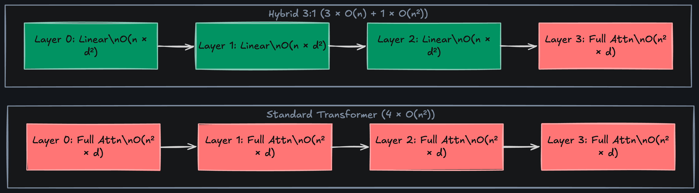

## Linear Attention: The Lightweight Block

Griffin (De et al., Google DeepMind, [Feb 2024](https://arxiv.org/abs/2402.19427)) uses gated linear recurrence; Jamba (Lieber et al., AI21, [Mar 2024](https://arxiv.org/abs/2403.19887)) and Zamba (Glorioso et al., Zyphra, [May 2024](https://arxiv.org/abs/2405.16712)) use Mamba SSM blocks. The cheap layers avoid the `n x n` attention matrix entirely. Here's the simplest version — linear attention via the associativity trick:

```
LinearAttention: O = (Q @ K.T) @ V  →  O = Q @ (K.T @ V)
```

- **Standard attention**: `(Q @ K.T)` is `[seq_len, seq_len]` — `O(n^2 * d)`
- **Linear attention**: `(K.T @ V)` is `[d_k, d_v]` — `O(n * d^2)`, linear in sequence length
- **Trade-off**: no softmax, so no proper probability distribution. Attention weights aren't normalized per-query. Works for local patterns, not precise long-range selection

The associativity trick is the key: `(Q @ K.T) @ V = Q @ (K.T @ V)`. Compute the `d_k × d_v` inner product first, then multiply by each query — never materialize the `n × n` matrix.

- **At 7 tokens** (`d_k = 16`): standard builds 7×7 = 49 entries; linear builds 16×16 = 256 — *worse*
- **At 4096 tokens**: standard needs ~16.8M entries per head; linear stays at 256 — the crossover pays off when `n >> d_k`

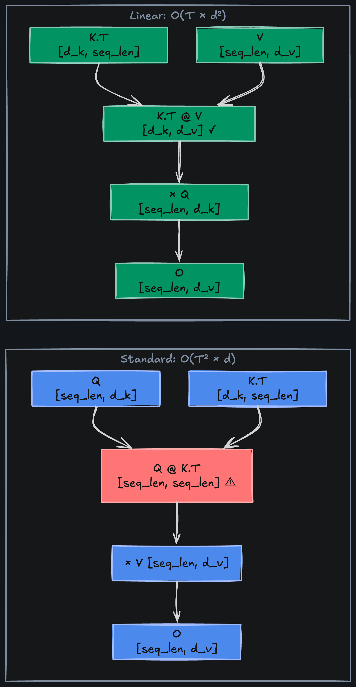

## The Interleaving Strategy

The ratio of linear-to-full layers controls the compute/quality trade-off:

```
Ratio 3:1 (12 layers total):  9 linear + 3 full attention
Ratio 5:1 (12 layers total):  10 linear + 2 full attention
Ratio 1:1 (12 layers total):  6 linear + 6 full attention (conservative)
```

- **Higher ratio** — faster, lower memory, but depends more on multi-hop propagation through linear layers for global context
- **Lower ratio** — closer to standard transformer quality, less inference speedup
- **Placement matters**: early and late layers benefit most from full attention; middle layers are often fine with linear

The 2024 results are striking:

- **Griffin** (2:1 recurrence-to-attention) — matched LLaMA 2 quality on **6x fewer tokens** (300B vs. 2T), significantly higher throughput
- **Jamba** (7:1 Mamba-to-attention, 52B / 12B active) — **4 GB KV cache at 256K context vs. 128 GB extrapolated for LLaMA 2** (LLaMA 2 natively supports 4K; 128 GB is the theoretical cache at 256K), HellaSwag 87.1 vs. Mixtral 86.7
- **Zamba** (~6:1, shared attention block reused across 80 layers) — MMLU 57.72 vs. LLaMA 2 7B's 45.88, trained on half the tokens

The winning ratios cluster around **6-7 linear/recurrent layers per 1 attention layer**.

## Gotchas and Trade-offs

- **Linear attention quality degrades on tasks requiring precise long-range retrieval** — the model can't do exact key-value lookup without the softmax normalization
- **Ratio is architecture-dependent** — what works for 7B doesn't necessarily transfer to 70B
- **Training instability**: linear attention layers can diverge without careful normalization. Common fix: apply RMSNorm after linear attention output
- **Not a drop-in replacement**: can't just swap layers in a pretrained model; must train from scratch with the hybrid pattern

## Example Architectures

- **Griffin / RecurrentGemma** (Google DeepMind) — gated linear recurrence + local attention, 2:1 ratio
- **Jamba** (AI21) — Mamba + MHA interleaved, 7:1 ratio, 256K context
- **Zamba** (Zyphra) — Mamba + shared attention block, ~6:1 ratio

## Implementation from Scratch

```python
class LinearAttention(nn.Module):
    """O(n * d^2) via associativity: Q @ (K.T @ V) instead of (Q @ K.T) @ V."""
    def __init__(self, d_model: int, n_heads: int):
        super().__init__()
        self.n_heads = n_heads
        self.d_k = d_model // n_heads
        self.W_q = nn.Linear(d_model, n_heads * self.d_k, bias=False)
        self.W_k = nn.Linear(d_model, n_heads * self.d_k, bias=False)
        self.W_v = nn.Linear(d_model, n_heads * self.d_k, bias=False)
        self.W_o = nn.Linear(n_heads * self.d_k, d_model, bias=False)
        self.norm = nn.RMSNorm(d_model)

    def forward(self, x: torch.Tensor) -> torch.Tensor:
        B, T, _ = x.shape
        Q = self.W_q(x).view(B, T, self.n_heads, self.d_k).transpose(1, 2)
        K = self.W_k(x).view(B, T, self.n_heads, self.d_k).transpose(1, 2)
        V = self.W_v(x).view(B, T, self.n_heads, self.d_k).transpose(1, 2)
        Q, K = F.elu(Q) + 1, F.elu(K) + 1        # non-negative feature map
        KV = torch.matmul(K.transpose(-2, -1), V)  # (B, H, d_k, d_k) — the small matrix
        context = torch.matmul(Q, KV)               # (B, H, T, d_k) — no n×n matrix!
        context = context.transpose(1, 2).contiguous().view(B, T, -1)
        return self.norm(self.W_o(context))

class HybridAttentionBlock(nn.Module):
    """Interleave linear and full attention layers by ratio."""
    def __init__(self, d_model: int, n_heads: int, n_layers: int, ratio: int = 3):
        super().__init__()
        layers, self.layer_types = [], []
        for i in range(n_layers):
            if (i + 1) % (ratio + 1) == 0:
                layers.append(GatedAttention(d_model, n_heads, qk_norm=True))
                self.layer_types.append("full")
            else:
                layers.append(LinearAttention(d_model, n_heads))
                self.layer_types.append("linear")
        self.layers = nn.ModuleList(layers)

    def forward(self, x: torch.Tensor) -> torch.Tensor:
        for layer, ltype in zip(self.layers, self.layer_types):
            if ltype == "full":
                out, _ = layer(x)   # GatedAttention returns (out, weights)
            else:
                out = layer(x)       # LinearAttention returns out only
            x = x + out              # residual connection
        return x
```

Run with layer layout visualization and parameter comparison in the [attention variants notebook](https://github.com/david-hoangt/llm_from_scratch/blob/main/attention/4.%20attention_variants.ipynb).

## Key Takeaways

Hybrid attention interleaves cheap `O(n)` linear layers with expensive `O(n^2)` full-attention layers — allocating quadratic compute only where global context is needed. The ratio is the key hyperparameter.

---

## Putting It All Together

No production model uses just one variant. Look at how they compose:

```
DeepSeek V3:  MLA (KV compression) + MoE + causal mask
LLaMA 3:     GQA (shared KV heads) + full causal attention
Mistral 7B:  GQA + SWA (all layers, rolling buffer cache)
OLMo 2:      Gated attention + QK-Norm + full causal
Jamba:        MHA + linear attention (hybrid 7:1 ratio)
```

GQA for cache reduction, SWA for local layers, gating for output control, full attention where global context is critical. The equation is always `softmax(Q @ K.T / sqrt(d_k)) @ V` — only the wiring, masks, and compression change.

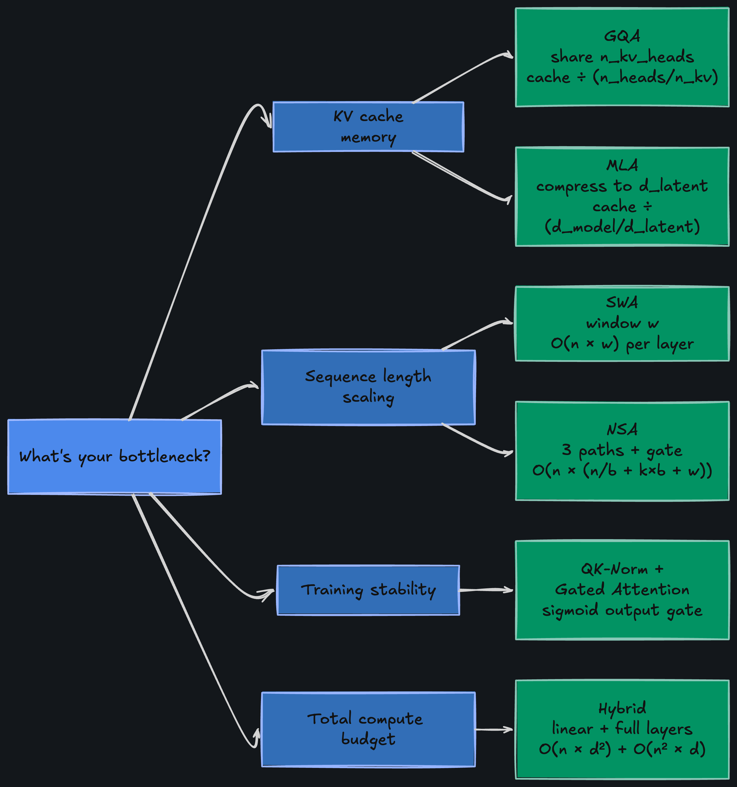

Same shapes, same scaling, same softmax. Only the wiring changes.
