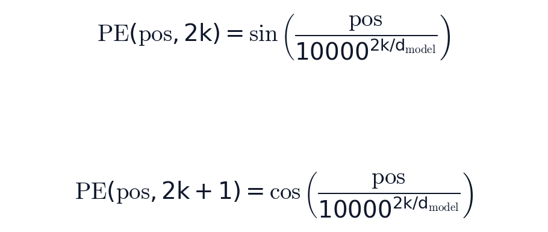
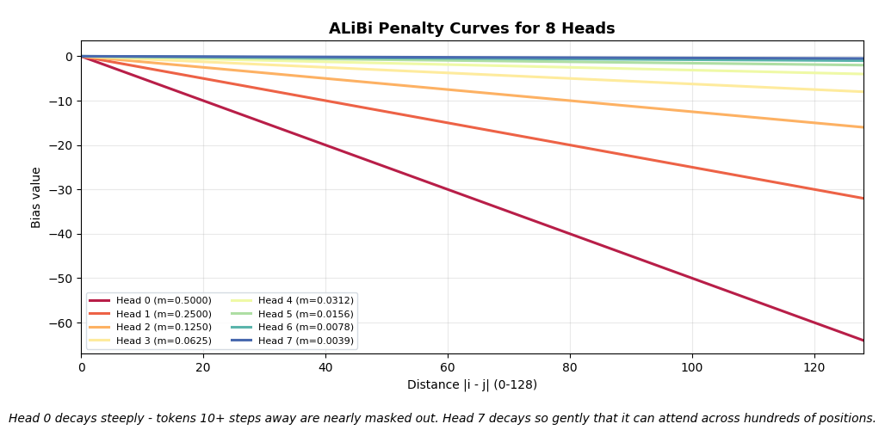
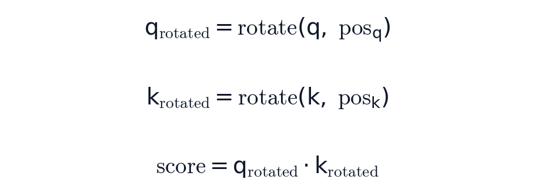
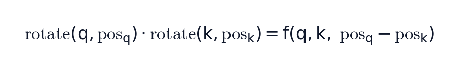
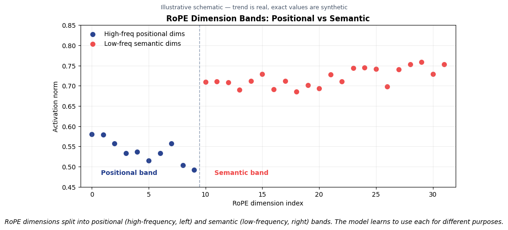
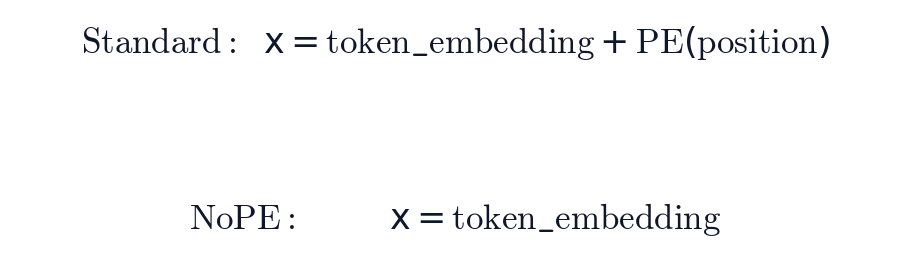

# Positional Encoding: How Transformers Learn Where Tokens Sit

*From sinusoids to RoPE to NoPE*

## Introduction

The previous attention ([[1]](https://david-hoangt.github.io/posts/2026-03-30-self-attn/), [[2]](https://david-hoangt.github.io/posts/2026-04-XX-attn-variants/)) posts focused on *which* tokens attend to which other tokens: Q/K scores, causal masks, multi-head attention, and efficient variants. This post covers the missing axis: how does the model know *where* each token sits?

We'll use one running example throughout: *"The CEO announced record earnings on Friday"* (7 tokens, zero-indexed from `The = 0` to `Friday = 6`). Code examples use `d_model = 64` with `n_heads = 4`, giving `d_k = d_model / n_heads = 16`.

Without positional encoding, "CEO" at position 1 and "CEO" at position 5 produce identical Q, K, V vectors. Self-attention treats them as the same token in the same context. The model cannot distinguish *"The CEO announced"* from *"announced CEO The"*. Without positional encoding or an asymmetric mask, self-attention is permutation-equivariant: shuffle the input and the output shuffles to match.

Every PE scheme solves this by injecting position information somewhere in the transformer. The approaches evolved as each generation hit a wall the previous one couldn't scale past, but they all differ mainly in *where* that signal enters the computation.

Explicit PE schemes inject position at one of three points in the attention pipeline; NoPE skips explicit injection:

- **Absolute PE**: at the input, adds a position vector to each token embedding before projection
- **RoPE**: at the vectors, rotates Q and K after projection, before the dot product
- **Relative PE / ALiBi**: at the scores, adds a position-dependent bias after the dot product, before softmax
- **NoPE**: no explicit injection, relies on the causal mask in decoder-only models

**Note:** All implementations in this post are available as runnable notebooks at [github.com/david-hoangt/llm_from_scratch](https://github.com/david-hoangt/llm_from_scratch/tree/main/src/positional_encoding).

---

## Absolute Positional Encoding

Each of our 7 tokens *"The CEO announced record earnings on Friday"* has a 64-dim embedding (`d_model = 64`), but "announced" at position 2 looks identical to "announced" at position 5. The embedding table doesn't know *where* the token landed. How do you stamp each position with a unique signature that the model can learn from?

The simplest answer is to add a position-dependent vector directly to the token embedding before it enters the transformer.


- **token_embedding_i**: the token's learned embedding
- **PE(i)**: a vector unique to position `i`
- **x_i**: the position-aware input to the transformer

There are two common ways to build that `PE(i)` vector: compute it from a fixed **sinusoidal** formula, or learn it as a trainable embedding table.

## Sinusoidal Encoding (Vaswani et al., 2017)

The original Transformer used deterministic sine and cosine functions at different frequencies to generate position vectors, no learned parameters needed.



- **pos**: token position in the sequence (0, 1, 2, ...)
- **k**: dimension-pair index, from `0` (fastest pair) to `d_model/2 - 1` (slowest pair)
- **2k, 2k+1**: even/odd dimensions within each pair, sharing the same frequency
- **10000**: base controlling how spread out the frequencies are

For our 7-token sentence with `d_model = 64`, this produces a `[7, 64]` matrix where each row is a unique position fingerprint. "The" at position 0 gets `PE(0)`, "CEO" gets `PE(1)`, and so on.


<video controls autoplay muted loop playsinline preload="metadata" style="width: 100%; max-width: 900px;">
  <source src="asset/sinusoidal_pe_animation.mp4" type="video/mp4">
  Your browser does not support the video tag.
</video>
*Animation: sinusoidal PE for `T = 128`, `d_model = 64`. Fast dimensions cycle every few tokens; slow dimensions barely move, carrying coarse position over long contexts.*

- **Each position gets a unique vector**: no two rows are identical
- **Nearby positions have similar vectors**: `PE(2)` and `PE(3)` differ only slightly, giving the model a smooth notion of "closeness"
- **The wavelength spectrum spans from `2π` to `10000 * 2π`**, dimension 0 completes a full cycle every ~6 positions, dimension 63 barely moves across the entire sequence

**Why sinusoids?** Vaswani et al. chose them because a fixed offset is representable by a linear transform: for each sine/cosine pair, `PE(pos + k)` is just `PE(pos)` rotated by an angle determined by `k`. In principle, this lets the model learn relative patterns like "3 positions to the left."

## Learned Positional Embeddings

GPT-2 and BERT replaced sinusoids with a learned embedding table, `nn.Embedding(max_len, d_model)`. Each position gets a trainable vector, just like each token gets a trainable embedding.

```
PE = nn.Embedding(max_len, d_model)
x = token_embeddings + PE(positions)    # positions = [0, 1, 2, ..., T-1]
```

- **PE.weight** `[max_len, d_model]`: learned position vectors
- **max_len**: hard ceiling on sequence length (512 for BERT, 1024 for GPT-2)

```python
class SinusoidalPE(nn.Module):
    """
    PE(pos, 2k)   = sin(pos / 10000^(2k / d_model))
    PE(pos, 2k+1) = cos(pos / 10000^(2k / d_model))
    """

    def __init__(self, d_model: int, max_len: int = 5000, dropout: float = 0.1):
        super().__init__()
        self.dropout = nn.Dropout(p=dropout)

        pe = torch.zeros(max_len, d_model)                       # [max_len, d_model]
        position = torch.arange(0, max_len).unsqueeze(1).float() # [max_len, 1]
        div_term = torch.exp(
            torch.arange(0, d_model, 2).float() * -(math.log(10000.0) / d_model)
        )                                                         # [d_model/2]

        pe[:, 0::2] = torch.sin(position * div_term)  # even dims
        pe[:, 1::2] = torch.cos(position * div_term)  # odd dims
        pe = pe.unsqueeze(0)                           # [1, max_len, d_model]
        self.register_buffer("pe", pe)

    def forward(self, x: torch.Tensor) -> torch.Tensor:
        """x: [batch, seq_len, d_model] → same shape, position added."""
        x = x + self.pe[:, :x.size(1)]  # [batch, seq_len, d_model]
        return self.dropout(x)


class LearnedPE(nn.Module):
    """Each position gets a trainable d_model-dimensional vector."""

    def __init__(self, d_model: int, max_len: int = 512, dropout: float = 0.1):
        super().__init__()
        self.embedding = nn.Embedding(max_len, d_model)  # [max_len, d_model]
        self.dropout = nn.Dropout(p=dropout)

    def forward(self, x: torch.Tensor) -> torch.Tensor:
        T = x.size(1)
        positions = torch.arange(T, device=x.device)   # [seq_len]
        pe = self.embedding(positions)                   # [seq_len, d_model]
        return self.dropout(x + pe)
```

## Gotchas and Trade-offs

- **Length extrapolation is not guaranteed**: sinusoidal PE *can* extrapolate past `max_len` in theory, but in practice attention patterns degrade. Learned PE cannot extrapolate at all, position 1025 has no embedding if `max_len = 1024`
- **Relative distance is implicit**: `PE(2)` tells the model "I am at position 2", but doesn't directly encode "I am 3 positions before position 5". The model must *learn* to compute relative distance from absolute coordinates
- **Content gets mixed with absolute coordinates**: "CEO" at position 1 and "CEO" at position 4 get different representations even when the local context is identical. The model spends capacity encoding "where am I" instead of "who is near me"

## Key Takeaway

Absolute PE stamps each position with a unique vector, solving the permutation problem but creating a new one: the model knows *where* each token is, but not *how far apart* any two tokens are.

Absolute PE solves position identity, but not distance. "CEO" knows it sits at position 1, but computing that "announced" is 1 step to the right requires learning a function from absolute coordinates.

---

## Relative Positional Encoding

If "CEO announced" appears at positions 1-2 in one sentence and at 50-51 in another, the model should recognize the same relationship without relearning it from new absolute coordinates. Shaw et al. introduced this approach in *"Self-Attention with Relative Position Representations"* (NAACL 2018): instead of adding position to the *input*, add it to the *attention scores*.


- **q_i @ k_j**: the standard content-based attention score
- **a^K_{j-i}** `[d_k]`: learned embedding indexed by clipped relative distance `clip(j - i, -K, K)`. Superscript `K` indicates key-side; Shaw also defined a value-side `a^V` used when aggregating values, dropped in most implementations including ours
- **K**: maximum relative distance (positions beyond `K` are clipped to the boundary)

The key shift: `a^K_{j-i}` depends only on `j - i` (how far apart), not on `i` or `j` individually.

## The Clipping Mechanism

Shaw et al. clipped relative positions to a range `[-K, K]`, arguing that precise relative position beyond a certain distance doesn't matter much; "10 tokens away" and "15 tokens away" carry roughly the same signal.


- **Diagonal = 0**: each token's distance to itself
- **Values clipped to [-2, 2]**: only `2K + 1 = 5` unique embeddings needed
- **"announced" attending to "CEO"** looks up `a^K_{-1}` (j − i = 1 − 2 = −1, "1 step to my left"), regardless of absolute position

## Same Family, Different Engineering

Shaw et al. was the first to bring relative position into transformer self-attention, but others refined the idea with different trade-offs:

- **Transformer-XL** (Dai et al., ACL 2019): decomposed the attention score into four terms: content × content, content × position, plus two global biases (a global content bias `u` and a global position bias `v`). More expressive, but more parameters (`u`, `v`, `W_K_R` per head)
- **T5** (Raffel et al., 2020): collapsed everything to a single learned scalar bias per relative distance bucket, with **log-spaced** buckets (each nearby distance gets its own bucket; far distances share buckets). Fewer parameters, same core idea

All three inject distance into the attention logits rather than the input. The implementation below follows Shaw et al., the simplest of the three.

```python
class RelativePositionAttention(nn.Module):
    """
    score(i, j) = q_i @ k_j + q_i @ a_{clip(j-i, -K, K)}

    Args:
        d_model:      Input embedding dimension.
        n_heads:      Number of attention heads.
        max_rel_dist: Maximum relative distance K (positions clipped to [-K, K]).
    """

    def __init__(self, d_model: int, n_heads: int, max_rel_dist: int = 16):
        super().__init__()
        self.n_heads = n_heads
        self.d_k = d_model // n_heads
        self.max_rel_dist = max_rel_dist

        self.W_q = nn.Linear(d_model, d_model, bias=False)
        self.W_k = nn.Linear(d_model, d_model, bias=False)
        self.W_v = nn.Linear(d_model, d_model, bias=False)
        self.W_o = nn.Linear(d_model, d_model, bias=False)

        # 2K+1 learned embeddings, one per clipped relative distance
        self.rel_embed = nn.Embedding(2 * max_rel_dist + 1, self.d_k)  # [2K+1, d_k]

    def forward(self, x: torch.Tensor, mask=None) -> tuple[torch.Tensor, torch.Tensor]:
        B, T, _ = x.shape
        Q = self.W_q(x).view(B, T, self.n_heads, self.d_k).transpose(1, 2)  # [B, h, T, d_k]
        K = self.W_k(x).view(B, T, self.n_heads, self.d_k).transpose(1, 2)
        V = self.W_v(x).view(B, T, self.n_heads, self.d_k).transpose(1, 2)

        content_scores = torch.matmul(Q, K.transpose(-2, -1))     # [B, h, T, T]

        # Relative position bias
        rel_indices = self._relative_indices(T, x.device)          # [T, T]
        rel_embeds = self.rel_embed(rel_indices)                   # [T, T, d_k]
        rel_scores = torch.einsum("bhid,ijd->bhij", Q, rel_embeds)  # [B, h, T, T]

        scores = (content_scores + rel_scores) / math.sqrt(self.d_k)
        if mask is not None:
            scores = scores.masked_fill(mask.unsqueeze(0).unsqueeze(0), float("-inf"))
        weights = F.softmax(scores, dim=-1)                        # [B, h, T, T]
        context = torch.matmul(weights, V)                          # [B, h, T, d_k]
        context = context.transpose(1, 2).contiguous().view(B, T, -1)
        return self.W_o(context), weights

    def _relative_indices(self, T: int, device) -> torch.Tensor:
        """[T, T] matrix of clipped relative positions shifted to [0, 2K]."""
        positions = torch.arange(T, device=device)
        rel = positions.unsqueeze(0) - positions.unsqueeze(1)      # j - i
        rel = rel.clamp(-self.max_rel_dist, self.max_rel_dist)
        return rel + self.max_rel_dist  # shift for embedding lookup
```

## Gotchas and Trade-offs

- **Translation-invariant position term**: the relative positional contribution for "CEO announced" is the same whether it appears at positions 1-2 or 50-51
- **Complexity overhead**: Shaw-style relative PE adds a query-dependent `[T, T]` relative score term, plus extra tensor ops for the position embeddings. Materializing this at 128K tokens is a 16B-entry score grid per head
- **Family variants differ in parameter count**: Shaw et al. uses learned `[d_k]` *vector* embeddings per relative distance (key-side, optionally per-head; the implementation above shares them across heads as a common simplification). Transformer-XL adds `u`, `v`, and `W_K_R`. T5 collapses everything to a single learned *scalar* bias per distance bucket
- **Stock fast attention kernels don't help**: arbitrary learned `[T, T]` biases break the tiling strategy that makes FlashAttention fast. Specialized kernels exist for structured biases (ALiBi has one in FlashAttention v2.4+), but a general learned relative bias still requires custom kernel work

## Key Takeaway

Relative PE shifts position information from the input embeddings into the attention score itself, encoding *signed relative offset* rather than absolute identity. The model gets a direct positional term for "CEO is 1 step left of announced" instead of recovering that relation from two absolute stamps.

The trade-off is engineering: learned relative score terms are flexible, but they add extra `[T, T]` structure to attention. ALiBi keeps the same score-side idea but removes the learned table entirely: distance becomes a fixed linear penalty.

---

## Attention with Linear Biases (ALiBi)

ALiBi is the simplest score-side relative position scheme: no learned distance embeddings, no buckets, no sinusoids. Press, Smith, and Lewis proposed it in *"Train Short, Test Long"* (ICLR 2022): subtract a fixed linear penalty from attention scores, proportional to query-key distance. Each head gets one scalar slope.


- **q_i @ k_j**: standard content-based attention score
- **m**: head-specific slope (fixed, not learned)
- **|i - j|**: absolute distance between query position `i` and key position `j`
- The penalty is always negative, farther tokens always get lower scores
- In decoder-only attention, future positions are masked; for valid keys `j <= i`, `|i - j| = i - j`

## The Bias Matrix

Keep the raw ALiBi penalty separate from the causal mask. For "announced" (position 2), the raw distance penalty with slope `m` is:

```
Raw ALiBi bias for query at position 2, slope m:
    The(0)  CEO(1)  ann(2)  rec(3)  ear(4)  on(5)  Fri(6)
    -2m     -m       0      -m      -2m     -3m    -4m
```

- **Position 2 → position 2**: zero penalty (self-attention, distance = 0)
- **Position 2 → position 1**: penalty `m` (1 step away)
- **Position 2 → position 6**: raw penalty `4m`, but this future token is masked in causal attention

After the causal mask, the effective row is:

```
Effective causal logits for query at position 2:
    The(0)  CEO(1)  ann(2)  rec(3)  ear(4)  on(5)  Fri(6)
    -2m     -m       0      -inf    -inf    -inf   -inf
```

The full effective `[7, 7]` causal bias matrix, applied identically at every layer:


For decoder-only language models, ALiBi is paired with a causal mask. Future positions are `-inf` before softmax, so only the lower triangle contributes. The symmetric `|i - j|` formulation is an implementation convenience: precompute the full distance matrix, then let the causal mask handle future tokens separately.

## Multi-Head Slopes

Each head gets a different slope, some heads attend broadly (small `m`), others focus locally (large `m`). The slopes form a geometric sequence:

```
For example, with n_heads = 8 (the canonical ALiBi slopes):
slopes = [2^(-1), 2^(-2), 2^(-3), 2^(-4), 2^(-5), 2^(-6), 2^(-7), 2^(-8)]
       = [1/2,    1/4,    1/8,    1/16,   1/32,   1/64,   1/128,  1/256 ]
```

- **Head 0 (slope = 1/2)**: steep penalty, strong recency bias, focuses on nearby tokens
- **Head 7 (slope = 1/256)**: gentle penalty, can attend to tokens hundreds of positions away
- For power-of-two `n_heads`, the first slope and common ratio are both `2^(-8/n_heads)`



## Train Short, Test Long

The key selling point: ALiBi models trained on short sequences extrapolate to longer ones at inference. Press et al. showed a 1.3B model trained on 1024 tokens extrapolating to 2048, matching the perplexity of a sinusoidal model *trained* on 2048, while using 11% less memory and 11% less compute.

The linear bias is defined for any distance, there's no lookup table to run out of, no embedding to extrapolate. A key 2048 tokens away just gets a penalty of `2048 * m`, which is a natural extension of the training-time pattern.

```python
class ALiBi(nn.Module):
    """
    ALiBi_score(i, j) = q_i @ k_j - m * |i - j|

    No learned position parameters. Slopes are fixed geometric sequence.

    Args:
        d_model:  Input embedding dimension.
        n_heads:  Number of attention heads.
        max_len:  Maximum sequence length for precomputing the distance matrix.
    """

    def __init__(self, d_model: int, n_heads: int, max_len: int = 2048):
        super().__init__()
        self.n_heads = n_heads
        self.d_k = d_model // n_heads

        self.W_q = nn.Linear(d_model, d_model, bias=False)
        self.W_k = nn.Linear(d_model, d_model, bias=False)
        self.W_v = nn.Linear(d_model, d_model, bias=False)
        self.W_o = nn.Linear(d_model, d_model, bias=False)

        # Slopes: 2^(-8/n), 2^(-16/n), ..., 2^(-8)
        slopes = torch.tensor(
            [2 ** (-8 * h / n_heads) for h in range(1, n_heads + 1)]
        )                                                          # [n_heads]
        self.register_buffer("slopes", slopes)

        # Toeplitz distance matrix: distances[i,j] = |i - j|
        positions = torch.arange(max_len)
        distances = (positions.unsqueeze(0) - positions.unsqueeze(1)).abs().float()
        self.register_buffer("distances", distances)               # [max_len, max_len]

    def forward(self, x: torch.Tensor, mask=None) -> tuple[torch.Tensor, torch.Tensor]:
        B, T, _ = x.shape
        Q = self.W_q(x).view(B, T, self.n_heads, self.d_k).transpose(1, 2)  # [B, h, T, d_k]
        K = self.W_k(x).view(B, T, self.n_heads, self.d_k).transpose(1, 2)
        V = self.W_v(x).view(B, T, self.n_heads, self.d_k).transpose(1, 2)

        scores = torch.matmul(Q, K.transpose(-2, -1)) / math.sqrt(self.d_k)

        # ALiBi bias: -slopes[h] * |i - j|
        alibi_bias = -self.slopes.view(1, self.n_heads, 1, 1) * \
                      self.distances[:T, :T].unsqueeze(0).unsqueeze(0)
        scores = scores + alibi_bias                               # [B, h, T, T]

        if mask is not None:
            scores = scores.masked_fill(mask.unsqueeze(0).unsqueeze(0), float("-inf"))
        weights = F.softmax(scores, dim=-1)
        context = torch.matmul(weights, V)
        context = context.transpose(1, 2).contiguous().view(B, T, -1)
        return self.W_o(context), weights
```

## Gotchas and Trade-offs

- **Zero learned parameters for position**: the slopes and distance matrix are fixed. No trained position embeddings to store
- **Recency bias is hardcoded**: the linear decay always penalizes distance. If "The" and "Friday" have a strong semantic relationship, every head still pushes that score down. The model must overcome the bias through content scores alone
- **Extrapolation has limits**: while better than absolute PE, extrapolation quality degrades at 4-8x training length. The linear assumption doesn't hold for very long contexts
- **Efficient attention needs kernel support**: naive ALiBi materializes a `[T, T]` bias, but optimized kernels can fold the linear bias into attention tiles without storing the full matrix

## Example Architectures

- **BLOOM** (BigScience, 176B): ALiBi
- **MPT-7B / MPT-30B** (MosaicML): ALiBi + FlashAttention

## Key Takeaway

ALiBi replaces learned position embeddings with a fixed linear penalty, zero extra parameters, natural length extrapolation. Each head gets a different slope, covering local to global attention ranges.

The linear decay is a strong inductive bias: it assumes "closer is more relevant" uniformly across all heads and contexts. Push the position signal into the vectors themselves, and the dot product changes character entirely.

---

## Rotary Positional Encoding (RoPE)

ALiBi penalizes distance after computing attention scores, a blunt instrument that treats position and content independently. Su et al. proposed RoPE in *"RoFormer: Enhanced Transformer with Rotary Position Embedding"* (2021): rotate the query and key vectors by angles proportional to their position *before* the dot product. The result: relative position information emerges naturally from the dot product of rotated vectors, without any additive bias.



- `rotate(q, pos)` rotates pairs of dimensions by `pos * theta_k`
- The dot product of two rotated vectors depends only on the *difference* `pos_q - pos_k`
- No additive bias, no learned position embeddings, position lives inside Q and K

## The Rotation Mechanism

RoPE groups the `d_k` dimensions into pairs and rotates each pair in a 2D plane. Pair `k` rotates by angle `pos * theta_k`:

![Equations for RoPE rotation of dimension pair (2k, 2k+1): q'[2k] = q[2k]·cos(pos·θ_k) − q[2k+1]·sin(pos·θ_k); q'[2k+1] = q[2k]·sin(pos·θ_k) + q[2k+1]·cos(pos·θ_k); where θ_k = 1 / 10000^(2k / d_k). This is a 2D rotation by angle pos·θ_k applied to each dimension pair](asset/eq_06_rope_rotation.png)

- **Same frequency formula as sinusoidal PE**: but applied as *rotation* to Q/K, not *addition* to embeddings
- **Low `k`** → high `θ_k` → fast rotation → encodes fine-grained local position
- **High `k`** → low `θ_k` → slow rotation → barely changes across nearby positions

For "CEO" at position 1, each dimension pair in its query vector gets rotated by `1 * θ_k`. For "announced" at position 2, the same pairs rotate by `2 * θ_k`. When you dot-product them, the angle that matters is `(2 - 1) * θ_k = θ_k`, the relative distance.

![RoPE rotation pipeline diagram. Left: query vector q with shape [batch, n_heads, T, d_k]. Middle: 3 representative dimension pair rotations, Pair 0 rotates fast (θ_0 = 1.0, wavelength ≈ 6 positions), Pair 4 medium (θ_4 = 0.01, wavelength ≈ 628 positions), Pair 7 slow (θ_7 ≈ 0.0003, wavelength ≈ 20K positions). Right: rotated output q' with same shape [batch, n_heads, T, d_k], operation is shape-preserving](asset/rope_rotation.png)
*Values shown for `d_k = 16`, matches our running example (`d_model = 64`, `n_heads = 4` → `d_k = d_model / n_heads = 16`). Each pair `k` rotates at `θ_k = 1 / 10000^(2k / d_k)`; the wavelength `2π / θ_k` says how many positions complete one full cycle. Pair 0 cycles every ~6 tokens (perfect for local syntax), pair 7 barely moves across 20K positions (so it survives untouched as a semantic channel). The diagram shows 3 of 8 pairs.*

## Why the Dot Product Encodes Relative Position

The core mathematical property: when you dot-product two vectors rotated in the same 2D plane, the rotation angles *subtract*.



- The dot product depends on `pos_q - pos_k`, not on `pos_q` or `pos_k` individually
- **Translation invariant**: "CEO"→"announced" at positions 1→2 produces the same positional signal as at positions 50→51
- **No bias matrix needed**: position lives in the vectors themselves, not in an additive term

This is what makes RoPE compatible with FlashAttention, there's no `[seq_len, seq_len]` bias to add. The position information is baked into Q and K before the dot product.

## The Two Bands: Position vs. Semantics

Research from *"Round and Round We Go! What makes Rotary Positional Encodings useful?"* (Barbero et al., ICLR 2025) revealed that RoPE dimensions self-organize into two functional bands:

- **High-frequency dimensions** (low `k`, fast rotation): encode *positional* attention patterns. These dimensions track where tokens are relative to each other
- **Low-frequency dimensions** (high `k`, slow rotation): carry *semantic* information. The rotation barely affects these dimensions for nearby positions, so the model stores meaning there



This two-band structure works well for short-to-medium contexts. But at very long sequences (128K+), even the low-frequency dimensions start rotating significantly, corrupting the semantic information stored there.

## Context Length Extension

RoPE's base frequency `θ_base = 10000` determines the maximum wavelength. To handle longer contexts, scale the base:


- **Higher base → lower frequencies → slower rotation → longer effective context**
- LLaMA 3 uses `θ_base = 500,000` (native 8K context); LLaMA 3.1 / 3.3 keep that base and use RoPE scaling (`apply_scaling`) to reach 128K
- Gemma 3 uses `θ_base = 10,000` for local layers and `θ_base = 1,000,000` for global layers

Other extension methods include **NTK-aware scaling** (interpolation in the frequency domain) and **YaRN** (attention scaling + NTK). All share the same goal: slow down rotation to prevent long-distance corruption.

```python
class RotaryPE(nn.Module):
    """
    q'[2k]   = q[2k] * cos(pos * θ_k) - q[2k+1] * sin(pos * θ_k)
    q'[2k+1] = q[2k] * sin(pos * θ_k) + q[2k+1] * cos(pos * θ_k)
    where θ_k = 1 / theta_base^(2k / d_k)

    Args:
        d_k:        Dimension per head.
        max_len:    Maximum sequence length to precompute.
        theta_base: Base frequency (10000 standard, higher for long context).
    """

    def __init__(self, d_k: int, max_len: int = 4096, theta_base: float = 10000.0):
        super().__init__()
        # Frequencies: θ_k for k = 0, ..., d_k/2 - 1
        freqs = 1.0 / (theta_base ** (torch.arange(0, d_k, 2).float() / d_k))  # [d_k/2]
        angles = torch.outer(torch.arange(max_len).float(), freqs)               # [max_len, d_k/2]
        self.register_buffer("cos_cached", angles.cos())  # [max_len, d_k/2]
        self.register_buffer("sin_cached", angles.sin())

    def forward(self, x: torch.Tensor) -> torch.Tensor:
        """x: [batch, n_heads, seq_len, d_k] → rotated, same shape."""
        T = x.size(2)
        cos = self.cos_cached[:T].unsqueeze(0).unsqueeze(0)  # [1, 1, T, d_k/2]
        sin = self.sin_cached[:T].unsqueeze(0).unsqueeze(0)

        # Split into pairs and rotate (the "rotate_half" trick)
        x_even = x[..., 0::2]  # [B, h, T, d_k/2]
        x_odd  = x[..., 1::2]

        rotated_even = x_even * cos - x_odd * sin
        rotated_odd  = x_even * sin + x_odd * cos

        # Interleave back: [r0, r1, r0, r1, ...]
        return torch.stack([rotated_even, rotated_odd], dim=-1).flatten(-2)
```

Run the full implementation with relative position property verification in the [positional encoding notebook](https://github.com/david-hoangt/llm_from_scratch/blob/main/src/positional_encoding/5.%20positional_encoding.ipynb).

## Gotchas and Trade-offs

- **FlashAttention-compatible**: no additive bias matrix, just modified Q/K vectors
- **Relative position from absolute rotation**: each vector is rotated by its absolute position, but the dot product only sees relative distance. Best of both worlds
- **Context extension usually needs continued training**: changing `θ_base` (or applying NTK / YaRN scaling) shifts all frequencies, so the model typically needs short fine-tuning for best quality. YaRN with Dynamic Scaling can extend context past 2x without any fine-tuning, but quality is lower than the fine-tuned variant
- **Low-frequency band degrades at extreme lengths**: semantic dimensions that barely rotate at 4K start rotating meaningfully at 128K+, corrupting stored meaning

## Example Architectures

- **LLaMA 2**: RoPE with `θ_base = 10,000` (4K context)
- **LLaMA 3 / 3.1 / 3.3**: RoPE with `θ_base = 500,000` (8K native; 3.1/3.3 reach 128K via RoPE scaling)
- **Mistral / Mixtral**: RoPE
- **Gemma 2/3**: RoPE
- **Qwen 2**: RoPE with YaRN scaling
- **DeepSeek-V2/V3**: RoPE (applied to a portion of the head dims, rest handled by MLA)

## Key Takeaway

RoPE rotates Q and K vectors by position-dependent angles, encoding relative distance directly in the dot product without additive biases or learned embeddings. It's the default PE in recent decoder-only open-weight LLMs: LLaMA, Mistral, Gemma, Qwen, and DeepSeek all ship with it.

Once rotation works, the next question is whether every dimension needs it. Those low-frequency dimensions carrying semantic information get corrupted at very long contexts, and they weren't encoding position in the first place.

---

*From this point on, the question changes, from **how** to encode position to **how much** position the model actually needs. The following two sections cover recent developments (2025-2026). If you're here for the fundamentals, the RoPE section above is the current industry default.*

## Bonus: p-RoPE (Gemma 4)

RoPE applies rotation to *all* dimension pairs, but Barbero et al. showed that the model uses high-frequency pairs for position and low-frequency pairs for semantics. At 128K+ contexts, those slow-rotating semantic dimensions start getting corrupted. Gemma 4 introduced p-RoPE (Proportional RoPE): only apply rotation to a fraction `p` of dimension pairs, leaving the rest entirely position-free.

```
For p = 0.25, d_k = 128:
  Dimensions 0-31:   RoPE rotation applied (high-frequency, positional)
  Dimensions 32-127: No rotation (position-free, pure semantic)
```

- **p = 0.25**: only 25% of dimension pairs receive RoPE
- **The top 25%** are the highest-frequency pairs: the ones the model was already using for positional patterns
- **The remaining 75%** carry no rotation signal at all: by construction, they don't accumulate the long-context rotation drift that affects standard RoPE's semantic-band dimensions

## Side-by-Side: RoPE vs. p-RoPE


- **Standard RoPE**: all 64 pairs (128 dims) rotated, gradient from fast (P0) to slow (P63). Low-frequency pairs carry semantics but accumulate rotation drift at long contexts
- **p-RoPE**: only 16 pairs (32 dims) rotated; 48 pairs (96 dims) frozen as permanent semantic channels with no rotation drift, regardless of context length

*Diagram uses Gemma 4's production values: `d_k = 128`, `theta_base = 1,000,000` (global layer config), `p = 0.25`. The 16/48 pair split corresponds to dims 0-31 rotated, dims 32-127 frozen.*

## Gemma 4's Hybrid Architecture

Gemma 4 combines p-RoPE with interleaved attention layers:

```
Layer pattern (repeating):
  5 × Sliding Window layers:  standard RoPE, θ = 10,000, window = 1,024
  1 × Global Attention layer: p-RoPE (p=0.25), θ = 1,000,000, full context
```

- **Local (sliding) layers**: standard RoPE with base 10,000. Handle local patterns within a 1,024-token window. All dimensions rotated, fine for local context
- **Global layers**: p-RoPE with base 1,000,000. Handle long-range dependencies across the full 256K context. Only 25% of dimensions carry position; 75% are pure semantic channels that don't degrade
- **Last layer is always global**: unlike Gemma 3 (where the final layer could land on a local sliding window), Gemma 4 enforces a global attention layer at the end so the final representation always sees the full context

## Why Not Just Use a Higher θ?

Gemma 3 already used `θ = 1,000,000` for global layers, so why add p-RoPE? Because a higher base slows rotation for *all* dimensions, which helps but doesn't address the structural issue: even at `θ = 1M`, the lowest-frequency dimensions still accumulate rotation across very long contexts.

p-RoPE sidesteps the issue by removing rotation entirely from those dimensions. No rotation in that band means no rotation-induced drift, regardless of context length, though the model now has less positional bandwidth to work with.

## Gotchas and Trade-offs

- **Fewer positional dimensions**: the model has less positional bandwidth. With `p=0.25`, only 32 out of 128 dims encode position. The bet: 32 positional dims is enough for the patterns the model needs
- **Only applied to global layers**: local sliding window layers still use full RoPE, since within a 4K window, low-frequency degradation isn't an issue
- **Motivated by empirical observation**: p-RoPE is a direct consequence of the "two-band" finding (Barbero et al., ICLR 2025). Remove RoPE from the band that doesn't use it for position anyway

## Key Takeaway

p-RoPE prunes RoPE from the low-frequency dimensions that carry semantics, not position. The result: dedicated semantic channels that maintain signal integrity at any context length, while the remaining high-frequency dimensions still encode relative position through rotation.

This is an engineering refinement: the model was already using dimensions for two purposes, p-RoPE just formalizes the split. But it raises a deeper question, if 75% of dimensions work fine without any positional encoding, how much does the model actually *need* explicit position information?

---

## Frontier: No Positional Encoding (NoPE)

p-RoPE bets that 75% of dimensions can run without explicit position information, and Gemma 4 ships on that bet. If some dimensions survive without explicit position, can a whole layer do the same?

Haviv et al. showed in *"Transformer Language Models without Positional Encodings Still Learn Positional Information"* (EMNLP Findings, 2022) that causal decoder-only transformers trained with *no* positional encoding are competitive with standard models. Kazemnejad et al. (*"The Impact of Positional Encoding on Length Generalization in Transformers"*, NeurIPS 2023) went further: on algorithmic tasks (addition, sorting, polynomial evaluation), NoPE outperforms all explicit PE methods at length generalization. On general language modeling, NoPE is competitive but not dominant, which is why the practical frontier is hybrid, not pure NoPE.



No PE addition, no rotation, no bias. Just token embeddings into the attention layers.

## Why It Works: The Causal Mask Encodes Position

In a causal (autoregressive) transformer, the attention mask reveals position implicitly:


- **"The" attends to 1 token** → the model infers "I am position 0"
- **"Friday" attends to 7 tokens** → the model infers "I am position 6"
- Each row has a unique "shape", the number of available keys is a direct proxy for absolute position

The model doesn't need an explicit position stamp, the triangular structure of the causal mask *is* the position signal. Probing experiments confirm that NoPE models build internal representations of absolute position from this implicit signal.

A second mechanism reinforces this: nearby token embeddings in causal transformers naturally develop higher similarity than distant ones, creating a position-dependent similarity gradient, even in *untrained* models (COLING 2025). The causal mask architecture itself induces positional structure.

```python
class NoPEAttention(nn.Module):
    """
    Causal self-attention with NO positional encoding.
    Position information comes solely from the causal mask.
    """

    def __init__(self, d_model: int, n_heads: int):
        super().__init__()
        self.n_heads = n_heads
        self.d_k = d_model // n_heads

        self.W_q = nn.Linear(d_model, d_model, bias=False)
        self.W_k = nn.Linear(d_model, d_model, bias=False)
        self.W_v = nn.Linear(d_model, d_model, bias=False)
        self.W_o = nn.Linear(d_model, d_model, bias=False)

    def forward(self, x: torch.Tensor) -> tuple[torch.Tensor, torch.Tensor]:
        B, T, _ = x.shape
        Q = self.W_q(x).view(B, T, self.n_heads, self.d_k).transpose(1, 2)  # [B, h, T, d_k]
        K = self.W_k(x).view(B, T, self.n_heads, self.d_k).transpose(1, 2)
        V = self.W_v(x).view(B, T, self.n_heads, self.d_k).transpose(1, 2)

        # No PE: no rotation, no bias, no position embedding added
        scores = torch.matmul(Q, K.transpose(-2, -1)) / math.sqrt(self.d_k)

        # Causal mask, the ONLY source of position information
        causal_mask = torch.triu(
            torch.ones(T, T, dtype=torch.bool, device=x.device), diagonal=1
        )
        scores = scores.masked_fill(causal_mask.unsqueeze(0).unsqueeze(0), float("-inf"))

        weights = F.softmax(scores, dim=-1)               # [B, h, T, T]
        context = torch.matmul(weights, V)                  # [B, h, T, d_k]
        context = context.transpose(1, 2).contiguous().view(B, T, -1)
        return self.W_o(context), weights
```

## Why NoPE Fails for Encoders

This only works because the causal mask is asymmetric. In a bidirectional encoder (BERT-style), every token attends to every other token, the mask is all 1s. "CEO" at position 1 sees the same set of keys as "CEO" at position 4. No implicit position signal exists, so explicit PE remains necessary.

![Side-by-side 7×7 attention mask comparison for the running example tokens. Left (Causal Attention - Decoder): lower-triangular pattern, row counts grow 1, 2, 3, 4, 5, 6, 7, each row has a unique number of allowed keys, giving NoPE an implicit positional signal. Right (Bidirectional Attention - Encoder): full all-ones matrix, every row has count 7, identical row shapes mean no positional signature. Light blue cells = visible, light orange = masked. Insight boxes mark "NoPE works" (green, decoder) vs "NoPE fails" (red, encoder)](asset/nope_masks.png)

## The Hybrid: RoPE + NoPE

Yang et al. (*"RoPE to NoPE and Back Again"*, 2025) found that RoPE and NoPE layers specialize for different tasks:

- **RoPE layers**: strong recency bias, good at local patterns. Handle nearby context
- **NoPE layers**: weak recency bias, strong retrieval. Handle needle-in-a-haystack across long contexts

The optimal architecture interleaves them in a 3:1 ratio:

```
Layer pattern (repeating):
  3 × RoPE + Sliding Window (local focus, positional bias)
  1 × NoPE + Full Attention  (global retrieval, no positional bias)
```

- **NoPE layers** showed 74.8% vs 57.1% on long-context retrieval benchmarks
- **Training** is ~50% faster at 64K context (NoPE layers skip rotation computation)
- **Inference** latency reduced ~44%

SmolLM3 (HuggingFace, 3B) adopted this pattern: RoPE on 3 out of every 4 layers, NoPE on the 4th.

## Gotchas and Trade-offs

- **Decoder-only**: NoPE relies on the causal mask for implicit position. Does not work in encoder-only or encoder-decoder architectures
- **Length generalization**: on algorithmic tasks, NoPE outperforms all explicit PE schemes on generalization to unseen sequence lengths (Kazemnejad et al., NeurIPS 2023), but the generalization window is still finite
- **Hybrid is the practical choice**: pure NoPE leaves the model without explicit positional signals for local patterns where recency matters. The RoPE+NoPE hybrid covers both needs
- **Conceptual link to p-RoPE**: p-RoPE keeps 75% of dimensions position-free; NoPE layers keep 100% of dimensions position-free. The hybrid RoPE+NoPE architecture achieves a similar effect at the layer level instead of the dimension level

## Key Takeaway

Causal attention masks implicitly encode position, making explicit PE optional for decoder-only models. The practical frontier: hybrid architectures that interleave RoPE layers (local, positional) with NoPE layers (global, semantic), getting the benefits of both while reducing computation.

---

## Which PE Should You Use?

The trajectory across this post: from injecting position *into the input* (absolute), to *into the attention score* (relative, ALiBi), to *into the query-key vectors* (RoPE), to *only where needed* (p-RoPE), to *not at all* (NoPE). Each step pushed the question: how little explicit position information can you get away with?

- **Decoder-only LLM, standard context (up to 8K)** → RoPE. Industry default. Used by LLaMA, Mistral, Gemma, Qwen, DeepSeek
- **Decoder-only, long context (128K+)** → hybrid RoPE + NoPE layers (SmolLM3) or p-RoPE (Gemma 4). Both protect semantic channels from long-distance rotation degradation
- **Need length extrapolation without retraining** → ALiBi. Linear bias generalizes naturally to unseen positions: but adoption has stalled as RoPE scaling methods (NTK, YaRN) matured
- **Encoder model (BERT-style)** → absolute PE (learned) or relative PE. NoPE doesn't work without a causal mask
- **Research / pedagogy** → sinusoidal PE. Simplest, no learned parameters, good for understanding the fundamentals

---

## References

- Vaswani et al., *"Attention Is All You Need"*, NeurIPS 2017, sinusoidal positional encoding
- Shaw et al., *"Self-Attention with Relative Position Representations"*, NAACL 2018, relative position representations
- Dai et al., *"Transformer-XL: Attentive Language Models Beyond a Fixed-Length Context"*, ACL 2019, decomposed relative PE
- Raffel et al., *"Exploring the Limits of Transfer Learning with a Unified Text-to-Text Transformer"* (T5), JMLR 2020, relative position buckets
- Su et al., *"RoFormer: Enhanced Transformer with Rotary Position Embedding"*, 2021, RoPE
- Press, Smith, Lewis, *"Train Short, Test Long: Attention with Linear Biases Enables Input Length Extrapolation"*, ICLR 2022, ALiBi
- Haviv et al., *"Transformer Language Models without Positional Encodings Still Learn Positional Information"*, Findings of EMNLP 2022, NoPE
- Kazemnejad et al., *"The Impact of Positional Encoding on Length Generalization in Transformers"*, NeurIPS 2023, NoPE outperforms explicit PE on length generalization
- Barbero et al., *"Round and Round We Go! What makes Rotary Positional Encodings useful?"*, ICLR 2025, RoPE two-band analysis
- Yang et al., *"RoPE to NoPE and Back Again: A New Hybrid Attention Strategy"*, 2025, hybrid RoPE/NoPE architecture
- Gemma 4 model card, Google DeepMind, 2026, p-RoPE with `p = 0.25`
