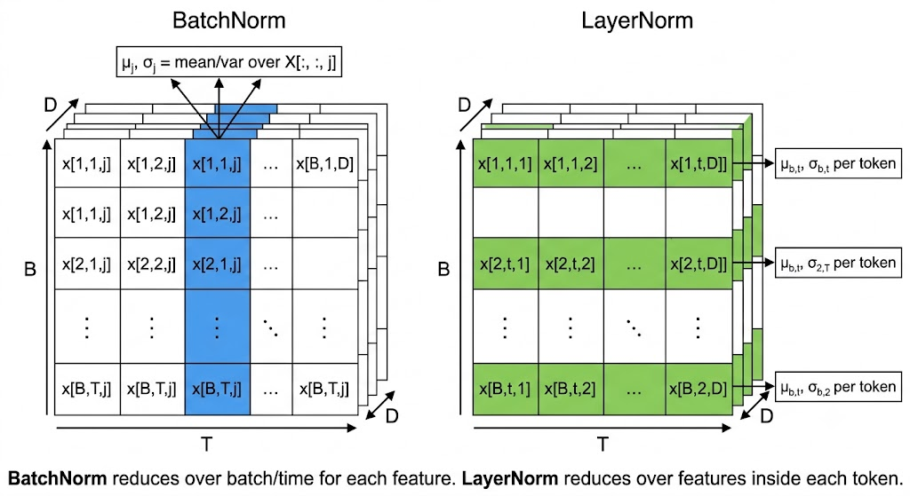
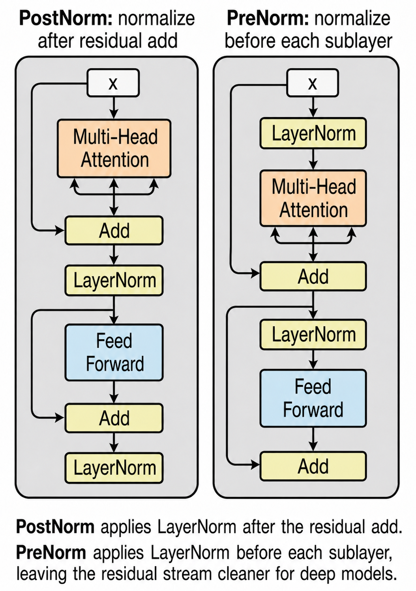
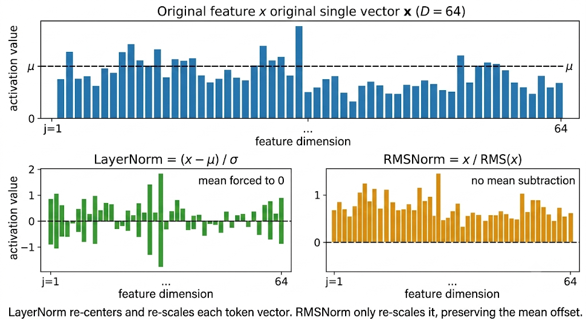
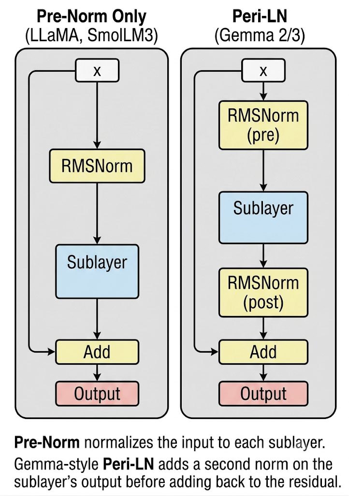
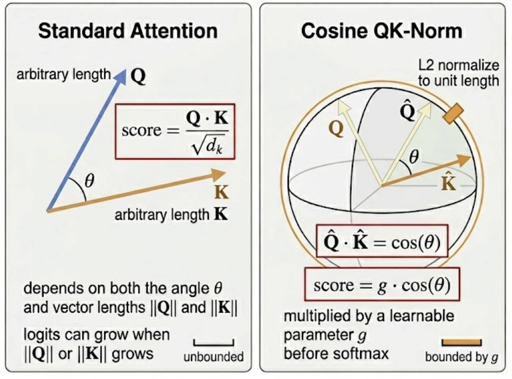
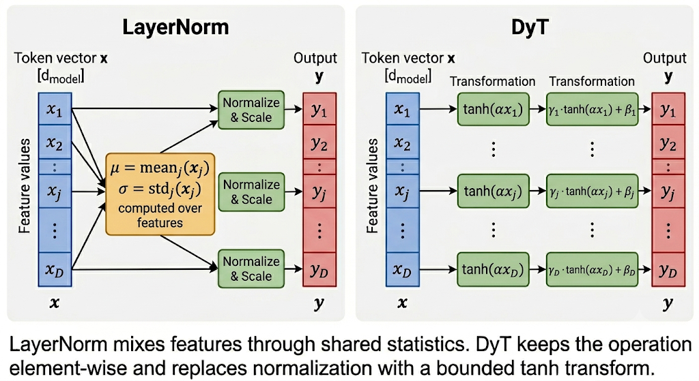

# Normalization: From BatchNorm to RMSNorm to Nothing

*How transformers tame their activations, and why every generation stripped more out*

## Introduction

A transformer block keeps writing into the same residual stream: project, attend, activate, add back, repeat. In a 32-layer stack, that stream can drift far from the scale it had at initialization; attention logits sharpen, residual updates become poorly conditioned, and an otherwise normal learning rate can produce loss spikes in the first few optimizer steps.

Normalization is the scale contract between blocks. Each scheme chooses an axis, computes a small statistic, and uses it to keep the next operation in a range where gradients are still useful. The interesting part is not "normalize or don't normalize", but *which axis*, *which statistic*, and *where in the block*.

Same running example as the positional-encoding post: *"The CEO announced record earnings on Friday"*, 7 tokens, `d_model = 64`. After the embedding layer, the residual stream is a `[7, 64]` matrix. LayerNorm and RMSNorm operate on each token vector in that stream; placement variants decide whether the norm sits before or after a sublayer; QK-Norm moves inside attention; DyT removes the statistic entirely and keeps only a point-wise squashing function.

If you only need the practical map:

- **BatchNorm**: normalize across batch/time per channel; great for CNNs, awkward for padded variable-length text
- **LayerNorm**: normalize across features per token; original Transformer/BERT/GPT-2 choice, no batch dependency
- **RMSNorm**: normalize token-vector scale without subtracting the mean; common default in modern open-weight decoder LLMs
- **Pre-Norm / Post-Norm / Peri-LN**: same norm, different placement; controls the gradient path and residual-stream scale
- **QK-Norm**: normalize only `Q` and `K`; targets attention-logit drift rather than residual-stream drift
- **DyT / Derf**: normalization-free research line; replaces statistics with a learned point-wise S-curve

**Note:** The repo for this series is available at [github.com/david-hoangt/llm_from_scratch](https://github.com/david-hoangt/llm_from_scratch); the snippets below are short PyTorch fragments you can paste into a notebook.

---

## Why Normalize at All?

Stack 32 transformer layers and feed our 7-token sentence through. Each layer adds its sublayer output back into the residual stream, so activation scale can grow additively with depth. By the time "Friday" reaches the final layer, the model may be operating far from the scale it was initialized for, logits sharpen, residual updates get poorly conditioned, and the optimizer starts fighting activation drift instead of learning token relationships.

$$
\begin{aligned}
\text{At layer } 0:&\quad \mathrm{Var}(x) \approx 1 \\
\text{At layer } L:&\quad \mathrm{Var}(x) \approx 1 + L \cdot \mathrm{Var}(\text{sublayer})
\end{aligned}
$$

- **Without normalization**: the network would need every weight matrix, residual branch, and learning-rate schedule tuned to keep scale bounded across all 32 layers
- **With normalization**: each layer rescales its inputs back to a known distribution before the next sublayer fires, regardless of what previous layers did

The job of a normalization layer is one sentence: take a vector with arbitrary scale, return a vector with controlled scale, sometimes controlled mean too, and let the network learn back any scale or bias it actually needs through trainable parameters. The rest of this post is about which axis to normalize over, and what to drop.

---

## BatchNorm (and Why It Fails for Transformers)

BatchNorm came first and works beautifully for CNNs, but the moment you swap images for variable-length sentences, three things break at once. It's worth understanding *how* it breaks, because LayerNorm is the clean escape hatch.

$$
\begin{aligned}
&\text{For each feature/channel } j,\ \text{pooling over non-channel axes:} \\
&\mu_j = \mathrm{mean}(x[:,j,:]) \qquad \sigma_j = \mathrm{std}(x[:,j,:]) \\
&\text{(over batch} \times \text{seq\_len, or batch} \times H \times W) \\
&y_{n,j,t} = \gamma_j \cdot \frac{x_{n,j,t} - \mu_j}{\sigma_j} + \beta_j
\end{aligned}
$$

- **Normalizes per channel, pooling over batch and any spatial/sequence dims**: one `(μ_j, σ_j)` pair per feature, shared across all positions in the slice
- **γ, β** `[d_model]`, learnable scale and shift, one pair per feature
- **Running mean/var**: at inference, BN swaps batch statistics for running averages computed during training
- **Built for CNNs**: fixed-shape image tensors `[N, C, H, W]`, normalize over `(N, H, W)` per channel

Now feed it our 7-token sentence inside a padded batch of mixed-length sentences. Three failures stack up.

### Failure 1: Padding Pollutes the Statistics

To form a `[B, T_max, d_model]` tensor, shorter sentences are padded with zeros to length `T_max`. BatchNorm 1d operates on this tensor as `[N, C, L]`, for each channel `j`, it pools statistics over the entire `(batch, sequence)` slice, not per position. So PAD tokens at every sequence position drag down the per-channel mean.

```
Batch of 3 sentences, T_max = 7:
  "The CEO announced record earnings on Friday" → 7 real tokens
  "Markets closed up"                            → 3 real + 4 PAD
  "Hi"                                           → 1 real + 6 PAD

For feature j, BN computes:
  μ_j = mean( x[:, j, :] )   ← averages over batch × seq_len
                                = 11 real values + 10 PAD zeros (3 batch × 7 pos)
```

- **The mean is dragged toward zero** by the padding tokens, distorting the statistic for every real token in that channel
- **Worse with imbalanced lengths**: a batch with one long sentence and many short ones is dominated by zeros, even though those zeros never contribute to a real prediction

### Failure 2: Train/Inference Mismatch

BatchNorm uses batch statistics during training and a running average at inference. For images this works because the per-channel distribution is roughly stationary across the dataset. For language, the running averages become a statistic of your batching and padding policy as much as the token distribution, shift the length mix at inference, and the model sees a different normalization regime.

### Failure 3: Small-Batch Sensitivity

LLM training pushes batch sizes per device down (large models eat memory) and microbatch granularity up (gradient accumulation). With effective per-device batches of 4–8 sequences, BN statistics are too noisy to be useful.

The fix is obvious in hindsight: stop normalizing across the batch. Pick an axis that doesn't care about batch size, padding, or sequence length.

---

## LayerNorm

Strip BatchNorm of its batch dependency entirely. For each token in our 7-token sentence, compute mean and variance across the *feature dimension*, the 64 numbers that make up that token's hidden vector, and rescale just that vector.

$$
\begin{aligned}
&\text{For each token vector } x \in \mathbb{R}^{d}: \\
&\mu = \frac{1}{d}\sum_{k} x_k \qquad \sigma^2 = \frac{1}{d}\sum_{k}(x_k - \mu)^2 \\
&y = \gamma \odot \frac{x - \mu}{\sqrt{\sigma^2 + \varepsilon}} + \beta
\end{aligned}
$$

- **x** `[d_model]`, one token's hidden vector
- **μ, σ** scalars, computed independently per token, no batch coupling
- **γ, β** `[d_model]`, learnable scale and shift, applied element-wise
- **ε** `~1e-5`, numerical stability constant, prevents divide-by-zero
- **y** `[d_model]`, normalized output for that token, same shape as `x`, fed into the next sublayer

For our sentence with `d_model = 64`, "CEO" gets one `μ` and one `σ` computed over its 64 features; "announced" gets its own. No information leaks between tokens; padding doesn't matter; batch size doesn't matter.



```python
class LayerNorm(nn.Module):
    """
    y = γ * (x - μ) / sqrt(σ² + ε) + β
    where μ, σ are computed over the last dim per token.
    """

    def __init__(self, d_model: int, eps: float = 1e-5):
        super().__init__()
        self.eps = eps
        self.gamma = nn.Parameter(torch.ones(d_model))   # [d_model]
        self.beta  = nn.Parameter(torch.zeros(d_model))  # [d_model]

    def forward(self, x: torch.Tensor) -> torch.Tensor:
        """x: [batch, seq_len, d_model] → same shape, normalized."""
        mu  = x.mean(dim=-1, keepdim=True)                    # [B, T, 1]
        var = x.var(dim=-1, keepdim=True, unbiased=False)     # [B, T, 1]
        x_hat = (x - mu) / torch.sqrt(var + self.eps)         # [B, T, d_model]
        return self.gamma * x_hat + self.beta
```

### Gotchas and Trade-offs

- **Two parameters per feature**: `γ` and `β` add `2 * d_model` trainable parameters per norm layer. For a 32-layer model with `d_model = 4096`, that's ~520K parameters just for normalization
- **Mean and variance reductions**: a naive implementation computes a mean, then a centered variance. Fused kernels reduce the overhead, but LayerNorm is still mostly memory-bandwidth bound on GPU
- **No batch coupling means no inference statistics**: LN behaves identically at train and inference time, no running averages, no surprises

### Key Takeaway

LayerNorm normalizes per-token across the feature dim, sidestepping every BatchNorm failure mode at once: no batch dependency, no padding pollution, no train/inference mismatch.

LN works everywhere, but it does two things: re-center (subtract mean) and re-scale (divide by std). The next question is whether the re-centering step is doing any actual work, and where to put the LN block within the residual stream.

---

## Pre-Norm vs Post-Norm: Where to Put It

The original Transformer (Vaswani et al., 2017) placed LayerNorm *after* the residual addition, so each sublayer's output is normalized along with the residual stream. That's "Post-Norm". It works, but training requires a learning rate warmup phase: the first few thousand steps use a tiny learning rate, ramp up linearly, then decay. Skip the warmup and Post-Norm transformers can diverge early.

```
# Post-Norm (original Transformer, 2017):
x = LayerNorm(x + Sublayer(x))

# Pre-Norm (modern default):
x = x + Sublayer(LayerNorm(x))
```

- **Post-Norm**: sublayer adds, then norm rescales. The residual stream itself is normalized
- **Pre-Norm**: norm before sublayer, then add. The residual stream stays unnormalized, only the *input* to each sublayer is rescaled
- The difference is a single line of code and no extra parameters. The training dynamics are completely different.



### Why Post-Norm Needs Warmup

Xiong et al. (*"On Layer Normalization in the Transformer Architecture"*, ICML 2020) showed that in Post-Norm, expected gradients near the output layers are large at initialization. With a standard learning rate, the first gradient step can push those top layers out of a useful region of weight space.

```
At initialization:
  Post-Norm:  top-layer gradients are large before warmup
  Pre-Norm:   residual path gives gradients a cleaner route through depth
```

- **Post-Norm puts LN after the residual add**: the output-side layers see large expected gradients at init
- **Pre-Norm leaves the residual path unnormalized**: gradients can flow through the identity branch instead of passing through a LayerNorm at every residual merge
- **Warmup is a workaround** for Post-Norm's bad init geometry, start with a learning rate small enough that you don't fall off the cliff, then ramp up once the model has moved into a stable region

Pre-Norm transformers can train without the same warmup sensitivity and usually reach comparable final loss faster. Most modern decoder LLMs keep a Pre-Norm path; Gemma-style blocks add post-sublayer norms on top instead of returning to plain Post-Norm.

### Gotchas and Trade-offs

- **Pre-Norm has its own failure mode**: at extreme depth, the residual stream can grow while each branch sees only a normalized input. Later residual updates become small relative to the stream they are added to
- **Post-Norm still has supporters**: some recent work (DeepNet, *"Scaling Transformers to 1,000 Layers"*) revisits Post-Norm with careful initialization to avoid the warmup issue
- **Pre-Norm needs a final norm**: since the residual stream is never normalized, there's typically a single LayerNorm before the unembedding to keep the output logits in range

### Key Takeaway

Pre-Norm is the common decoder-only path: stable gradients at init, less warmup sensitivity, simpler hyperparameter schedule. Post-Norm normalizes the residual stream itself; Pre-Norm only normalizes sublayer inputs.

Pre-Norm fixes the placement question. The next question is whether LayerNorm is doing too much work, specifically, whether subtracting the mean is even necessary.

---

## RMSNorm

LayerNorm does two operations: re-center (subtract `μ`) and re-scale (divide by `σ`). Zhang and Sennrich asked the sharper question in *"Root Mean Square Layer Normalization"* (NeurIPS 2019): what if the scale control is the important part, and mean-centering is mostly extra work? They dropped the mean computation and reported comparable quality with 7–64% training-time reductions in their tested settings.

$$
\begin{aligned}
\mathrm{RMS}(x) &= \sqrt{\frac{1}{d}\sum_{k} x_k^2 + \varepsilon} \\
y &= \gamma \odot \frac{x}{\mathrm{RMS}(x)}
\end{aligned}
$$

- **One statistic over features**: only `mean(x²)`, not a separate mean and centered variance
- **One parameter per feature**: only `γ`, no `β`. Halves the normalization parameters per layer
- **No re-centering**: the mean of `x` is left wherever it was; only the scale is normalized

For our 7-token sentence, RMSNorm computes one scalar per token (`RMS` over 64 features), then divides each token's vector by it and applies the per-feature scale `γ`. The mean of "CEO"'s vector is preserved; only its magnitude is controlled.



### Why Dropping the Mean Works

Zhang & Sennrich's argument is sharper than "the bias absorbs it": they decomposed LayerNorm into two separate invariance properties and tested which one carried the convergence benefit.

- **Re-scaling invariance**: multiplying inputs by any positive constant leaves the output unchanged. This is the part that controls activation magnitude and stops the residual stream from drifting
- **Re-centering invariance**: adding any constant offset to inputs leaves the output unchanged. The paper's experiments show this property contributes little to convergence in transformers
- **Implicit learning-rate adaptation**: the RMS statistic makes updates less sensitive to input and weight scale, preserving the optimizer-side benefit without mean subtraction
- **Empirical confirmation**: across their translation, language modeling, vision, and speech experiments, dropping the mean preserved quality while reducing runtime

$$
\begin{aligned}
\text{LayerNorm:}&\quad y = \gamma \odot \frac{x - \mu}{\sqrt{\mathrm{Var}(x) + \varepsilon}} + \beta \qquad (\text{mean+var, } \gamma+\beta) \\
\text{RMSNorm:}&\quad y = \gamma \odot \frac{x}{\sqrt{\mathrm{mean}(x^2) + \varepsilon}} \qquad (\text{RMS, } \gamma)
\end{aligned}
$$

- **Fewer reduction ops** → the paper reports 7–64% runtime reduction across tested models; actual LLM gains depend on kernel fusion and hardware
- **Fewer params** → halves optimizer state for normalization, reduces gradient communication in distributed training
- **Same downstream quality in the original experiments**: verified across translation, language modeling, vision, and speech tasks

```python
class RMSNorm(nn.Module):
    """
    y = γ * x / sqrt(mean(x²) + ε)

    No mean subtraction, no β bias. Half the parameters of LayerNorm.
    """

    def __init__(self, d_model: int, eps: float = 1e-6):
        super().__init__()
        self.eps = eps
        self.gamma = nn.Parameter(torch.ones(d_model))  # [d_model]

    def forward(self, x: torch.Tensor) -> torch.Tensor:
        """x: [batch, seq_len, d_model] → same shape, normalized."""
        rms = torch.sqrt(x.pow(2).mean(dim=-1, keepdim=True) + self.eps)  # [B, T, 1]
        return self.gamma * (x / rms)
```

### Gotchas and Trade-offs

- **Single parameter per feature**: only `γ`, no learnable bias `β`. The mean of each token's vector is left wherever it was after the previous sublayer
- **Numerically slightly different epsilon placement**: most implementations put `ε` inside the `sqrt`, some outside. The difference is tiny but check the source if matching a specific reference implementation
- **Not a drop-in for every architecture**: re-scaling invariance does most of the work in transformers, but architectures that genuinely depend on per-feature mean centering (some CNN variants) still prefer LayerNorm

### Example Architectures

- **LLaMA / LLaMA 2 / LLaMA 3**: RMSNorm
- **Mistral / Mixtral**: RMSNorm
- **Gemma 2 / 3**: RMSNorm (with peri-norm placement, see next section)
- **Qwen 2 / 3**: RMSNorm
- **DeepSeek-V2 / V3**: RMSNorm
- **SmolLM3**: RMSNorm

### Key Takeaway

RMSNorm drops LayerNorm's mean-centering step: one statistic, one trainable vector, fewer reductions, and comparable quality in the original experiments. Most recent decoder-only open-weight LLM families use it.

RMSNorm fixes the *operation*; Pre-Norm fixed the *placement*. The next question revisits placement: what if pre-norm alone isn't enough at scale?

---

## Extra Norms Around the Sublayer

Pre-Norm trains stably, but it has a hidden cost at scale: the residual stream can keep growing because the stream itself is never renormalized. At billions of parameters and dozens of layers, that drift can show up as loss spikes and learning-rate sensitivity. Recent models handle this by adding norms around the sublayer output, but they do not all use the same placement.

```
# Pre-Norm only (LLaMA-style):
x = x + Attn(Norm(x))
x = x + FFN(Norm(x))

# Peri-LN / pre+post RMSNorm (Gemma 2-style):
x = x + Norm_post_attn(Attn(Norm_pre_attn(x)))
x = x + Norm_post_ffn (FFN (Norm_pre_ffn (x)))

# Reordered norm (OLMo 2-style):
h = x + Norm_attn(Attn(x))
x = h + Norm_ffn (FFN (h))
```

- **Gemma-style Peri-LN**: four RMSNorms per block, before and after attention/FFN
- **OLMo 2-style reordered norm**: RMSNorm after attention and FFN outputs, plus RMSNorm on `Q`/`K` inside attention
- **Pre-Norm preserves the easy gradient path**: the residual identity branch remains open
- **Post-sublayer norm caps the residual update** before it merges back into the stream



Here, `Sublayer` means one residual branch inside a Transformer block: either Attention or FFN. Peri-LN applies the same pre/post norm pattern to both, so the diagram collapses them into one generic sublayer.

```python
class PeriLNBlock(nn.Module):
    """
    Gemma-style block: RMSNorm pre AND post each sublayer.

      x = x + RMSNorm_post_attn(Attn(RMSNorm_pre_attn(x)))
      x = x + RMSNorm_post_ffn (FFN (RMSNorm_pre_ffn (x)))
    """

    def __init__(self, d_model: int, attn: nn.Module, ffn: nn.Module):
        super().__init__()
        self.pre_attn  = RMSNorm(d_model)
        self.post_attn = RMSNorm(d_model)
        self.pre_ffn   = RMSNorm(d_model)
        self.post_ffn  = RMSNorm(d_model)
        self.attn = attn
        self.ffn  = ffn

    def forward(self, x: torch.Tensor) -> torch.Tensor:
        """x: [batch, seq_len, d_model]"""
        x = x + self.post_attn(self.attn(self.pre_attn(x)))
        x = x + self.post_ffn (self.ffn (self.pre_ffn (x)))
        return x
```

### Gotchas and Trade-offs

- **Extra norm layers**: Gemma-style Peri-LN uses 4 RMSNorms per block instead of 2. OLMo 2's reordered norm moves the block norms after sublayer outputs instead of simply adding four pre/post norms
- **Helps most at scale**: for 100M-parameter toy models, the payoff can be small. The benefit appears when residual variance and gradient spikes compound across many layers
- **Placement is model-specific**: Gemma 2 uses RMSNorm before and after each sublayer; OLMo 2 normalizes attention/FFN outputs and also normalizes `Q`/`K`. Check the implementation before reproducing a checkpoint

### Key Takeaway

Extra post-sublayer norms target the failure mode Pre-Norm leaves open: residual updates that grow through depth. Gemma-style Peri-LN keeps pre-norm and adds post-sublayer RMSNorm; OLMo 2 takes a reordered-norm route. Both are practical stability tools once scale makes residual drift visible.

So far every scheme has operated on the residual stream. The next question: what if the issue isn't the residual at all, but the `Q` and `K` projections that get multiplied to produce attention logits?

---

## QK-Norm: Just the Attention Vectors

At billion-parameter scale, attention logits can drift even when the residual stream is under control. If the norms of `q` and `k` grow, the dot product `q @ k.T` grows with them, softmax rows collapse toward one-hot weights, and gradients through non-winning keys fade out. Two variants of "QK-Norm" address this by normalizing `Q` and `K` before the dot product.

### Variant A, Cosine QK-Norm (Henry et al., 2020)

L2-normalize `Q` and `K` to unit length, then replace `1/sqrt(d_k)` with a learnable scale `g`. The dot product becomes a true cosine similarity, bounded by construction.

```
# Standard scaled dot-product attention:
scores = (Q @ K.T) / sqrt(d_k)

# Cosine QK-Norm (Henry et al., EMNLP Findings 2020):
Q_hat  = Q / ||Q||                # L2 normalize each query vector
K_hat  = K / ||K||                # L2 normalize each key vector
scores = g * (Q_hat @ K_hat.T)    # g learnable, replaces sqrt(d_k)
```

- **L2 normalization along the head dim**: each query and key vector becomes a unit vector
- **Dot product becomes cosine similarity**: bounded to `[-1, 1]` by construction
- **Learnable scale `g`**: replaces the fixed `sqrt(d_k)` divisor; lets the model choose how peaked attention should be
- **Logit magnitude bounded by `g`**: no more runaway growth

For our sentence, "announced" attending to "CEO" produces a cosine similarity in `[-1, 1]`, scaled by `g` into whatever sharpness range the head learns.



### Variant B, LayerNorm/RMSNorm QK-Norm (ViT-22B, Chameleon, OLMo 2)

ViT-22B and several newer model families use a softer formulation: apply LayerNorm or RMSNorm along the head dim of `Q` and `K`, then keep the standard `1/sqrt(d_k)` scaling.

```
# LayerNorm/RMSNorm QK-Norm (ViT-22B, Chameleon, OLMo 2):
Q_hat  = LayerNorm(Q, dim=d_k)    # or RMSNorm, controls per-vector scale
K_hat  = LayerNorm(K, dim=d_k)
scores = (Q_hat @ K_hat.T) / sqrt(d_k)  # standard scaling kept
```

- **Magnitude is controlled, but vectors are not unit-length**: the dot product is *not* bounded to `[-1, 1]`; it's just kept in a stable range
- **Why this version shows up in large models**: it preserves more of the geometry of `Q` and `K` than unit-vector normalization, plays nicely with mixed precision, and slots into existing scaled-dot-product code without changing the scaling factor
- **What it shares with Variant A**: the runaway-logit failure mode is controlled at the source, because `Q` and `K` magnitudes can no longer grow unchecked during training

### Why Logits Drift Without It

Training dynamics push the model toward higher confidence: the optimizer reduces loss by making useful attention weights larger, which means making logits more separated. ViT-22B hit this failure around the 8B-parameter scale: uncontrolled attention-logit growth produced near-one-hot attention and divergent loss.

```
Unnormalized Q/K:
  ||Q|| grows, ||K|| grows
    → Q @ K.T grows
    → softmax entropy collapses
    → gradients through non-winning keys fade out

QK-normalized:
  normalize Q and K along d_k
    → dot-product scale stays controlled
    → softmax stays trainable
```

Variant A caps the loop by construction: logits stay inside `[-g, g]`. Variant B is less strict, but it removes the easiest path to logit explosion: growing the norms of `Q` and `K`.

The cosine variant (A) is the cleanest implementation, Variant B is a one-line swap, replacing `F.normalize(...)` with `LayerNorm(d_k)(...)` and restoring `/ math.sqrt(d_k)` in the score computation.

```python
class QKNormAttention(nn.Module):
    """
    Cosine QK-Norm (Variant A, Henry et al., 2020).

    Standard MHA, but with L2-normalized Q and K and learnable scalar g.

      scores = g * (Q_hat @ K_hat.T)
      where Q_hat = Q / ||Q||, K_hat = K / ||K||  (along head dim)

    For Variant B (ViT-22B style), replace F.normalize with LayerNorm/RMSNorm
    along the head dim and restore / math.sqrt(d_k) in the score computation.
    """

    def __init__(self, d_model: int, n_heads: int, init_scale: float = 10.0):
        super().__init__()
        self.n_heads = n_heads
        self.d_k = d_model // n_heads

        self.W_q = nn.Linear(d_model, d_model, bias=False)
        self.W_k = nn.Linear(d_model, d_model, bias=False)
        self.W_v = nn.Linear(d_model, d_model, bias=False)
        self.W_o = nn.Linear(d_model, d_model, bias=False)

        # One learnable scale per head
        self.g = nn.Parameter(torch.full((n_heads, 1, 1), init_scale))

    def forward(self, x: torch.Tensor, mask=None) -> torch.Tensor:
        B, T, _ = x.shape
        Q = self.W_q(x).view(B, T, self.n_heads, self.d_k).transpose(1, 2)  # [B, h, T, d_k]
        K = self.W_k(x).view(B, T, self.n_heads, self.d_k).transpose(1, 2)
        V = self.W_v(x).view(B, T, self.n_heads, self.d_k).transpose(1, 2)

        # L2 normalize along head dim, turns each Q, K vector into a unit vector
        Q_hat = F.normalize(Q, p=2, dim=-1)
        K_hat = F.normalize(K, p=2, dim=-1)

        scores = self.g * torch.matmul(Q_hat, K_hat.transpose(-2, -1))  # [B, h, T, T]

        if mask is not None:
            scores = scores.masked_fill(mask, float("-inf"))

        weights = F.softmax(scores, dim=-1)
        context = torch.matmul(weights, V)
        context = context.transpose(1, 2).contiguous().view(B, T, -1)
        return self.W_o(context)
```

### Gotchas and Trade-offs

- **Compatible with FlashAttention**: normalization happens before the kernel; the kernel sees pre-normalized Q, K and treats them like any other inputs
- **Can block MLA absorption**: Multi-Latent Attention implementations often factorize Q/K through low-rank projections and avoid materializing full per-head vectors. QK-Norm forces you to normalize those vectors, which can break the optimization even if the math is still possible
- **Scale init matters**: Variant A's `g` and Variant B's norm scale decide how sharp attention is at step 0. Too high and you reintroduce early softmax saturation
- **Newer variants exist**: Lp-norm QK-Norm (using `Lp` instead of `L2`), per-head learnable scale vs. shared scale, and model-specific placement around RoPE

### Example Architectures

- **Henry et al., 2020** (Variant A, cosine), low-resource NMT demo, +0.928 BLEU average over baseline
- **ViT-22B** (Google, 2023, Variant B), large-scale transformer demo, LayerNorm on Q/K with `1/sqrt(d_k)` retained
- **Chameleon** (Meta, 2024, Variant B), multimodal model with QK normalization before attention
- **Gemma 3** (Google DeepMind, 2025, Variant B), replaces Gemma 2's attention logit soft-capping with QK-Norm
- **OLMo 2** (AI2, 2025, Variant B), RMSNorm on Q/K plus post-sublayer normalization

### Key Takeaway

QK-Norm controls attention-logit growth at the source: normalize `Q` and `K` along the head dim before the dot product. Variant A (cosine) bounds logits to `[-g, g]` by construction; Variant B (LayerNorm/RMSNorm) keeps the standard scaling but stops `Q`/`K` magnitudes from drifting unchecked.

Every scheme above is some flavor of "compute statistics, divide by them". The next question is whether the *normalization itself* is the load-bearing operation, or whether something simpler does the same job.

---

*From this point on, the question changes, from **how** to normalize to **whether** normalization is even necessary. The following section covers a 2025 research result, not a production default. If you're here for the fundamentals, RMSNorm above is still the practical default for open-weight decoder LLMs.*

## 2025 Challenge: Dynamic Tanh (DyT)

Every scheme above computes statistics, divides, and rescales. Zhu, Chen, He, LeCun, and Liu noticed something in *"Transformers without Normalization"* (CVPR 2025): if you plot LayerNorm's input against its output across layers, the curve often looks like `tanh`, squashing extreme values while leaving the middle roughly linear. So they replaced normalization entirely with an element-wise tanh:

$$
\mathrm{DyT}(x) = \gamma \odot \tanh(\alpha \cdot x) + \beta
$$

- **α** scalar, learnable, controls the steepness of the tanh
- **γ, β** `[d_model]`, learnable scale and shift, exactly like LayerNorm
- **No statistics computed**: no mean, no variance, no division. Pure element-wise op
- **Drop-in replacement in tested blocks**: swap a LayerNorm or RMSNorm site for `DyT(d_model)` and keep the surrounding architecture unchanged

For our 7-token sentence, DyT applies the same `tanh(α * x)` to every element of every token's vector, then per-feature scale and shift. No interaction between features, no coupling within a token.

### Why It Works

The paper's empirical observation: LayerNorm's input-output curve is often S-shaped because:

- **Most activations are in the linear regime** of the normalized output, `x / σ` for a typical `x` produces a value in `[-2, 2]`
- **Outliers get squashed**: extreme `x` values produce normalized outputs near `±2`, the saturation region
- **An S-curve is the simplest function that does both**: and `tanh` is the cheapest S-curve to compute

DyT's bet: the statistics may not be the load-bearing part. In many transformer blocks, LayerNorm behaves like an adaptive S-curve; replace it with an explicit S-curve, save the reduction ops, and see whether quality holds.



```python
class DyT(nn.Module):
    """
    DyT(x) = γ * tanh(α * x) + β

    No statistics. No reduction across the feature dim.
    Element-wise replacement for LayerNorm/RMSNorm.
    """

    def __init__(self, d_model: int, init_alpha: float = 0.5):
        super().__init__()
        self.alpha = nn.Parameter(torch.tensor(init_alpha))
        self.gamma = nn.Parameter(torch.ones(d_model))   # [d_model]
        self.beta  = nn.Parameter(torch.zeros(d_model))  # [d_model]

    def forward(self, x: torch.Tensor) -> torch.Tensor:
        """x: [batch, seq_len, d_model] → same shape."""
        return self.gamma * torch.tanh(self.alpha * x) + self.beta
```

### What the Paper Tested

Zhu et al. ran DyT as a drop-in replacement across:

- **Vision**: ViT and ConvNeXt (supervised), MAE and DINO (self-supervised)
- **Language**: LLaMA-style models
- **Diffusion**: DiT
- **Speech**: wav2vec 2.0
- **DNA**: sequence modeling

Across the reported settings, DyT-equipped transformers matched or slightly exceeded their normalized counterparts, with training curves close to LayerNorm.

### Gotchas and Trade-offs

- **Newer than the rest**: DyT is from CVPR 2025; production deployments are still rare. Reproduce the paper before relying on it for a critical run
- **Initialization of α matters**: the paper recommends `α ≈ 0.5` for transformers. Too small and the tanh is nearly linear (no squashing); too large and it saturates everything
- **No statistics → no per-token coupling**: every element is processed independently. This may matter for tasks where per-token magnitude normalization is genuinely load-bearing
- **Speedup is modest at FP16/BF16**: RMSNorm is already cheap on modern GPUs. DyT's win is conceptual (no reduction op) as much as wall-clock
- **Follow-up work is already moving**: Derf (`erf(αx + s)`) reports stronger normalization-free results than DyT in a December 2025 preprint. Treat DyT as the first clean crack in the normalization assumption, not the final answer

### Key Takeaway

DyT replaces normalization with an element-wise `tanh(α * x)`, no statistics, no division, and drop-in compatible in the paper's tested transformer blocks. It challenges the long-standing assumption that normalization layers are essential, while newer normalization-free functions suggest this line of work is still moving.

---

## Which Norm Should You Use?

The trajectory across this post: from normalizing across the *batch* (BatchNorm), to across *features per token* (LayerNorm), to *features per token without centering* (RMSNorm), to extra norms around sublayer outputs, to *just Q and K* (QK-Norm), to *no normalization statistics at all* (DyT/Derf). Each step either drops an operation, moves the statistic, or narrows the place where scale needs control.

- **Decoder-only LLM, modern default** → RMSNorm + Pre-Norm. Used by LLaMA, Mistral, Qwen, DeepSeek, SmolLM3
- **Large decoder at scale** → RMSNorm plus model-specific post-sublayer norms when residual drift shows up. Extra RMSNorm cost is small; stability gains compound
- **Stability issues at scale (attention logits exploding)** → add QK-Norm to attention. Cosine QK-Norm bounds logits by construction; LayerNorm/RMSNorm QK-Norm controls Q/K scale. Compatible with FlashAttention; can complicate MLA absorption
- **Encoder model (BERT-style)** → LayerNorm. RMSNorm works too, but LayerNorm is what every reference impl ships with
- **Vision CNN** → BatchNorm. Where it was born, where it still works best
- **Research / experimentation** → DyT or Derf as a drop-in test for whether your normalization is doing real work, or whether a point-wise S-curve is enough

---

## References

- Ioffe & Szegedy, [*"Batch Normalization: Accelerating Deep Network Training by Reducing Internal Covariate Shift"*](https://proceedings.mlr.press/v37/ioffe15.html), ICML 2015, BatchNorm
- Ba, Kiros, Hinton, [*"Layer Normalization"*](https://arxiv.org/abs/1607.06450), 2016, LayerNorm
- Vaswani et al., [*"Attention Is All You Need"*](https://arxiv.org/abs/1706.03762), NeurIPS 2017, original Post-Norm transformer
- Zhang & Sennrich, [*"Root Mean Square Layer Normalization"*](https://arxiv.org/abs/1910.07467), NeurIPS 2019, RMSNorm, 7–64% speedup over LayerNorm
- Henry et al., [*"Query-Key Normalization for Transformers"*](https://arxiv.org/abs/2010.04245), Findings of EMNLP 2020, QK-Norm
- Xiong et al., [*"On Layer Normalization in the Transformer Architecture"*](https://arxiv.org/abs/2002.04745), ICML 2020, Pre-Norm vs Post-Norm gradient analysis, warmup elimination
- Wang et al., [*"DeepNet: Scaling Transformers to 1,000 Layers"*](https://arxiv.org/abs/2203.00555), 2022, Post-Norm with careful init for very deep networks
- Dehghani et al., [*"Scaling Vision Transformers to 22 Billion Parameters"*](https://openreview.net/forum?id=Lhyy8H75KA), 2023, QK-Norm at scale (ViT-22B)
- Meta AI, [*"Chameleon: Mixed-Modal Early-Fusion Foundation Models"*](https://arxiv.org/abs/2405.09818), 2024, QK normalization in multimodal attention
- Google DeepMind, [*"Gemma 2: Improving Open Language Models at a Practical Size"*](https://storage.googleapis.com/deepmind-media/gemma/gemma-2-report.pdf), 2024, pre- and post-norm with RMSNorm
- Google DeepMind, [*"Gemma 3 Technical Report"*](https://arxiv.org/abs/2503.19786), 2025, pre- and post-norm with RMSNorm plus QK-Norm
- AI2, [*"2 OLMo 2 Furious"*](https://arxiv.org/abs/2501.00656), 2025, RMSNorm on Q/K and reordered post-sublayer normalization
- Zhu, Chen, He, LeCun, Liu, [*"Transformers without Normalization"*](https://openaccess.thecvf.com/content/CVPR2025/html/Zhu_Transformers_without_Normalization_CVPR_2025_paper.html), CVPR 2025, Dynamic Tanh (DyT)
- Chen, Lu, Zhu, Sun, Liu, [*"Stronger Normalization-Free Transformers"*](https://arxiv.org/abs/2512.10938), arXiv 2025, Derf
