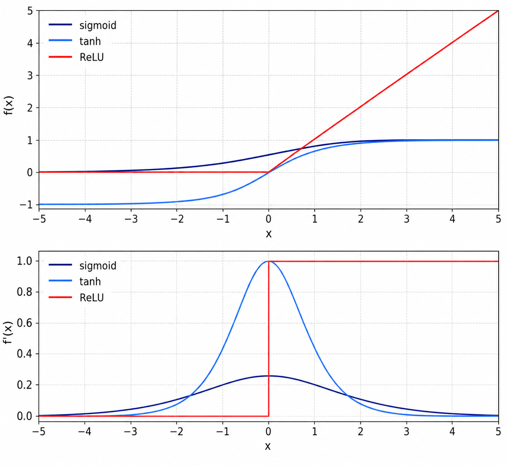
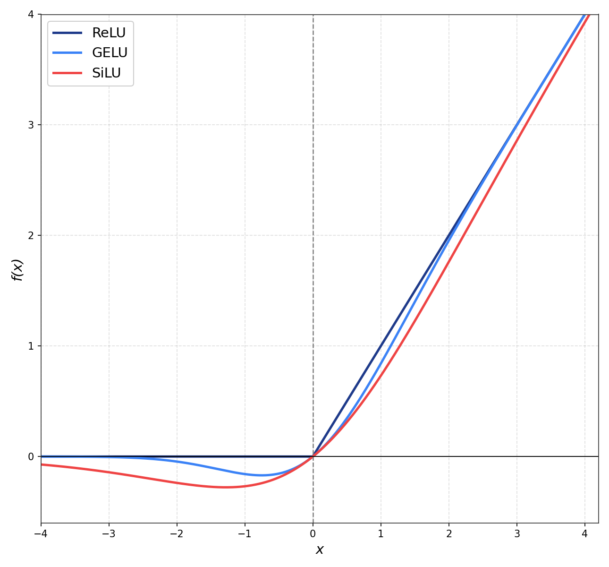
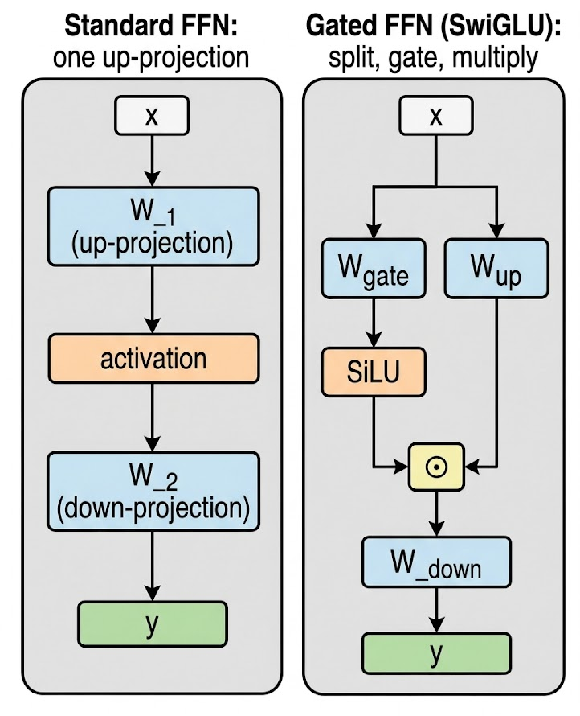

# Activations: From ReLU to SwiGLU and the Rise of Gated FFNs

*How transformers gave their hidden layers more shape, and then more gates*

## Introduction

Half of every transformer block is attention; the other half is a feed-forward network applied independently to each token. That FFN is two linear layers with a single nonlinearity wedged between them, and the choice of nonlinearity is what makes "two matmuls in a row" into something that can model non-linear relationships at all. Strip the activation out and every feed-forward block collapses to a single linear projection, no matter how many you stack.

The history of activation functions in transformers is a 60-year game of "make the curve smoother, make it cheaper, make it learn better gradients." Sigmoid and tanh started it, ReLU broke the depth barrier in 2012, GELU smoothed the kink for BERT and GPT-2, and SwiGLU re-architected the FFN block itself for many modern open-weight LLMs.

Same running example as the [previous post](../4.%20normalization/normalization.md): *"The CEO announced record earnings on Friday"*, 7 tokens, `d_model = 64`. Each FFN block sees a `[7, 64]` matrix, projects it up into a wider intermediate layer, applies an activation element-wise, then projects it back to `[7, 64]`. In a vanilla transformer FFN it is often `4 * d_model`, so this example uses `d_ff = 256` and an intermediate shape of `[7, 256]`. The activation never mixes tokens or features, it shapes one number at a time.

Each activation tweaks the same `f(x)` graph in a different way:

- **Sigmoid / tanh**: saturating S-curves, vanishing gradients killed them for deep nets
- **ReLU**: `max(0, x)`, broke the deep-net training problem in 2012, dies on negatives
- **GELU**: smooth approximation of ReLU weighted by a Gaussian CDF, BERT/GPT-2/GPT-3 default
- **SiLU / Swish**: `x * sigmoid(x)`, cheaper cousin of GELU, near-identical shape
- **SwiGLU**: Swish + a multiplicative gate, splits the FFN's hidden layer into two paths, dominant decoder-only LLM default
- **ReLU²**: `max(0, x)²`, a 2021 revival, surfaced again in some 2024-25 architectures


**Note:** All implementations in this post are available as runnable notebooks at [github.com/david-hoangt/llm_from_scratch](https://github.com/david-hoangt/llm_from_scratch/tree/main/src/activations).

---

## Why a Nonlinearity at All?

Each FFN block in a transformer is two `nn.Linear` layers stacked back to back. If the only thing between them is another linear operation, the composition collapses into a single linear map and the model can't represent anything a single linear layer couldn't.

$$
\begin{aligned}
y &= (x W_1 + b_1) W_2 + b_2 \\
  &= x (W_1 W_2) + (b_1 W_2 + b_2) \\
  &= x W' + b' \qquad (\text{one linear layer in disguise})
\end{aligned}
$$

- **W_1** `[d_model, d_ff]`, projects up from `64` to `256`
- **W_2** `[d_ff, d_model]`, projects back down from `256` to `64`
- **W' = W_1 @ W_2** `[d_model, d_model]`, the equivalent single matrix
- The product of two linear maps is still linear, no amount of stacking adds expressive power without a nonlinearity

The activation breaks the linearity. By bending the function at zero (ReLU), at a sigmoid (GELU), or with a multiplicative gate (SwiGLU), each FFN block carves the input space into regions where different combinations of the `d_ff` hidden units fire. Stack 32 of these and the model can fit functions that no linear projection ever could.

---

## Sigmoid and Tanh: Why They Don't Survive

The 1980s default was sigmoid `σ(x) = 1 / (1 + exp(-x))`, with tanh as the recentered cousin. Both are smooth, both are bounded, and both kill deep networks at the saturation tails: once `|x|` grows past ~3, the gradient is essentially zero.

$$
\begin{aligned}
\sigma(x)   &= \frac{1}{1 + e^{-x}} && \in (0, 1) \\
\sigma'(x)  &= \sigma(x)\,(1 - \sigma(x)) && \le 0.25,\ \text{peaks at } x = 0 \\[4pt]
\tanh(x)    &= \frac{e^{x} - e^{-x}}{e^{x} + e^{-x}} && \in (-1, 1) \\
\tanh'(x)   &= 1 - \tanh^2(x) && \le 1,\ \text{peaks at } x = 0
\end{aligned}
$$

- **Sigmoid's gradient maxes out at 0.25**: backprop through L layers multiplies L gradients together; for sigmoid each is ≤ 0.25, so the signal reaching the early layers shrinks like `0.25^L`. Tanh's derivative peaks at 1.0 at the origin, which helps, but it still collapses toward zero at the tails
- **Saturates at the tails**: for `|x| > 3`, the slope flattens. A neuron pushed into saturation by the prior layer stops learning entirely
- **Tanh is zero-centered, sigmoid is not**: sigmoid outputs are all positive, which biases the next layer's gradient direction. Tanh fixed that, but kept the saturation problem


*Sigmoid and tanh saturate at the tails, derivatives vanish past |x| > 3. ReLU keeps the gradient at exactly 1 for any positive x, but produces a hard zero for negatives.*

For "CEO" sitting in some hidden unit at `x = 4.2`, sigmoid returns `0.985` with a derivative of `0.015`. Whatever signal the loss wants to push back through this neuron is multiplied by `0.015`, and the next layer down has the same problem. By layer 6, the gradient is dead.

The fix was to stop being smooth at the tails entirely.

---

## ReLU

Krizhevsky, Sutskever, and Hinton's AlexNet (2012) used ReLU instead of tanh in every hidden layer. In their CIFAR-10 ablation, a four-layer ReLU network reached 25% training error six times faster than the same network with tanh. The function is one comparison and one multiplication.

$$
\begin{aligned}
\mathrm{ReLU}(x)  &= \max(0, x) \\[4pt]
\mathrm{ReLU}'(x) &= \begin{cases} 1 & x > 0 \\ 0 & x \le 0 \end{cases}
\end{aligned}
$$

- **No saturation on the positive side**: gradient is exactly 1 for any positive input. Backprop through 32 layers preserves the signal as long as the activation is non-zero
- **Sparse activation**: typically ~50% of neurons output zero on a given forward pass, which acts as implicit regularization
- **Cheap**: one comparison, no exponentials. Runs at memory bandwidth speed on a GPU
- **Not differentiable at `x = 0`**: in practice frameworks define the subgradient as 0 (or 1) at exactly zero, and the measure-zero point doesn't matter for SGD

For our 7-token sentence in the FFN's hidden layer of size 256, roughly half the `7 * 256 = 1792` activations will fire, half will be zero. The next layer sees a sparse representation it can route over.

```python
class FFN_ReLU(nn.Module):
    """
    Standard transformer FFN:
      y = ReLU(x @ W_1 + b_1) @ W_2 + b_2
    """

    def __init__(self, d_model: int, d_ff: int):
        super().__init__()
        self.w1 = nn.Linear(d_model, d_ff)   # [d_model, d_ff]   = [64, 256]
        self.w2 = nn.Linear(d_ff, d_model)   # [d_ff, d_model]   = [256, 64]

    def forward(self, x: torch.Tensor) -> torch.Tensor:
        """x: [batch, seq_len, d_model] → same shape."""
        h = F.relu(self.w1(x))                # [B, T, d_ff]
        return self.w2(h)                     # [B, T, d_model]
```

### Gotchas and Trade-offs

- **Dying ReLU**: once a neuron's pre-activation is consistently negative (e.g., a large negative bias accumulates during training), its gradient is permanently zero and it never updates again. The dead fraction is highly setup-dependent and can be large: Lu et al. (2019) measured ~5%/20%/30% dead at layers 3/10/20 of a 20-layer net, and Voita et al. (2023) found over 70% of neurons dead in some layers of OPT-66B
- **Unbounded above**: outputs can grow arbitrarily large. Combined with bad weight init, this can cause activation explosions
- **Hard cutoff at zero**: the discontinuity in the derivative is a benign issue numerically, but it's a hint that a smoother variant might learn better

The dying-neuron problem inspired a small zoo of patches, Leaky ReLU `max(0.01x, x)`, PReLU (learned slope), ELU `α(exp(x) - 1)` for `x < 0` (with `α = 1` by default), none of which became the dominant transformer activation. The reason is that the next idea didn't just patch ReLU's negative side; it reinterpreted the whole function probabilistically.

### Key Takeaway

ReLU broke the gradient-vanishing problem with a gradient that's exactly 1 on the positive side and 0 on the negative side. Cheap, sparse, and good enough that vision and early NLP rode it for a decade. The hard zero is the lingering problem the next generation tried to smooth out.

---

## GELU

ReLU multiplies its input by a binary mask: keep `x` if positive, drop it if negative. Hendrycks and Gimpel (*"Gaussian Error Linear Units"*, 2016) replaced that hard mask with a soft one, weighting `x` by the probability that a standard-normal random variable is below it.

$$
\mathrm{GELU}(x) = x \cdot \Phi(x), \qquad
\Phi(x) = \frac{1 + \operatorname{erf}\!\left(x / \sqrt{2}\right)}{2}
$$

where $\Phi(x)$ is the CDF of the standard normal.

- **`x * Φ(x)`**: multiply the input by "the probability that a Gaussian with mean 0, variance 1 is less than `x`"
- **For large positive `x`**: `Φ(x) ≈ 1`, so `GELU(x) ≈ x` (matches ReLU)
- **For large negative `x`**: `Φ(x) ≈ 0`, so `GELU(x) ≈ 0` (matches ReLU)
- **Around `x = 0`**: `Φ(0) = 0.5`, smooth dip below zero before climbing back. The slope stays non-zero through the origin and across most of the negative side, not a hard switch like ReLU (it does touch zero at GELU's minimum near `x ≈ -0.75` and again far out in the negative tail)

The probabilistic story: imagine "drop the input with some probability." ReLU drops with probability 0 if `x > 0` and 1 if `x ≤ 0`. GELU drops with probability `1 - Φ(x)`, a smooth function of `x` itself, so the keep-or-drop decision and the value being dropped are coupled. Hendrycks framed it as a stochastic regularizer made deterministic by taking the expectation.

Beyond the exact `erf` form, a tanh approximation is also common, trading a little accuracy to avoid `erf` (modern frameworks like PyTorch default to exact, but the approximation persists in older checkpoints):

$$
\mathrm{GELU}(x) \approx 0.5\,x\left(1 + \tanh\!\left[\sqrt{2/\pi}\,\left(x + 0.044715\,x^3\right)\right]\right)
$$

```python
class FFN_GELU(nn.Module):
    """
    BERT/GPT-2 style FFN, same structure as ReLU FFN, swap activation.
    """

    def __init__(self, d_model: int, d_ff: int):
        super().__init__()
        self.w1 = nn.Linear(d_model, d_ff)
        self.w2 = nn.Linear(d_ff, d_model)

    def forward(self, x: torch.Tensor) -> torch.Tensor:
        """x: [batch, seq_len, d_model] → same shape."""
        h = F.gelu(self.w1(x))               # exact erf-based by default
        # h = F.gelu(self.w1(x), approximate="tanh")  # fast tanh approximation
        return self.w2(h)
```


*GELU and SiLU are smooth versions of ReLU, they dip slightly below zero around x ≈ -1 before rising. The non-zero gradient through the origin is what mostly avoids ReLU-style permanently dead units in transformer FFNs.*

### Why the Smooth Dip Matters

GELU dips below zero just left of the origin, bottoming out around `-0.17` at `x ≈ -0.75`. That small negative lobe is the part that does real work compared to ReLU:

- **No hard-dead neurons**: the gradient is non-zero through the origin and across most of the negative side, vanishing only at GELU's minimum near `x ≈ -0.75` and deep in the negative tail. A neuron pushed to a slight negative pre-activation can still participate in learning and recover, instead of being stuck at ReLU's permanent zero
- **Smoothly reweights small inputs**: for `x` near zero, GELU behaves like a soft "this neuron contributes a little bit of the input." ReLU's binary on/off can't represent that
- **Empirically better at language**: Hendrycks & Gimpel reported small but consistent gains across MNIST, CIFAR-10/100, TIMIT phoneme recognition, and Twitter POS tagging. The big payoff came when transformer papers (BERT, GPT-2) showed multi-point downstream gains

### Gotchas and Trade-offs

- **More expensive than ReLU**: even the tanh approximation involves a `tanh` and a cubed term. The exact `erf` form is slower still on hardware that doesn't have a fused `erf` instruction
- **Two flavors in the wild**: exact `erf`-based vs. tanh approximation. They're numerically close (max diff ~0.001) but not identical. PyTorch's default is exact; HuggingFace's `gelu_new` and TensorFlow's older default are the tanh approximation. Match the model card when reproducing a checkpoint
- **Worth it at scale**: for FP16/BF16 transformers on modern GPUs, the FLOPs cost is negligible compared to the matmul. The activation choice is essentially free in wall-clock terms

### Example Architectures

- **BERT** (Devlin et al., 2018), GELU
- **GPT-2** (Radford et al., 2019), GELU (tanh approximation)
- **GPT-3** (Brown et al., 2020), GELU
- **T5** (Raffel et al., 2020), first version ReLU; later T5 1.1 switched to GEGLU
- **ViT** (Dosovitskiy et al., 2021), GELU

### Key Takeaway

GELU smooths ReLU's hard zero by weighting the input with a Gaussian CDF. The non-zero gradient around and below zero mostly avoids ReLU-style permanently dead units and gives small but consistent gains. The default for the entire BERT/GPT-2/GPT-3 generation.

GELU is a pointwise function, input goes in, output comes out, no extra parameters. The next idea changed both the function *and* the structure of the FFN block itself.

---

## SiLU / Swish: Cheaper Cousin

While GELU was settling in, two groups landed on essentially the same function via different routes. Elfwing, Uchibe, and Doya called it SiLU (*Sigmoid-Weighted Linear Unit*, 2017). Ramachandran, Zoph, and Le ran a Neural Architecture Search and rediscovered it as Swish (*"Searching for Activation Functions"*, 2017). The two names refer to the same function.

$$
\mathrm{SiLU}(x) = \mathrm{Swish}(x) = x \cdot \sigma(x) = \frac{x}{1 + e^{-x}}
$$

- **One sigmoid and one multiply**: cheaper than GELU's `erf` or tanh approximation
- **Same general shape as GELU**: smooth, dips below zero around `x ≈ -1.28`, asymptotes to ReLU for large positive `x`
- **Self-gated**: the "gate" `σ(x)` is computed from the input itself, no extra parameters

For our 7-token sentence, SiLU and GELU produce nearly identical outputs at every position, the curves overlap so closely that you have to plot the difference to see them apart.

```python
class FFN_SiLU(nn.Module):
    """
    Drop-in for ReLU/GELU FFN, same shape, swap activation.
    """

    def __init__(self, d_model: int, d_ff: int):
        super().__init__()
        self.w1 = nn.Linear(d_model, d_ff)
        self.w2 = nn.Linear(d_ff, d_model)

    def forward(self, x: torch.Tensor) -> torch.Tensor:
        h = F.silu(self.w1(x))               # x * sigmoid(x)
        return self.w2(h)
```

### Why It Matters as a Building Block

On its own, SiLU/Swish never displaced GELU at the top of a model, the gains over GELU were too small to justify the switch. Its real legacy is as the activation *inside* SwiGLU. The cheap `x * σ(x)` form is what makes the gated FFN affordable to compute.

The next jump isn't a smoother curve, it's a different *structure* for the entire FFN block.

### Key Takeaway

SiLU is `x * σ(x)`, GELU's shape at a fraction of the cost: one sigmoid and one multiply, no `erf`. As a standalone activation it never beat GELU by enough to matter. Its lasting role is as the gate inside SwiGLU, where the cheap form is exactly what makes the gated FFN affordable.

---

## The GLU Family: Gating Comes In

Every activation so far is a single function applied to a single tensor. Dauphin, Fan, Auli, Grangier (*"Language Modeling with Gated Convolutional Networks"*, 2017) split the FFN's hidden layer into two halves and let one half multiplicatively gate the other.

```
# Standard FFN hidden activation:
h = activation(x @ W_1)                  # [d_ff]

# Gated Linear Unit (GLU):
h = (x @ W_a) ⊙ σ(x @ W_b)              # [d_ff], element-wise product

  where W_a, W_b each project x to d_ff
```

- **Two projections instead of one**: `W_a` produces the "value" path, `W_b` produces the "gate" path
- **`⊙`**: element-wise multiply, also called Hadamard product
- **`σ`**: sigmoid, but any nonlinearity works (this is what generates the variants)
- **The gate modulates what passes through**: for each of the `d_ff` hidden units, the gate scales the corresponding value-path output. In the original sigmoid GLU that scale is in `(0, 1)`; in variants like ReGLU, GEGLU, and SwiGLU, the scale depends on the chosen activation and can also amplify or flip the value
- **More parameters**: two `W` matrices instead of one in the up-projection


*Standard FFN: one up-projection, one activation, one down-projection. Gated FFN: two parallel up-projections combined with element-wise multiplication, then a single down-projection.*

Once you have the gating template, the variant question becomes "what nonlinearity goes on the gate path?" Shazeer (*"GLU Variants Improve Transformer"*, 2020) tabulated all of them:

- **GLU**: gate uses sigmoid `σ` (Dauphin et al., 2017)
- **ReGLU**: gate uses ReLU
- **GEGLU**: gate uses GELU
- **SwiGLU**: gate uses Swish/SiLU
- **Bilinear**: no nonlinearity, just `(x @ W_a) ⊙ (x @ W_b)`

Shazeer benchmarked all five against a standard ReLU/GELU FFN on T5's pretraining and downstream tasks. SwiGLU and GEGLU consistently came out ahead. The paper famously closes with: *"We offer no explanation as to why these architectures seem to work; we attribute their success, as all else, to divine benevolence."*

### Key Takeaway

GLU adds a multiplicative gate to the FFN's up-projection. The gate modulates each hidden unit, while the value path supplies the content being modulated, a structural change, not a curve change. Picking the gate's activation gives you the GLU family; SwiGLU is the variant that won.

---

## SwiGLU

SwiGLU is GLU with Swish/SiLU on the gate path. It's the FFN block in many modern decoder-only open-weight LLMs, and the only activation choice in this post that changes the *shape* of the network rather than just the curve.

$$
\mathrm{SwiGLU\text{-}FFN}(x) = \big(\mathrm{SiLU}(x W_{\text{gate}}) \odot (x W_{\text{up}})\big)\, W_{\text{down}}
$$

- **`W_gate`** `[d_model, d_ff]`, gate projection, then SiLU
- **`W_up`** `[d_model, d_ff]`, value projection, no activation
- **`⊙`** element-wise multiply, `[d_ff]` × `[d_ff]` → `[d_ff]`
- **`W_down`** `[d_ff, d_model]`, project back to the residual stream
- **No biases**: modern LLMs drop bias terms from these projections, same convention as Q/K/V

For our 7-token sentence, the gate path computes a `[7, d_ff]` matrix of values in roughly `[-0.28, ∞)` (Swish's range), the value path computes another `[7, d_ff]` with no activation, and the element-wise product is fed to `W_down`. Each hidden unit gets independently scaled by the SiLU gate: small gates suppress the value path, large positive gates amplify it, and slightly negative gates can flip its sign.

```python
class SwiGLU_FFN(nn.Module):
    """
    LLaMA-style FFN:
      y = ( SiLU(x @ W_gate) ⊙ (x @ W_up) ) @ W_down

    Three projections instead of two. No biases.
    """

    def __init__(self, d_model: int, d_ff: int):
        super().__init__()
        self.w_gate = nn.Linear(d_model, d_ff, bias=False)
        self.w_up   = nn.Linear(d_model, d_ff, bias=False)
        self.w_down = nn.Linear(d_ff,   d_model, bias=False)

    def forward(self, x: torch.Tensor) -> torch.Tensor:
        """x: [batch, seq_len, d_model] → same shape."""
        gate = F.silu(self.w_gate(x))         # [B, T, d_ff]
        up   = self.w_up(x)                   # [B, T, d_ff]
        return self.w_down(gate * up)         # [B, T, d_model]
```

### The 2/3 Rule (Parameter Budget)

A standard ReLU/GELU FFN with `d_ff = 4 * d_model` has two matrices, total params `2 * d_model * d_ff = 8 * d_model²`. SwiGLU has three matrices, total params `3 * d_model * d_ff`. To keep parameter count constant when swapping in SwiGLU, shrink `d_ff`:

$$
\begin{aligned}
\text{Standard FFN params:} &\quad 2 \cdot d_{\text{model}} \cdot (4\,d_{\text{model}}) = 8\,d_{\text{model}}^2 \\
\text{SwiGLU FFN params:}   &\quad 3 \cdot d_{\text{model}} \cdot d_{\text{ff}}^{\text{swiglu}} \\[4pt]
\text{Set equal:}          &\quad d_{\text{ff}}^{\text{swiglu}} = \tfrac{8}{3}\,d_{\text{model}} \approx 2.67\,d_{\text{model}}
\end{aligned}
$$

- **`d_ff_swiglu = (8/3) * d_model`**: keeps total FFN params the same as a 4×-expanded ReLU/GELU FFN
- **Round to a multiple of `multiple_of` (256 in LLaMA)**: for hardware-friendly tile sizes
- **LLaMA 7B**: `d_model = 4096`, raw target `(8/3) * 4096 ≈ 10923`, rounded up to `11008`

The shape difference is real: SwiGLU's `d_ff` is ~2.67× `d_model`, vs. ~4× for a vanilla FFN. The extra projection is what buys back the apparent "shrinkage."

### Why SwiGLU Wins

The honest answer is the Shazeer answer: empirically it works better and we don't fully understand why. Two plausible mechanisms, plus the evidence:

- **Multiplicative interactions**: gating lets each hidden unit's output depend on two linear projections of the input multiplicatively, not just additively. This adds expressiveness that a single nonlinearity can't replicate
- **Soft per-unit modulation**: the SiLU gate gives each hidden dimension an input-dependent scale. When a value-path entry is irrelevant, the gate can suppress it without forcing a permanent hard zero; when it's relevant, the gate can amplify it
- **Empirical evidence**: Shazeer's T5 ablations showed GEGLU and SwiGLU giving lower pretraining perplexity and higher GLUE/SuperGLUE averages than the ReLU/GELU baseline at constant FLOPs and parameters. The gains were consistent on the benchmark averages but modest and variant-dependent (some variants underperformed the baseline on individual tasks). PaLM (Chowdhery et al., 2022) confirmed the gain at scale; LLaMA, Mistral, Qwen, DeepSeek, and other modern decoder-only lineages adopted SwiGLU as the default

### Gotchas and Trade-offs

- **Three matmuls instead of two**: with the `8/3 * d_model` sizing, the dense matmul FLOPs and parameters come out roughly equal to a 4×-expanded two-matrix FFN (`3 * d_model * (8/3) * d_model = 8 * d_model²`, the same as `2 * d_model * 4 * d_model`), so raw compute is not the cost. The real trade-off is the extra intermediate state and different kernel/memory behavior, below
- **Awkward `d_ff` numbers**: `(8/3) * d_model` rarely lands on a clean tile boundary. Every implementation rounds differently; check the model card for the exact intermediate dim before reproducing
- **Doubles intermediate activation memory**: both `W_gate(x)` and `W_up(x)` need to live in memory simultaneously to compute the elementwise product. Activation checkpointing can claw this back at compute cost
- **No biases**: modern LLMs drop bias terms from all FFN projections, same convention as Q/K/V. If reproducing an older paper, check whether biases are present

### Example Architectures

- **PaLM** (Google, 2022), SwiGLU
- **LLaMA / LLaMA 2 / LLaMA 3** (Meta), SwiGLU
- **Mistral / Mixtral** (Mistral), SwiGLU
- **Gemma 2 / 3** (Google DeepMind), GeGLU (Gemma 2 paper), close cousin, GELU on the gate
- **Qwen 2 / 3** (Alibaba), SwiGLU
- **DeepSeek-V2 / V3**: SwiGLU
- **SmolLM3** (HuggingFace, 2025), SwiGLU

### Key Takeaway

SwiGLU re-architects the FFN block with a multiplicative gate. Three matrices instead of two, `d_ff` shrunk to `8/3 * d_model` to keep params constant, SiLU on the gate path. It is the dominant default in modern decoder-only open-weight LLMs, despite the field's honest "we don't fully know why"; empirical wins compound at scale.

---

## ReLU² and the Quiet Revival

After SwiGLU swept the field around 2021–2022, ReLU got a small comeback. Primer (*"Searching for Efficient Transformers for Language Modeling"*, So et al., 2021) ran an architecture search and found that squared ReLU, `max(0, x)²`, beat GELU on training efficiency for autoregressive LMs.

$$
\mathrm{ReLU}^2(x) = \max(0, x)^2 = \big(\max(0, x)\big)\big(\max(0, x)\big)
$$

- **Same zero floor as ReLU**: outputs are identically zero for `x ≤ 0`
- **Quadratic growth on the positive side**: for large `x`, gradient grows linearly with `x` rather than capping at 1
- **Sparse and cheap**: one max, one multiply, no exponentials
- **Empirically faster training**: Primer's full recipe reached a target quality with about 4× less compute than the vanilla Transformer on C4 autoregressive LM. That 4× comes from two changes together, squared ReLU plus a depthwise convolution after each Q/K/V projection, not from squared ReLU alone

It hasn't displaced SwiGLU, most production LLMs stayed on the gated path, but it shows up in some efficiency-focused designs and as a baseline in MoE / sparse-activation research where the hard zero matters for routing. Worth knowing exists; not the modern default.

---

## Which Activation Should You Use?

The trajectory across this post: from saturating S-curves (sigmoid, tanh) that killed depth, to a hard ReLU that broke deep training but had dead neurons, to a smooth GELU that mostly avoids ReLU-style dead units, to gated GLU variants that re-architected the FFN entirely. Each step either smoothed the curve or restructured the block.

- **Decoder-only LLM, modern default** → SwiGLU. Used by LLaMA, Mistral, Qwen, DeepSeek, SmolLM3. Use the `8/3 * d_model` rule for `d_ff`
- **Encoder-only model (BERT-style), reproducing a checkpoint** → GELU. Match the original (exact `erf` vs. tanh approximation per the model card)
- **Encoder-decoder (T5 / Flan-T5)** → GeGLU for current versions (T5 1.1), ReLU for the original T5
- **Vision transformer** → GELU still common; SwiGLU appearing in newer models
- **Vision CNN (ResNet-style)** → ReLU. Where it was born, where it still works
- **Compute-bound research / efficiency-focused designs** → ReLU² is worth benchmarking, especially for sparse/MoE setups
- **Toy model from scratch, learning the mechanics** → start with ReLU (cheap, understandable), then swap in GELU and SwiGLU to see the effect on loss curves

---

## References

- Krizhevsky, Sutskever, Hinton, *"ImageNet Classification with Deep Convolutional Neural Networks"*, NeurIPS 2012, AlexNet, ReLU at scale
- Hendrycks & Gimpel, *"Gaussian Error Linear Units (GELUs)"*, 2016, GELU
- Lu, Shin, Su, Karniadakis, *"Dying ReLU and Initialization: Theory and Numerical Examples"*, 2019, dead-neuron fractions by depth
- Voita, Ferrando, Nalmpantis, *"Neurons in Large Language Models: Dead, N-gram, Positional"*, 2023, dead neurons in OPT
- Elfwing, Uchibe, Doya, *"Sigmoid-Weighted Linear Units for Neural Network Function Approximation in Reinforcement Learning"*, 2017, SiLU
- Ramachandran, Zoph, Le, *"Searching for Activation Functions"*, 2017, Swish (rediscovery of SiLU)
- Dauphin, Fan, Auli, Grangier, *"Language Modeling with Gated Convolutional Networks"*, ICML 2017, GLU
- Vaswani et al., *"Attention Is All You Need"*, NeurIPS 2017, original transformer FFN with ReLU
- Devlin et al., *"BERT: Pre-training of Deep Bidirectional Transformers"*, NAACL 2019, GELU in NLP
- Shazeer, *"GLU Variants Improve Transformer"*, 2020, SwiGLU, GEGLU, ReGLU benchmarked
- So, Mańke, Liu, Dai, Shazeer, Le, *"Searching for Efficient Transformers for Language Modeling"*, NeurIPS 2021, Primer, squared ReLU
- Chowdhery et al., *"PaLM: Scaling Language Modeling with Pathways"*, 2022, SwiGLU at 540B scale
- Touvron et al., *"LLaMA: Open and Efficient Foundation Language Models"*, 2023, SwiGLU production recipe
